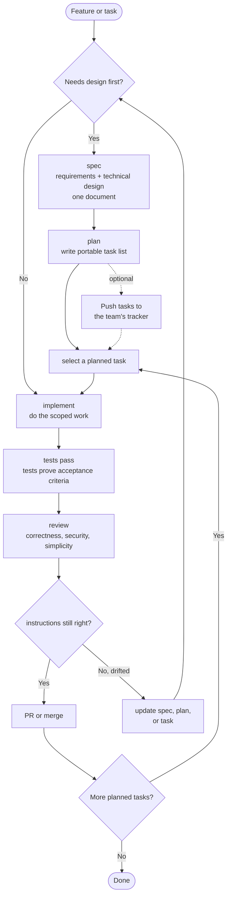

# Blueprint

> World-class software engineering and agentic engineering, encoded as a workflow agents can follow.

Blueprint is the SDLC done right for AI coding agents. Spec when decisions matter. Plan when work needs splitting. Test before ship. Review before merge. The practices excellent engineering teams have always followed, distilled into focused skills an agent can execute reliably.

It is the deliberate opposite of guardrail-heavy frameworks that try to constrain agents into producing good work. Blueprint bets on the model and encodes the workflow. Every model improvement makes that bet pay off more, not less.

## Principles

- **Encode process, not knowledge.** Skills are workflows. Reference material lives elsewhere.
- **Verification is non-negotiable.** Tests prove the spec. Review checks the tests are real.
- **Bet on the model.** Smart agents, not heavy guardrails. Every model improvement makes guardrails less necessary and more likely to conflict with the model's own judgment.
- **Density over length.** Skills are as short as they can be while remaining clear. The `compress` skill keeps them honest.
- **Focused skills, not sprawling catalogues.** Saying no is the discipline.

## The Shape

| Phase | Skill | What it does |
|---|---|---|
| **Define** | `spec` | One document with requirements and design |
| **Plan** | `plan` | Break a spec into agent-sized tasks |
| **Build** | `implement` / `tdd` | Execute one task; tests prove acceptance |
| **Review** | `review` | Correctness, security, simplicity before merge |
| **Maintain** | `compress` | Keep skills tight; the meta-skill |

## The Flow



**If implementation reveals the instructions are wrong, stop.** Update the task, spec, or plan, then continue from the updated source. Do not push through stale instructions. Clarifying costs minutes; pushing through wrong instructions costs the rest of the feature.

**Tests are the verification.** Blueprint does not run a separate "did the implementation match the instructions?" pass. The request or spec defines the testing strategy. The implementation produces tests that prove the requirements. Review checks the tests are real and not theatre. If you want stronger verification, write the additional concerns into `REVIEW.md`; the review skill will pick them up.

## Commands and Skills

Blueprint exposes two surfaces. **Slash commands** (`/blueprint:plan`, `/blueprint:implement`, etc.) are what you type. **Skills** (`skills/plan/`, `skills/implement/`, etc.) are how those commands are implemented. The vocabulary is shared; the command and skill for a given verb have the same name.

| Command | Skill | Purpose |
|---|---|---|
| `/blueprint:spec` | `skills/spec/` | Write a spec |
| `/blueprint:plan` | `skills/plan/` | Break a spec into reviewable tasks |
| `/blueprint:implement` | `skills/implement/` | Execute a single task |
| `/blueprint:tdd` | `skills/tdd/` | Test-first variant of implement |
| `/blueprint:review` | `skills/review/` | Local code review |
| `/blueprint:compress` | `skills/compress/` | Shorten agent-facing instructions |
| `/blueprint:branch` | `skills/branch/` | Create a Git branch |
| `/blueprint:commit` | `skills/commit/` | Conventional commit |

Branching and committing are mechanical, but they are still skills so the installer can expose the full workflow consistently.

`/blueprint:build` is deprecated. Use `/blueprint:implement`; the old name was retired because "build" collides with project build steps and CI vocabulary.

The old `/blueprint:requirements`, `/blueprint:architecture`, and `/blueprint:task` commands are removed. Requirements and architecture now live together in `/blueprint:spec`; task execution is `/blueprint:implement`.

## Install

```bash
npx skills add owainlewis/blueprint
```

Install Blueprint with the `skills` CLI. This is the supported setup path; Blueprint does not maintain per-tool install instructions.

## Update

```bash
npx skills update
```

Run this to update Blueprint and your installed skills to the latest version.

## Skills

| Skill | What it does | Example |
|---|---|---|
| `spec` | Writes `docs/<feature-slug>/spec.md`: requirements and design in one document | `Write a spec for user-auth` |
| `plan` | Breaks a spec into tasks sized for agents, review, and rollback | `Create a plan for user-auth` |
| `implement` | Executes one scoped change with tests and verification | `Implement LIN-123 from user-auth` |
| `tdd` | Implements behavior test-first | `Use TDD for retry logic in the API client` |
| `review` | Reviews specs or code for correctness, security, simplicity, robustness, and tests | `Review the current diff` |
| `compress` | Shortens agent-facing instructions without changing behavior | `Compress docs/user-auth/spec.md` |
| `branch` | Creates a focused Git branch using the repo's naming convention | `Create a branch for user-auth` |
| `commit` | Stages intended changes and writes one clear commit | `Commit the current changes` |

## Agent Instructions

Blueprint creates instructions for agents. Sometimes that instruction is a one-sentence prompt. Sometimes it is a tracker issue. Sometimes it is a markdown spec in the repo. The format should match the work.

One spec lives at `docs/<feature-slug>/spec.md`. External requirements flow into it; the spec is the artifact that brings context into the codebase.

Plans default to `docs/<feature-slug>/plan.md`: a portable task list that can be reviewed, copied into a tracker, or used directly. If you want issues created in Linear, GitHub Issues, or another system, ask for that as the next step.

Use the full pipeline for work that touches contracts, schemas, multiple files, or invariants. For trivial changes, just do them. For exploration, explore without manufacturing fake specs, plans, or tracker issues.

## Philosophy

**Specs are prompts with weight.** A spec is an instruction with enough structure to make decisions reviewable. Once the code is right, the spec's job is done.

**Do not confuse planning with prompting.** Professional teams do planning in the systems they already use: issue trackers, docs, design reviews, meetings, and PRs. Blueprint turns that context into the distilled instruction an agent needs.

**Compress context.** Every word competes for attention. Cut restated rules, overlap, padding, and preamble. Keep constraints, exact names, commands, paths, schemas, and examples that carry meaning.

**Agent inputs only.** Blueprint is not an issue tracker, architecture review board, or release process. It turns external context into high-quality instructions for coding agents. That's the entire job.

## Example

The [examples/](examples/) folder shows the planning output for a Python RAG chatbot API:

1. [input.md](examples/input.md): rough project notes
2. [spec.md](examples/rag-chatbot/spec.md): the spec
3. [plan.md](examples/rag-chatbot/plan.md): ordered tasks

## Learn More

https://www.skool.com/aiengineer
