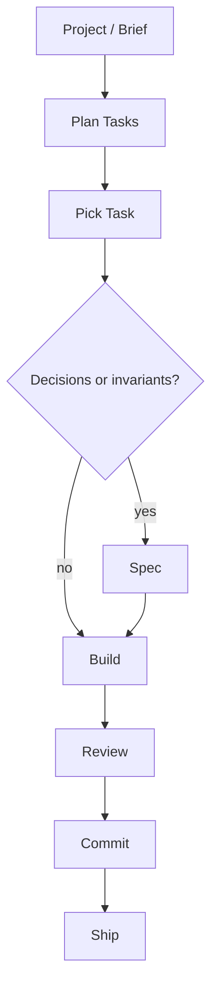
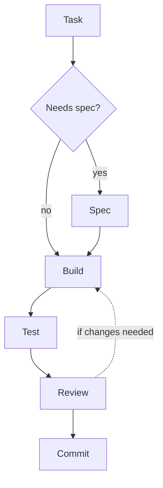

# Blueprint

> A collection of agent skills for running the software development lifecycle with AI coding agents.

## Why Blueprint

Good software follows a process: understand what to build, plan the work, build it in small pieces, test it, review it, and ship it. Blueprint encodes that process as a small set of reusable agent skills.

The skills are short, focused, and opinionated. They give the agent clear instructions and get out of the way. As models get more capable, that approach gets better, not worse.

Blueprint is agent-agnostic. The same skills can be used from Claude Code, Codex, Cursor, OpenCode, and other agents that support local skills.

10 skills. You can read the entire framework in 15 minutes.

## The Flow



For each task:



```text
Create a plan for user-auth.
Write a spec for Task 2 if the auth flow has decisions worth surfacing.
Implement Task 1 from user-auth.
Review the current changes.
Commit the current changes.
```

## Agent Instructions

Blueprint creates instructions for agents. Sometimes that instruction is a one-sentence prompt. Sometimes it is a task in a tracker. Sometimes it is a markdown spec in the repo. The format should match the work.

Specs are not project-management documents, architecture review records, or permanent documentation. In a professional environment, that work usually lives in Jira, Linear, Confluence, GitHub, meetings, or whatever the team already uses. Blueprint only cares about the distilled instruction an agent needs to build correctly.

A spec earns its keep when it surfaces decisions before code exists: API shape, migration approach, error behavior, transaction boundary, file format, invariant to preserve. If the task has no decisions you'd want to review, skip the spec and prompt the agent directly.

Keep every agent-facing instruction short. Extra words compete for model attention. If a spec is getting long, split the task. If a task is clear but verbose, compress it.

## Install

```bash
npx skills add owainlewis/blueprint
```

Install Blueprint with the `skills` CLI. This is the simplest setup and works across agents that support local skills.

## Update

```bash
npx skills update
```

Run this to update Blueprint and your installed skills to the latest version.

How you invoke a skill depends on the agent:

- Some agents expose slash commands
- Some expose a skill picker
- Some work best when you ask for a skill by name in natural language

Blueprint itself is just the skill content.

## Skills

### Planning

Plans turn projects, phases, specs, or rough requests into agent-sized tasks. Specs are written only when a task has decisions or invariants worth surfacing.

| Skill | What it does | Example |
|-------|-------------|---------|
| **plan** | Break work into tasks sized for agent execution, review, and rollback | `Create a plan for user-auth` |
| **spec** | Surface decisions, invariants, requirements, design, and tests for a task | `Write a spec for Task 2 from user-auth` |
| **compress** | Shorten agent-facing instructions without changing behavior | `Compress docs/user-auth/spec.md` |

### Building

| Skill | What it does | Example |
|-------|-------------|---------|
| **build** | Execute a task: write code, write tests if relevant, verify it works | `Implement Task 2 from user-auth` |
| **tdd** | Build test-first: failing tests, then implementation, then simplify | `Use TDD for retry logic in the API client` |

Use **build** for most work. Use **tdd** when you want test-first discipline: the agent must write failing tests before any implementation code.

### Quality

| Skill | What it does | Example |
|-------|-------------|---------|
| **review** | Spec or code review: correctness, security, simplicity, robustness | `Review the current diff` |
| **refactor** | Simplify code without changing behavior | `Refactor src/api/routes.py` |
| **coverage** | Fill test gaps with tests that catch realistic bugs | `Add high-value tests for src/auth/` |
| **debug** | Systematic root-cause debugging: observe, hypothesize, test, fix | `Debug the API returning 500 on POST` |

### Git

| Skill | What it does | Example |
|-------|-------------|---------|
| **commit** | Stage and commit with a clear conventional commit message | `Commit the current changes` |

## Philosophy

**Encode the process, not bureaucracy.** The value is in good task shape, explicit decisions when they matter, tests alongside implementation, and review before ship. Get those right and the agent does the rest.

**Specs are prompts with weight.** A spec is just an instruction with enough structure to make decisions reviewable. Once the code is right, the spec's job is done.

**Do not confuse planning with prompting.** Professional teams do planning in the systems they already use: issue trackers, docs, design reviews, meetings, and PRs. Recreating that in markdown for the agent is usually noise. Feed the agent the distilled instruction it needs, not a fake project-management layer.

**Compress context.** Every word competes for attention. Cut restated rules, overlap, padding, and preamble. Keep constraints, exact names, commands, paths, schemas, and examples that carry meaning.

**Simplicity scales.** Short, focused skills that trust the model outperform heavy frameworks full of guardrails. One focused review catches more real bugs than 16 agents generating noise.

**Small safe changes win.** Preserve contracts, handle failure paths explicitly, and prefer the smallest change that fully solves the problem.

**Agent inputs only.** Blueprint does not replace issue trackers, architecture review, team planning, or release process. It turns that context into high-quality instructions for coding agents.

## Example

The [`examples/`](examples/) folder shows the planning output for a Python RAG chatbot API:

1. [input.md](examples/input.md): rough project notes
2. [spec.md](examples/rag-chatbot/spec.md): the spec
3. [plan.md](examples/rag-chatbot/plan.md): ordered tasks

## Learn More

https://www.skool.com/aiengineer
