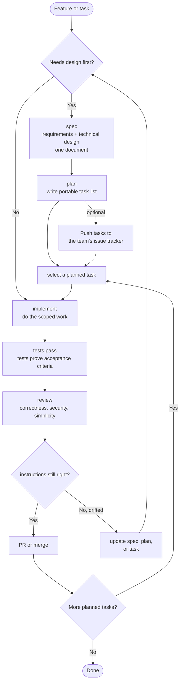

# Blueprint

> World-class software engineering and agentic engineering, encoded as a workflow agents can follow.

Blueprint is the SDLC done right for AI coding agents. Spec when decisions matter. Plan when work needs splitting. Test before ship. Review before merge. The practices excellent engineering teams have always followed, distilled into focused skills an agent can execute reliably.

It is the deliberate opposite of guardrail-heavy frameworks that try to constrain agents into producing good work. Blueprint bets on the model and encodes the workflow. Every model improvement makes that bet pay off more, not less.

## Principles

- **Encode process, not knowledge.** Skills are workflows. Reference material lives elsewhere.
- **Verification is non-negotiable.** Tests prove the requested behavior. Browser-rendered work is checked in a real browser. Review checks the proof is real.
- **Bet on the model.** Smart agents, not heavy guardrails. Every model improvement makes guardrails less necessary and more likely to conflict with the model's own judgment.
- **Density over length.** Skills are as short as they can be while remaining clear. The `compress` skill keeps them honest.
- **Focused skills, not sprawling catalogues.** Saying no is the discipline.

## The Shape

Blueprint has two kinds of skills:

| Category | Skills | What they do |
|---|---|---|
| **Delivery** | `spec`, `plan`, `implement`, `tdd`, `review`, `branch`, `commit` | Turn software work into shipped changes |
| **Engineering Productivity** | `browser-verify`, `explain-visually`, `excalidraw-diagram`, `compress` | Help engineers and agents work faster, understand better, and avoid quality regressions |

## The Flow



**If implementation reveals the instructions are wrong, stop.** Update the task, spec, or plan, then continue from the updated source. Do not push through stale instructions. Clarifying costs minutes; pushing through wrong instructions costs the rest of the feature.

**Tests are the default verification.** Blueprint does not run a separate "did the implementation match the instructions?" pass. The request or spec defines the testing strategy. The implementation produces tests that prove the requirements. Browser-rendered work also gets checked with `browser-verify`. Review checks the proof is real and not theatre. If you want stronger verification, write the additional concerns into `REVIEW.md`; the review skill will pick them up.

## Invoking Skills

The supported install path is `npx skills add owainlewis/blueprint`. That installs standalone skills; invoke them by skill name (`spec`, `plan`, `implement`, etc.) or by the skill picker/natural-language flow your agent supports.

Some plugin hosts expose namespaced slash commands such as `/blueprint:spec`. Those commands are aliases for the same skill names; the standalone skill name is the stable vocabulary.

| Category | Skill | Plugin command, when available | Purpose |
|---|---|---|---|
| Delivery | `spec` | `/blueprint:spec` | Write a spec |
| Delivery | `plan` | `/blueprint:plan` | Break input into reviewable tasks |
| Delivery | `implement` | `/blueprint:implement` | Execute a single task |
| Delivery | `tdd` | `/blueprint:tdd` | Test-first variant of implement |
| Delivery | `review` | `/blueprint:review` | Local code review |
| Delivery | `branch` | `/blueprint:branch` | Create a traceable Git branch |
| Delivery | `commit` | `/blueprint:commit` | Conventional commit |
| Engineering Productivity | `browser-verify` | `/blueprint:browser-verify` | Verify browser-rendered work |
| Engineering Productivity | `compress` | `/blueprint:compress` | Shorten agent-facing instructions |
| Engineering Productivity | `explain-visually` | `/blueprint:explain-visually` | Create a visual HTML explanation |
| Engineering Productivity | `excalidraw-diagram` | `/blueprint:excalidraw-diagram` | Create an editable Excalidraw diagram |

Branching and committing are mechanical, but they are still skills so the installer can expose the full workflow consistently.

Removed entry points are not maintained as aliases: `requirements` and `architecture` are now `spec`; `task`, `build`, `debug`, and `refactor` are now `implement`; `coverage` is handled through `implement` when adding tests or `review` when evaluating them.

## Install

```bash
npx skills add owainlewis/blueprint
```

Install Blueprint with the `skills` CLI. This is the supported setup path; Blueprint does not maintain per-tool skill installation guides.

`browser-verify` requires Chrome DevTools MCP:

```bash
claude mcp add chrome-devtools --scope user npx chrome-devtools-mcp@latest
codex mcp add chrome-devtools -- npx chrome-devtools-mcp@latest
```

## Update

```bash
npx skills update
```

Run this to update Blueprint and your installed skills to the latest version.

## Skills

### Delivery

| Skill | What it does | Example |
|---|---|---|
| `spec` | Writes `docs/<feature-slug>/spec.md`: requirements and design in one document | `Write a spec for user-auth` |
| `plan` | Breaks a spec, brief, or request into tasks sized for agents, review, and rollback | `Create a plan for user-auth` |
| `implement` | Executes one scoped change with tests and verification | `Implement LIN-123 from user-auth` |
| `tdd` | Implements behavior test-first | `Use TDD for retry logic in the API client` |
| `review` | Reviews specs or code for correctness, security, simplicity, robustness, and tests | `Review the current diff` |
| `branch` | Creates a traceable Git branch with the ticket ID when available | `Create a branch for LIN-123 user-auth` |
| `commit` | Stages intended changes and writes one clear Conventional Commit | `Commit the current changes` |

### Engineering Productivity

| Skill | What it does | Example |
|---|---|---|
| `browser-verify` | Verifies rendered UI, HTML, visual docs, and browser-facing behavior in a real browser | `Browser-verify the local HTML report` |
| `compress` | Shortens agent-facing instructions without changing behavior | `Compress docs/user-auth/spec.md` |
| `explain-visually` | Creates a responsive HTML explanation of a repo, spec, PR, architecture, or concept | `Explain this repo visually` |
| `excalidraw-diagram` | Creates an editable Excalidraw diagram of a repo, spec, architecture, workflow, or concept | `Turn this architecture into an Excalidraw diagram` |

## Agent Instructions

Blueprint creates instructions for agents. Sometimes that instruction is a one-sentence prompt. Sometimes it is an issue tracker item. Sometimes it is a markdown spec in the repo. The format should match the work.

One spec lives at `docs/<feature-slug>/spec.md`. External requirements flow into it; the spec is the artifact that brings context into the codebase.

Plans default to `docs/<feature-slug>/plan.md`: a portable task list that can be reviewed, copied into an issue tracker, or used directly. If you want issues created in Linear, GitHub Issues, or another system, ask for that as the next step.

Use the full pipeline for work that touches contracts, schemas, multiple files, or invariants. For trivial changes, just do them. For exploration, explore without manufacturing fake specs, plans, or issue tracker entries.

## Philosophy

**Specs are prompts with weight.** A spec is an instruction with enough structure to make decisions reviewable. Once the code is right, the spec's job is done.

**Do not confuse planning with prompting.** Professional teams do planning in the systems they already use: issue trackers, docs, design reviews, meetings, and PRs. Blueprint turns that context into the distilled instruction an agent needs.

**Compress context.** Every word competes for attention. Cut restated rules, overlap, padding, and preamble. Keep constraints, exact names, commands, paths, schemas, and examples that carry meaning.

**Agent inputs only.** Blueprint is not an issue tracker, architecture review board, or release process. It turns external context into high-quality instructions for coding agents. That's the entire job.

## Example

The [examples/](examples/) folder shows the planning output for a Python RAG chatbot API:

1. [input.md](examples/input.md): rough project notes
2. [spec.md](examples/rag-chatbot/spec.md): the spec
3. [plan.md](examples/rag-chatbot/plan.md): ordered tasks

## Learn More

https://www.skool.com/aiengineer
