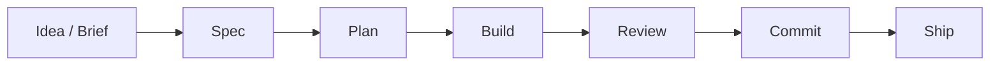

# Blueprint

> A collection of agent skills for running the software development lifecycle.

## Why Blueprint

Good software follows a process: understand what to build, plan the work, build it in small pieces, test it, review it, and ship it. Blueprint encodes that process as a small set of reusable agent skills.

The skills are short, focused, and opinionated. They give the agent clear goals and get out of the way. As models get more capable, that approach gets better — not worse.

Blueprint is agent-agnostic. The same skills can be used from Claude Code, Codex, Cursor, OpenCode, and other agents that support local skills.

10 skills. You can read the entire framework in 15 minutes.

## The Flow



For each task in the plan:


```text
Write a spec for user-auth adding OAuth login with Google and GitHub.
Create a plan for user-auth.
Implement Task 1 from user-auth.
Review the current changes.
Commit the current changes.
```

## Writing Specs for Agents

Blueprint generates markdown specs and plans that live in your repo. These are **instructions for agents**, not design documents for humans.

Your real design thinking happens elsewhere — in Confluence, on a whiteboard, in a conversation with your team. What lands in the repo is the distilled brief an agent needs to build correctly: what we're building, why, how it fits into the existing system, and what order to build it in.

This is why Blueprint uses a single spec rather than separate requirements, architecture, and planning documents. An agent doesn't need hand-offs between phases or sign-off gates between documents. Two docs, two concerns: *what are we building* (spec) and *how to build it and in what order* (plan).

Keep specs short. If a spec is getting long, the feature is too big — split the feature, not the document.

## Install

The simplest setup is to keep Blueprint in your repo's `.agents/skills/` directory so the skills can be shared across agents that support the common project-level skills convention.

```bash
npx skills add owainlewis/blueprint -a codex
```

You can also copy the folders from [`skills/`](skills/) into your shared skills directory manually.

How you invoke a skill depends on the agent:

- Some agents expose slash commands
- Some expose a skill picker
- Some work best when you ask for a skill by name in natural language

Blueprint itself is just the skill content.

## Skills

### Scaffolding

| Skill | What it does | Example |
|-------|-------------|---------|
| **bootstrap** | Scaffold a new project from minimal, opinionated defaults: uv for Python, bun + Next.js for TypeScript, PostgreSQL, `app/` structure. Always pins the latest stable versions. | `Bootstrap a new Python service called my-service` |

### Planning

Specs and plans are written to `docs/<feature>/` — one directory per feature, no collisions.

| Skill | What it does | Example |
|-------|-------------|---------|
| **spec** | Write a spec: requirements, technical design, and testing strategy | `Write a spec for user-auth adding OAuth login` |
| **plan** | Break a spec into tasks you can give to an AI coding agent to implement | `Create a plan for user-auth` |

### Building

| Skill | What it does | Example |
|-------|-------------|---------|
| **build** | Execute a task — write code, write tests if relevant, verify it works | `Implement Task 2 from user-auth` |
| **tdd** | Build test-first: failing tests, then implementation, then simplify | `Use TDD for retry logic in the API client` |

Use **build** for most work. Use **tdd** when you want test-first discipline — the agent must write failing tests before any implementation code.

### Quality

| Skill | What it does | Example |
|-------|-------------|---------|
| **review** | Code review — correctness, security, simplicity, robustness | `Review the current diff` |
| **refactor** | Simplify code without changing behavior | `Refactor src/api/routes.py` |
| **coverage** | Fill test gaps with tests that catch realistic bugs | `Add high-value tests for src/auth/` |
| **debug** | Systematic root-cause debugging: observe, hypothesize, test, fix | `Debug the API returning 500 on POST` |

### Git

| Skill | What it does | Example |
|-------|-------------|---------|
| **commit** | Stage and commit with a conventional commit message | `Commit the current changes` |

## Philosophy

**Encode the process, not the rules.** The value is in the sequence — spec before code, tests alongside implementation, review before ship. Get the sequence right and the agent does the rest.

**Specs are for agents.** Your design thinking happens in Confluence, on whiteboards, in conversations. What lands in markdown is the minimum an agent needs to build correctly.

**Simplicity scales.** Short, focused skills that trust the model outperform heavy frameworks full of guardrails. One focused review catches more real bugs than 16 agents generating noise.

**Core SDLC only.** Blueprint encodes the development lifecycle — planning, building, testing, reviewing, shipping. Integrations with specific tools (Linear, Jira, Slack) are a separate concern and belong in separate plugins.

## Example

The [`examples/`](examples/) folder shows the planning output for a Python RAG chatbot API:

1. [input.md](examples/input.md) — rough project notes
2. [spec.md](examples/rag-chatbot/spec.md) — the spec
3. [plan.md](examples/rag-chatbot/plan.md) — ordered tasks

## Updating

```bash
npx skills update
```

## Releasing (for contributors)

```bash
./release.sh patch   # 0.2.0 → 0.2.1
./release.sh minor   # 0.2.0 → 0.3.0
./release.sh major   # 0.2.0 → 1.0.0
```

## Local Development

Edit the skill files in [`skills/`](skills/).

To test locally, install this repo into `.agents/skills/` or your agent's local skills directory and invoke the skills through that agent.

## Learn More

https://www.skool.com/aiengineer
