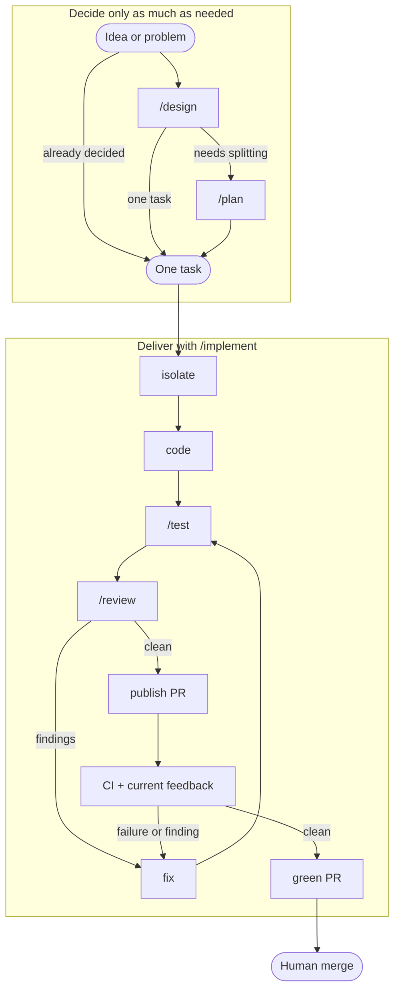

<div align="center">

# Blueprint

**A small, principles-first workflow for AI coding.**

Clear decisions. Bounded work. Real proof. Independent review.

</div>

Blueprint gives coding agents the engineering boundaries that matter without turning software delivery into a catalogue of tiny skills. It separates repository policy, reusable phases, and end-to-end workflows so each instruction has one clear job.

## Start with the work, not the process

Use the smallest entry point that resolves the uncertainty in front of you.

| If you need to… | Start with | Result |
| --- | --- | --- |
| Decide what to build or resolve important technical choices | `/design` | A reviewed design with requirements and acceptance criteria |
| Split a decided feature into work for several agent runs | `/plan` | Ordered tasks in chat or tracker tickets |
| Take one task through delivery | `/implement` or `/task-to-pr` | A tested, reviewed, green pull request |
| Complete every issue in a GitHub milestone | `/milestone` | One green pull request at a time, with human merge checkpoints |
| Prove a change works | `/test` | Acceptance criteria mapped to evidence |
| Get an independent second opinion | `/review` | Findings and a pre-merge verdict from a fresh subagent |
| Simplify existing code without changing behavior | `/improve` | Clearer, smaller, better-structured code |

Small, decided work can go straight to `/implement`. Use `/design` only when decisions need review, and `/plan` only when the work needs splitting.

## How Blueprint fits together



`/improve` is a separate maintenance path for existing code, not a step every change must pass through.

The model has three layers:

1. **Repository instructions define policy.** `AGENTS.md` says what good work means in a codebase.
2. **Skills define phases and reusable coordination.** Each skill has one durable engineering outcome and a clear stopping point.
3. **Commands compose workflows.** `/implement` connects normal delivery steps without turning each one into a skill.

## The five phases

| Skill | Owns | Stops when |
| --- | --- | --- |
| `/design` | What, why, requirements, acceptance criteria, technical design, constraints, risks, and scope | The design is ready for human review |
| `/plan` | Vertical, ordered tasks and optional milestones | The work is ready to hand off |
| `/test` | Automated checks, failure paths, and real-browser proof when relevant | Every criterion is pass, fail, or explicitly unverified |
| `/review` | Independent review of correctness, security, regressions, complexity, and proof | Findings and a verdict are reported |
| `/improve` | Behavior-preserving simplification of existing code | Relevant checks prove behavior was preserved |

Writing code is a base capability, not a phase skill. Branching, committing, opening a PR, debugging, TDD, browser checking, and addressing feedback are techniques or workflow steps, not separate product concepts.

## One task to one pull request

[`commands/implement.md`](commands/implement.md) is the single authority for delivery. Given a ticket, task, or existing PR, it:

1. resolves the source and isolates work before editing;
2. implements the smallest complete change;
3. runs `/test` and independent `/review` loops;
4. creates Conventional Commits and opens or updates the PR;
5. waits for CI, handles feedback that exists, and records evidence;
6. stops at a green, mergeable PR for a human to merge.

It does not wait forever for future human feedback, manufacture tracker artifacts for trivial work, or merge without explicit permission.

[`commands/task-to-pr.md`](commands/task-to-pr.md) restores the explicit `/task-to-pr` workflow name. It delegates to `/implement` rather than duplicating the delivery loop.

## One milestone to completed issues

`/milestone` is the release-slice workflow. It reads a GitHub milestone, orders open issues by dependency and risk, then runs `/task-to-pr` for one issue at a time. It stops for human merge after each green pull request unless the user explicitly delegates merging for that run.

## Install

Install the five phase skills and the milestone workflow:

```bash
npx skills add owainlewis/blueprint
```

The Skills CLI does not install commands. For the project-level Claude Code workflows:

```bash
mkdir -p .claude/commands
curl -fsSL https://raw.githubusercontent.com/owainlewis/blueprint/main/commands/implement.md \
  -o .claude/commands/implement.md
curl -fsSL https://raw.githubusercontent.com/owainlewis/blueprint/main/commands/task-to-pr.md \
  -o .claude/commands/task-to-pr.md
```

For another coding tool, download the [raw implementation workflow](https://raw.githubusercontent.com/owainlewis/blueprint/main/commands/implement.md) and [raw task-to-PR workflow](https://raw.githubusercontent.com/owainlewis/blueprint/main/commands/task-to-pr.md) to its custom-command directory or use them as ordinary prompts.

Upgrading from the older skill catalogue? Follow the [migration guide](MIGRATION.md). Removed skills can remain installed after a normal update, so the cleanup step matters.

## Repository map

```text
skills/                 five reusable phases and the milestone workflow
commands/implement.md   canonical implementation workflow
commands/task-to-pr.md  named task-to-PR workflow entry point
AGENTS.md                portable repository policy
CLAUDE.md                Claude Code adapter
REVIEW.md                review standard for Blueprint itself
MIGRATION.md             clean upgrade from the old catalogue
examples/                reviewed design and planning examples
```

## Examples

The RAG chatbot example follows one idea through the decision flow:

1. [rough project notes](examples/input.md)
2. [reviewed design](examples/rag-chatbot/design.md)
3. [captured chat plan](examples/rag-chatbot/plan.md)

For a larger architecture example, read the [Dispatch local control-plane design](examples/dispatch-control-plane/design.md).

## Principles

- **Encode process, not knowledge.** Give agents outcomes, constraints, and proof; trust them with local mechanics.
- **One skill per phase.** A skill represents a durable mode of work, not a command or job title.
- **Proof is part of the work.** Tests establish behavior. Review checks that the implementation and proof are sound.
- **Use the real surface.** Browser behavior is checked in a browser. Live PR feedback is read from the PR.
- **Fix the source of truth.** If implementation exposes a bad requirement, update the task or design before continuing.
- **Prefer less.** Keep the smallest complete change, shortest useful instruction, and no duplicate entry points.
- **Keep irreversible judgment human.** Agents prepare the decision. Humans review designs and merge pull requests unless they explicitly delegate it.

Blueprint is not an issue tracker, agent framework, release system, or reviewer-persona library. It is a compact engineering process for capable coding agents.
