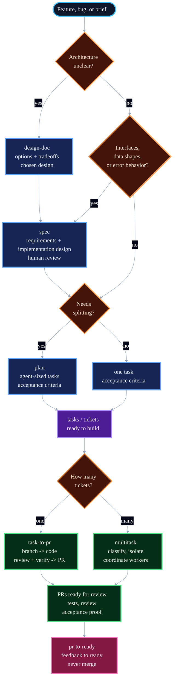
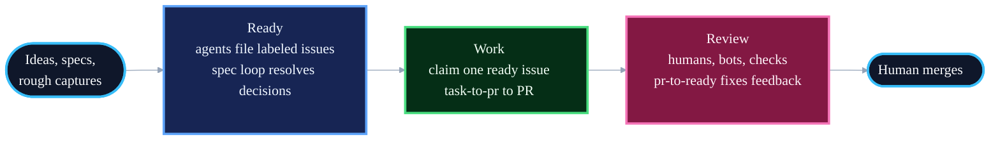

# Blueprint

> The best agent development skills in the world.

Coding agents don't fail for lack of intelligence. They fail for lack of process: no spec, no plan, no tests, no review, just a confident 2,000-line PR nobody asked for. Blueprint fixes the process and trusts the intelligence.

It encodes how strong engineering teams ship: design when architecture is unclear, write specs when behavior or interfaces need review, plan when work needs splitting, test before ship, and review before merge. Core skills, plus two small Git helpers, let you run one step yourself or take tickets all the way to PRs ready for review.

Blueprint is deliberately small. No ceremony, no mazes of rules, no thousand-line process files before work starts. A short skill is easier for an agent to follow. Blueprint assumes the model is strong enough to use clear instructions and good engineering judgment.

## Principles

- **Encode process, not knowledge.** Skills say what to do. Reference material lives elsewhere.
- **Verification is non-negotiable.** Tests prove the requested behavior. Browser-rendered work is checked in a real browser. Review checks the proof is real.
- **Bet on the model.** Use clear instructions, not heavy rules.
- **Density over length.** Skills are as short as they can be while remaining clear.
- **Focused skills, not big catalogues.** Saying no is the discipline.

## The Shape

| Phase        | Skill                      | What it does                                                                  |
| ------------ | -------------------------- | ----------------------------------------------------------------------------- |
| **Design**   | `design-doc`               | Explore architecture, options, and tradeoffs                                  |
| **Define**   | `spec`                     | Requirements, interfaces, data shapes, and implementation design              |
| **Plan**     | `plan`                     | Break work into tasks, adding phases and milestones for larger work           |
| **Goal**     | `goal-design`              | Write Codex and Claude Code `/goal` prompts with checks, proof, and stop rules |
| **Build**    | `implement` / `tdd`        | Execute one task; tests prove acceptance                                      |
| **Debug**    | `debug`                    | Reproduce a failure, fix it test-first when practical, and keep the test      |
| **Improve**  | `refactor`                 | Simplify changed code without changing behavior                               |
| **Review**   | `review`                   | Code-change correctness, security, simplicity before merge                    |
| **Deliver**  | `task-to-pr` / `multitask` | Turn one ticket, or several tickets in parallel, into PRs ready for review    |
| **Feedback** | `pr-to-ready`              | Drive an open PR with human, bot, or check feedback to ready                  |
| **Browser**  | `browser-verify`           | Check rendered UI, HTML, and visual docs in a real browser                    |

## The Flow



**If implementation reveals the instructions are wrong, stop.** Update the task, spec, or plan, then continue from the updated source. Do not push through stale instructions. Clarifying costs minutes; pushing through wrong instructions costs the rest of the feature.

**Tests are the default proof.** The request or spec defines what to test. The implementation adds tests that prove the requirements. Browser-rendered work also gets checked with `browser-verify`. `task-to-pr` checks each acceptance criterion before opening the PR. Review checks that the proof is real. If you want stronger code review rules, write them into `REVIEW.md`; the review skill will pick them up.

## The Loops

The skills above are steps: one phase, one human checkpoint. Three skills chain the steps into end-to-end loops:

| Skill         | From                     | To                                                                         |
| ------------- | ------------------------ | -------------------------------------------------------------------------- |
| `task-to-pr`  | a ticket                 | a PR ready for review, with code, tests, another review, acceptance checks, and proof |
| `multitask`   | several tickets          | several PRs ready for review, one separate worker per ticket or dependent group |
| `pr-to-ready` | an open PR with human, bot, or check feedback | a PR that is ready to merge, with checks passing |

Loops keep the ticket updated as they work: status moves, comments with proof, and PR links.
They stop at human checkpoints.
Merging is always a human decision.

`task-to-pr` is the single-ticket loop: it reads the ticket, creates a branch, implements the acceptance criteria, reviews the diff, checks acceptance, opens a PR ready for review, handles current feedback, and writes proof back to the ticket.

`multitask` is the coordinator-worker loop for several tickets at once:


Each worker still handles exactly one ticket: branch, code, tests, review, acceptance checks, PR, current feedback, and ticket update. The coordinator does not edit code; it splits work, starts separate workers, watches failures, and reports the result.

## Running Unattended

The loops above still start when you invoke them. They can also run on a schedule over an issue tracker, with agents filing every issue. Work moves through three phases:



1. **Ready**: turn ideas and specs into issues a new agent can do. The agent filing an issue judges it at creation: decided work gets `agent:ready`; real work with open decisions gets `needs:spec`, and the spec loop turns it into a reviewed spec. Nothing unjudged enters the tracker.
2. **Work**: a scheduled agent claims one `agent:ready` issue and runs `task-to-pr` to a PR ready for review, with the ticket as the work record. The loop throttles itself on review capacity: when too many agent PRs await review, it stops starting new work.
3. **Review**: humans, review bots, and checks leave feedback. A review-watch loop runs `pr-to-ready` after a short grace window, repeats until the PR is ready or blocked, and a human merges.

Humans do three things: flip `needs:spec` to `agent:ready` after reviewing a spec, review PRs when judgment is needed, and merge.
Agents do everything else.

`goal-design` is the pre-flight skill for Codex and Claude Code `/goal` prompts.
It turns fuzzy intent into a clear goal with a finish line, required checks, proof, and stop rules.
Scheduled loops and issue-tracker automations are separate runbooks; use `goal-design` only for the `/goal` prompt inside an attended agent session.
The definition of ready and the label state machine live in [AGENTS.md](AGENTS.md); setup, triggers, and copy-pasteable loop prompts live in [guides/loops.md](guides/loops.md).

For an attended Codex coordinator that works through a small issue set, keeps a project board current, and may merge only when explicitly authorized, see [guides/codex-coordinator.md](guides/codex-coordinator.md).

## Invoking Skills

The supported install path is `npx skills add owainlewis/blueprint`. That installs standalone skills; invoke them by skill name (`spec`, `plan`, `implement`, etc.) or by the skill picker/natural-language flow your agent supports.

Core workflows:

| Skill               | Purpose                                                                                           |
| ------------------- | ------------------------------------------------------------------------------------------------- |
| `design-doc`        | Decide architecture, options, and tradeoffs                                                        |
| `spec`              | Specify requirements, interfaces, data shapes, and behavior that must not change                    |
| `plan`              | Break input into tasks, with phase goals and milestones when useful                                |
| `goal-design`       | Write `/goal` prompts with clear done conditions, checks, proof, and stop rules |
| `implement`         | Execute a single task                                                                             |
| `tdd`               | Test-first variant of implement                                                                   |
| `debug`             | Reproduce and fix a failure test-first when practical                                             |
| `refactor`          | Simplify changed code without changing behavior                                                   |
| `review`            | Local code review                                                                                 |
| `task-to-pr`        | Run the loop from ticket to PR ready for review                                                    |
| `multitask`         | Run several tickets to PRs in parallel                                                            |
| `pr`                | Commit, push, and open a PR                                                                       |
| `pr-to-ready`       | Drive an open PR with live feedback to ready                                                       |
| `browser-verify`    | Verify browser-rendered work                                                                      |

Helper entry points:

| Skill    | Purpose                       |
| -------- | ----------------------------- |
| `branch` | Create a Git branch with the ticket ID or task name |
| `commit` | Conventional commit           |

`branch` and `commit` are helper entry points, not core workflows. They stay installable so `task-to-pr`, `multitask`, and `pr` can expose the full delivery path consistently.

Removed entry points are not maintained as aliases: `requirements` is now `spec`; `architecture` is now `design-doc` for architecture docs or `spec` for implementation instructions; `task` and `build` are now `implement`; `coverage` is handled through `implement` when adding tests or `review` when evaluating them; `goal-skill` and `loop-design` are now `goal-design`; `address-pr-feedback` is now `pr-to-ready`; `codex-run-loop` is now `task-to-pr` for one ticket or `multitask` for several tickets.

## Install

```bash
npx skills add owainlewis/blueprint
```

Install Blueprint with the `skills` CLI. This is the supported setup path; Blueprint does not maintain per-tool skill installation guides.

`browser-verify` requires an available real-browser automation and inspection path.
Chrome DevTools MCP is one supported setup:

```bash
claude mcp add chrome-devtools --scope user npx chrome-devtools-mcp@latest
codex mcp add chrome-devtools -- npx chrome-devtools-mcp@latest
```

## Update

```bash
npx skills update
```

Run this to update Blueprint and your installed skills to the latest version.

## Skills

Core workflows:

| Skill               | What it does                                                                                                                                            | Example                                              |
| ------------------- | ------------------------------------------------------------------------------------------------------------------------------------------------------- | ---------------------------------------------------- |
| `design-doc`        | Writes `docs/<design-slug>/design.md`: architecture, options, tradeoffs, and risks                                                                       | `Write a design doc for multi-tenant auth`           |
| `spec`              | Writes `docs/<feature-slug>/spec.md`: requirements, interfaces, data shapes, and implementation design                                                   | `Write a spec for user-auth`                         |
| `plan`              | Breaks a spec, brief, or request into tasks sized for agents, review, and rollback                                                                      | `Create a plan for user-auth`                        |
| `goal-design`       | Writes Codex and Claude Code `/goal` prompts with clear checks, proof, and stop rules                                                                   | `Write a goal for this ticket-to-PR task`            |
| `implement`         | Executes one task with tests and checks                                                                                                                  | `Implement LIN-123 from user-auth`                   |
| `tdd`               | Implements behavior test-first                                                                                                                          | `Use TDD for retry logic in the API client`          |
| `debug`             | Finds the root cause of a failure, fixes it test-first when practical, and leaves a regression test                                                     | `Debug the failing retry test`                       |
| `refactor`          | Improves code shape without changing behavior                                                                                                           | `Refactor the current diff`                          |
| `review`            | Reviews code changes for correctness, security, simplicity, robustness, and tests                                                                       | `Review the current diff`                            |
| `task-to-pr`        | Runs the loop from ticket to PR: fetch the ticket, implement, test, get another review, check acceptance, open the PR, handle current feedback, and keep the ticket updated with proof | `task-to-pr LIN-123` |
| `multitask`         | Coordinates several tickets to PRs at once: group dependent work, start separate workers, give each worker a complete prompt, and report the result | `multitask LIN-101 LIN-102 LIN-103`                  |
| `pr`                | Commits intended changes, pushes the branch, and opens a clear PR                                                                                       | `Open a PR for this change`                          |
| `pr-to-ready`       | Inspects live PR state, fixes still-actionable feedback, verifies checks, and reports merge readiness; never merges                                     | `Is PR #42 ready to merge?`                          |
| `browser-verify`    | Verifies rendered UI, HTML, visual docs, and browser-facing behavior in a real browser                                                                  | `Browser-verify the local HTML report`               |

Helper entry points:

| Skill    | What it does                                                 | Example                                 |
| -------- | ------------------------------------------------------------ | --------------------------------------- |
| `branch` | Creates a Git branch with the ticket ID when available | `Create a branch for LIN-123 user-auth` |
| `commit` | Stages intended changes and writes one clear Conventional Commit | `Commit the current changes`            |

## Agent Instructions

Blueprint creates instructions for agents. Sometimes that instruction is a one-sentence prompt. Sometimes it is an issue tracker item. Sometimes it is a design doc or markdown spec in the repo. The format should match the work.

Design docs default to `docs/<design-slug>/design.md`: a short architecture doc for unclear decisions, options, tradeoffs, and risks.

One spec lives at `docs/<feature-slug>/spec.md`. Requirements flow into it; the spec is the file that brings background into the codebase.

Plans are temporary. They go to exactly one place: tracker issues when you ask or the repo runs without a human present, `docs/<feature-slug>/plan.md` when there is a feature directory, or chat. When tasks go to the tracker, no plan doc is written; the issues are the plan.

Use the full pipeline for work that touches interfaces, schemas, multiple files, or behavior that must not change. For trivial changes, just do them. For exploration, explore without making fake specs, plans, or issue tracker entries.

## Philosophy

**Specs are prompts with weight.** A spec is an instruction with enough structure to make decisions easy to review. Once the code is right, the spec's job is done.

**Do not confuse planning with prompting.** Teams do planning in the systems they already use: issue trackers, docs, design reviews, meetings, and PRs. Blueprint turns that background into the clear instruction an agent needs.

**Compress context.** Every word competes for attention. Cut repeated rules, overlap, padding, and preamble. Keep limits, exact names, commands, paths, schemas, and examples that matter.

**Agent inputs only.** Blueprint is not an issue tracker, architecture review board, or release process. It turns outside information into clear instructions for coding agents. That's the entire job.

## Example

The [examples/](examples/) folder shows sample Blueprint files.

Design doc example:

- [dispatch-control-plane/design.md](examples/dispatch-control-plane/design.md): a design doc for Dispatch's local agent control plane architecture

Spec and plan examples for a Python RAG chatbot API:

1. [input.md](examples/input.md): rough project notes
2. [spec.md](examples/rag-chatbot/spec.md): the spec
3. [plan.md](examples/rag-chatbot/plan.md): ordered tasks

## Learn More

https://www.skool.com/aiengineer
