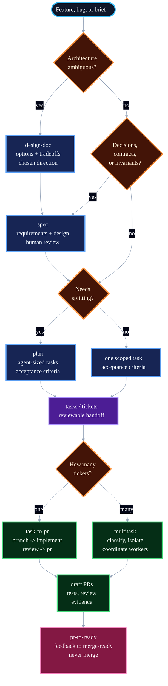
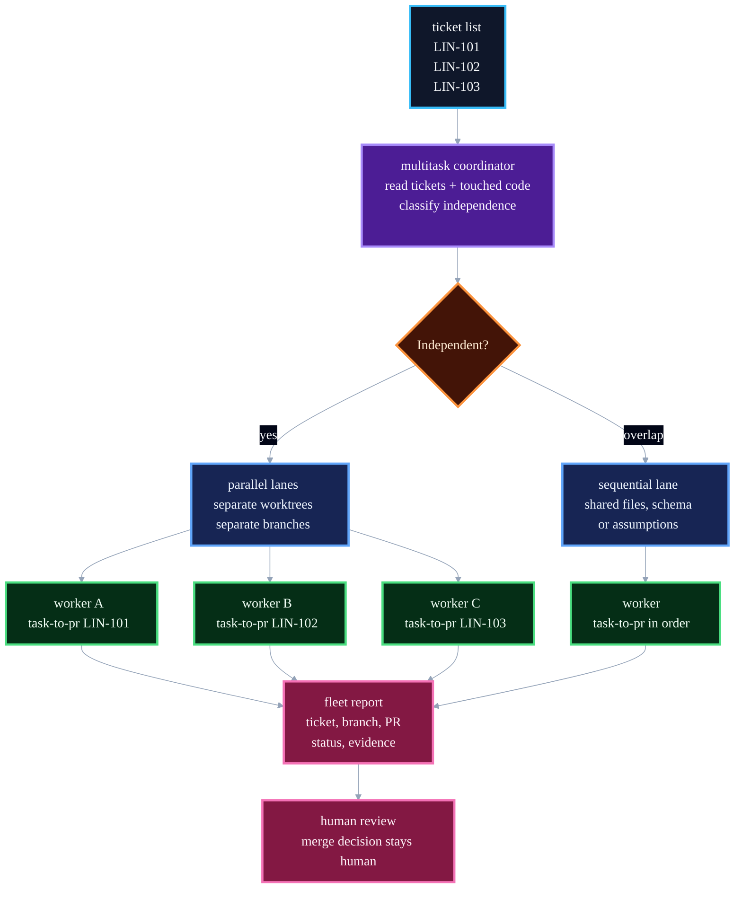
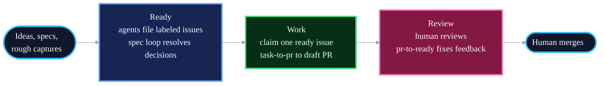

# Blueprint

> The best agent development skills in the world.

Coding agents don't fail for lack of intelligence. They fail for lack of process: no spec, no plan, no tests, no review, just a confident 2,000-line PR nobody asked for. Blueprint fixes the process and trusts the intelligence.

It encodes how the best engineering teams have always shipped: bootstrap cleanly, design when architecture is ambiguous, spec when decisions matter, plan when work needs splitting, test before ship, review before merge. Sixteen dense skills you can run as single steps you drive yourself, or as loops that take whole tickets to draft PRs while you sleep.

Blueprint is the deliberate opposite of bloated, over-engineered skill libraries like Superpowers and GSD. No ceremony, no guardrail mazes, no thousand-line process files burning your context window before any work starts. Simplicity is clarity: a skill short enough to hold in your head is a skill an agent actually follows. And Blueprint bets on the model. Heavy frameworks assume the model is weak and wrap it in rules; Blueprint assumes the model is strong and hands it the judgment of a great senior engineer, written down. Every model release makes that bet pay off more, and the guardrails more wrong.

## Principles

- **Encode process, not knowledge.** Skills are workflows. Reference material lives elsewhere.
- **Verification is non-negotiable.** Tests prove the requested behavior. Browser-rendered work is checked in a real browser. Review checks the proof is real.
- **Bet on the model.** Smart agents, not heavy guardrails. Every model improvement makes guardrails less necessary and more likely to conflict with the model's own judgment.
- **Density over length.** Skills are as short as they can be while remaining clear.
- **Focused skills, not sprawling catalogues.** Saying no is the discipline.

## The Shape

| Phase | Skill | What it does |
|---|---|---|
| **Setup** | `bootstrap-project` | Start a repo with clean docs, agent guidance, tracker setup, and first commit |
| **Design** | `design-doc` | Explore architecture, alternatives, and tradeoffs |
| **Define** | `spec` | One document with requirements and design |
| **Plan** | `plan` | Break work into agent-sized tasks |
| **Build** | `implement` / `tdd` | Execute one task; tests prove acceptance |
| **Debug** | `debug` | Reproduce a failure, fix it test-first, and keep the guard |
| **Improve** | `refactor` | Simplify changed code without changing behavior |
| **Review** | `review` | Correctness, security, simplicity before merge |
| **Deliver** | `task-to-pr` / `multitask` | Turn one ticket, or several tickets in parallel, into draft PRs |
| **Feedback** | `pr-to-ready` | Drive an open PR with feedback to merge-ready |
| **Browser** | `browser-verify` | Check rendered UI, HTML, and visual docs in a real browser |

## The Flow



**If implementation reveals the instructions are wrong, stop.** Update the task, spec, or plan, then continue from the updated source. Do not push through stale instructions. Clarifying costs minutes; pushing through wrong instructions costs the rest of the feature.

**Tests are the default verification.** Blueprint does not run a separate "did the implementation match the instructions?" pass. The request or spec defines the testing strategy. The implementation produces tests that prove the requirements. Browser-rendered work also gets checked with `browser-verify`. Review checks the proof is real and not theatre. If you want stronger verification, write the additional concerns into `REVIEW.md`; the review skill will pick them up.

## The Loops

The skills above are steps: one phase, one human checkpoint. Three skills chain the steps into end-to-end loops:

| Skill | From | To |
|---|---|---|
| `task-to-pr` | a ticket | a draft PR with code, tests, fresh-subagent review, and evidence |
| `multitask` | several tickets | several draft PRs, one isolated worker lane per ticket or dependency group |
| `pr-to-ready` | an open PR with feedback | a merge-ready PR with checks passing |

Loops keep the ticket updated as they work — status moves, comments with verification evidence, PR links — and stop at human checkpoints. Merging is always a human decision.

`task-to-pr` is the single-ticket loop: it resolves the ticket, creates a branch, implements the acceptance criteria, reviews the diff, opens a draft PR, and writes evidence back to the ticket.

`multitask` is the coordinator-worker loop for several tickets at once:



Each worker still runs the full `task-to-pr` workflow for exactly one ticket: `branch` -> `implement` -> `review` -> `pr` -> ticket update. The coordinator does not edit code; it partitions work, starts isolated lanes, monitors failures, and reports the fleet.

## Running Unattended

The loops above still start when you invoke them. They can also run on a schedule over an issue tracker, with agents filing every issue. Work moves through three phases:



1. **Ready**: turn ideas and specs into agent-ready issues. The agent filing an issue judges it at creation: decision-complete work gets `agent:ready`; a real problem with open decisions gets `needs:spec`, and the spec loop turns it into a reviewed spec. Nothing unjudged enters the tracker.
2. **Work**: a scheduled agent claims one `agent:ready` issue and runs `task-to-pr` to a draft PR, with the ticket as the audit trail. The loop throttles itself on review capacity: when too many agent PRs await review, it stops starting new work.
3. **Review**: a human reviews the PR, `pr-to-ready` drives feedback to merge-ready, a human merges.

Humans do three things: flip `needs:spec` to `agent:ready` after reviewing a spec, review PRs, and merge. Agents do everything else.

The loop layer is prompts, not skills: skills encode judgment that must stay consistent everywhere, while the loop layer is wiring you paste into whatever runs it. The definition of ready and the label state machine live in [AGENTS.md](AGENTS.md); setup, triggers, and copy-pasteable loop prompts live in [guides/loops.md](guides/loops.md).

For an attended Codex coordinator that works through a small issue set, keeps a project board current, and may merge only when explicitly authorized, see [guides/codex-coordinator.md](guides/codex-coordinator.md).

## Invoking Skills

The supported install path is `npx skills add owainlewis/blueprint`. That installs standalone skills; invoke them by skill name (`spec`, `plan`, `implement`, etc.) or by the skill picker/natural-language flow your agent supports.

| Skill | Purpose |
|---|---|
| `bootstrap-project` | Bootstrap a new repo with docs, license, agent guidance, tracker setup, and optional first commit |
| `design-doc` | Write a lightweight architecture design doc |
| `spec` | Write a spec |
| `plan` | Break input into reviewable tasks |
| `implement` | Execute a single task |
| `tdd` | Test-first variant of implement |
| `debug` | Reproduce and fix a failure test-first |
| `refactor` | Simplify changed code without changing behavior |
| `review` | Local code review |
| `task-to-pr` | Run the loop from ticket to draft PR |
| `multitask` | Run several tickets to draft PRs in parallel |
| `pr` | Commit, push, and open a PR |
| `pr-to-ready` | Drive an open PR to merge-ready |
| `browser-verify` | Verify browser-rendered work |
| `branch` | Create a traceable Git branch |
| `commit` | Conventional commit |

Branching and committing are mechanical, but they are still skills so the installer can expose the full workflow consistently.

Removed entry points are not maintained as aliases: `requirements` is now `spec`; `architecture` is now `design-doc` for architecture docs or `spec` for implementation instructions; `task` and `build` are now `implement`; `coverage` is handled through `implement` when adding tests or `review` when evaluating them; `address-pr-feedback` is now `pr-to-ready`; `codex-run-loop` is now `task-to-pr` for one ticket or `multitask` for several tickets.

## Install

```bash
npx skills add owainlewis/blueprint
```

Install Blueprint with the `skills` CLI. This is the supported setup path; Blueprint does not maintain per-tool skill installation guides.

`browser-verify` requires Chrome DevTools MCP:

```bash
claude mcp add chrome-devtools --scope user npx chrome-devtools-mcp@latest
codex mcp add chrome-devtools -- npx chrome-devtools-mcp@latest
```

## Update

```bash
npx skills update
```

Run this to update Blueprint and your installed skills to the latest version.

## Skills

| Skill | What it does | Example |
|---|---|---|
| `bootstrap-project` | Starts a new or empty repo with README, license, `.gitignore`, `AGENTS.md`, docs, optional tracker setup, and an initial commit | `Bootstrap this repo for a new macOS editor project` |
| `design-doc` | Writes `docs/<design-slug>/design.md`: architecture, alternatives, tradeoffs, and cross-cutting concerns | `Write a design doc for multi-tenant auth` |
| `spec` | Writes `docs/<feature-slug>/spec.md`: requirements and design in one document | `Write a spec for user-auth` |
| `plan` | Breaks a spec, brief, or request into tasks sized for agents, review, and rollback | `Create a plan for user-auth` |
| `implement` | Executes one scoped change with tests and verification | `Implement LIN-123 from user-auth` |
| `tdd` | Implements behavior test-first | `Use TDD for retry logic in the API client` |
| `debug` | Finds the root cause of a failure, fixes it via TDD, and leaves a regression test | `Debug the failing retry test` |
| `refactor` | Improves code shape without changing behavior | `Refactor the current diff` |
| `review` | Reviews specs or code for correctness, security, simplicity, robustness, and tests | `Review the current diff` |
| `task-to-pr` | Runs the loop from ticket to draft PR: fetch the ticket, implement, test, fresh-subagent review, open the PR, and keep the ticket updated with evidence | `task-to-pr LIN-123` |
| `multitask` | Coordinates several tickets to draft PRs at once: classify dependencies, isolate worker lanes, run `task-to-pr` per ticket, and report the fleet | `multitask LIN-101 LIN-102 LIN-103` |
| `pr` | Commits intended changes, pushes the branch, and opens a clear draft PR | `Open a draft PR for this change` |
| `pr-to-ready` | Inspects live PR state, fixes still-actionable feedback, verifies checks, and reports merge readiness; never merges | `Is PR #42 ready to merge?` |
| `browser-verify` | Verifies rendered UI, HTML, visual docs, and browser-facing behavior in a real browser | `Browser-verify the local HTML report` |
| `branch` | Creates a traceable Git branch with the ticket ID when available | `Create a branch for LIN-123 user-auth` |
| `commit` | Stages intended changes and writes one clear Conventional Commit | `Commit the current changes` |

## Agent Instructions

Blueprint creates instructions for agents. Sometimes that instruction is a one-sentence prompt. Sometimes it is an issue tracker item. Sometimes it is a design doc or markdown spec in the repo. The format should match the work.

Design docs default to `docs/<design-slug>/design.md`: a lightweight architecture artifact for ambiguous decisions, alternatives, tradeoffs, and cross-cutting concerns.

One spec lives at `docs/<feature-slug>/spec.md`. External requirements flow into it; the spec is the artifact that brings context into the codebase.

Plans are transport, not durable artifacts. They go to exactly one destination: tracker issues when you ask or the repo runs an unattended loop, `docs/<feature-slug>/plan.md` when there is a feature directory, or chat. When tasks go to the tracker, no plan doc is written; the issues are the plan.

Use the full pipeline for work that touches contracts, schemas, multiple files, or invariants. For trivial changes, just do them. For exploration, explore without manufacturing fake specs, plans, or issue tracker entries.

## Philosophy

**Specs are prompts with weight.** A spec is an instruction with enough structure to make decisions reviewable. Once the code is right, the spec's job is done.

**Do not confuse planning with prompting.** Professional teams do planning in the systems they already use: issue trackers, docs, design reviews, meetings, and PRs. Blueprint turns that context into the distilled instruction an agent needs.

**Compress context.** Every word competes for attention. Cut restated rules, overlap, padding, and preamble. Keep constraints, exact names, commands, paths, schemas, and examples that carry meaning.

**Agent inputs only.** Blueprint is not an issue tracker, architecture review board, or release process. It turns external context into high-quality instructions for coding agents. That's the entire job.

## Example

The [examples/](examples/) folder shows sample Blueprint artifacts.

Design doc example:

- [dispatch-control-plane/design.md](examples/dispatch-control-plane/design.md): a design doc for Dispatch's local agent control plane architecture

Spec and plan examples for a Python RAG chatbot API:

1. [input.md](examples/input.md): rough project notes
2. [spec.md](examples/rag-chatbot/spec.md): the spec
3. [plan.md](examples/rag-chatbot/plan.md): ordered tasks

## Learn More

https://www.skool.com/aiengineer
