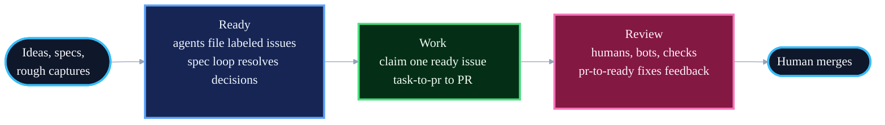

# Blueprint

Coding agents don't fail for lack of intelligence. They fail for lack of process: no spec, no plan, no tests, no review, just a confident 2,000-line PR nobody asked for. Blueprint fixes the process and trusts the intelligence.

It encodes how strong engineering teams ship: design when architecture is unclear, write specs when behavior or interfaces need review, plan when work needs splitting, test before ship, and review before merge. Core skills, plus two small Git helpers, let you run one step yourself or take tickets all the way to PRs ready for review.

Blueprint is deliberately small. No ceremony, no mazes of rules, no thousand-line process files before work starts. A short skill is easier for an agent to follow.

## Principles

- **Encode process, not knowledge.** Skills say what to do. Blueprint turns outside information into clear instructions for coding agents; it is not an issue tracker, review board, or release process.
- **Verification is non-negotiable.** Tests prove the requested behavior. Browser-rendered work is checked in a real browser. Review checks the proof is real.
- **Bet on the model.** Use clear instructions, not heavy rules.
- **Density over length.** Every word competes for attention. Keep limits, names, commands, paths, and examples that matter; cut everything else.
- **Focused skills, not big catalogues.** Saying no is the discipline.
- **Specs are prompts with weight.** Planning happens in the systems teams already use; Blueprint turns that background into the instruction an agent needs. Once the code is right, the spec's job is done.

## The Flow


**If implementation reveals the instructions are wrong, stop.** Update the task, spec, or plan, then continue from the updated source. Do not push through stale instructions. Clarifying costs minutes; pushing through wrong instructions costs the rest of the feature.

**Tests are the default proof.** The request or spec defines what to test. The implementation adds tests that prove the requirements. Browser-rendered work also gets checked with `browser-verify`. `task-to-pr` checks each acceptance criterion before opening the PR. Review checks that the proof is real. If you want stronger code review rules, write them into `REVIEW.md`; the review skill will pick them up.

## The Loops

Most skills are steps: one phase, one human checkpoint. Four skills chain the steps into end-to-end loops:

| Skill         | From                     | To                                                                         |
| ------------- | ------------------------ | -------------------------------------------------------------------------- |
| `task-to-pr`  | a ticket                 | a PR ready for review, with code, tests, another review, acceptance checks, and proof |
| `milestone`   | a GitHub milestone       | every open issue completed through `task-to-pr`, one PR at a time |
| `multitask`   | several tickets          | several PRs ready for review, one separate worker per ticket or dependent group |
| `pr-to-ready` | an open PR with human, bot, or check feedback | a PR that is ready to merge, with checks passing |

Loops keep the ticket updated as they work: status moves, comments with proof, and PR links. They stop at human checkpoints. Merging is always a human decision.

`task-to-pr` is the single-ticket loop: it reads the ticket, creates a branch, implements the acceptance criteria, reviews the diff, checks acceptance, opens a PR ready for review, handles current feedback, and writes proof back to the ticket.

`milestone` is the release-slice loop: it reads open issues in a GitHub milestone, orders them by dependency and risk, then runs `task-to-pr` for each issue. It stops for human merge unless merge permission was explicit. When merging is allowed, it merges only after checks and review are clean, syncs the default branch, then continues.

`multitask` is the coordinator-worker loop for several tickets at once: it groups dependent work, starts one isolated worker per ticket, and reports each PR or blocker. The coordinator never edits code. See [guides/multitask.md](guides/multitask.md) for how it splits and coordinates work.

## Running Unattended

The loops above still start when you invoke them. They can also run on a schedule over an issue tracker, with agents filing every issue. Work moves through three phases:



1. **Ready**: turn ideas and specs into issues a new agent can do. The agent filing an issue judges it at creation: decided work gets `agent:ready`; real work with open decisions gets `needs:spec`, and the spec loop turns it into a reviewed spec. Nothing unjudged enters the tracker.
2. **Work**: a scheduled agent claims one `agent:ready` issue and runs `task-to-pr` to a PR ready for review, with the ticket as the work record. The loop throttles itself on review capacity: when too many agent PRs await review, it stops starting new work.
3. **Review**: humans, review bots, and checks leave feedback. A review-watch loop runs `pr-to-ready` after a short grace window, repeats until the PR is ready or blocked, and a human merges.

Humans do three things: flip `needs:spec` to `agent:ready` after reviewing a spec, review PRs when judgment is needed, and merge. Agents do everything else.

The definition of ready and the label state machine live in [AGENTS.md](AGENTS.md); setup, triggers, and copy-pasteable loop prompts live in [guides/loops.md](guides/loops.md). For an attended Codex coordinator that works through a small issue set, see [guides/codex-coordinator.md](guides/codex-coordinator.md).

## Install

```bash
npx skills add owainlewis/blueprint
```

This is the supported setup path; Blueprint does not maintain per-tool skill installation guides. Invoke skills by name (`spec`, `plan`, `implement`, ...) or through your agent's skill picker.

`browser-verify` requires an available real-browser automation and inspection path. Chrome DevTools MCP is one supported setup:

```bash
claude mcp add chrome-devtools --scope user npx chrome-devtools-mcp@latest
codex mcp add chrome-devtools -- npx chrome-devtools-mcp@latest
```

Update Blueprint and your installed skills with:

```bash
npx skills update
```

## Skills

| Phase        | Skill               | What it does                                                                                                     | Example                                      |
| ------------ | ------------------- | ----------------------------------------------------------------------------------------------------------------- | -------------------------------------------- |
| **Design**   | `design-doc`        | Writes `docs/<design-slug>/design.md`: architecture, options, tradeoffs, and risks                                | `Write a design doc for multi-tenant auth`   |
| **Define**   | `spec`              | Writes `docs/<feature-slug>/spec.md`: requirements, interfaces, data shapes, and implementation design            | `Write a spec for user-auth`                 |
| **Plan**     | `plan`              | Breaks a spec, brief, or request into tasks sized for agents, review, and rollback                               | `Create a plan for user-auth`                |
| **Goal**     | `goal-design`       | Writes Codex and Claude Code `/goal` prompts with clear checks, proof, and stop rules                            | `Write a goal for this ticket-to-PR task`    |
| **Build**    | `implement`         | Executes one task with tests and checks                                                                           | `Implement LIN-123 from user-auth`           |
| **Build**    | `tdd`               | Implements behavior test-first                                                                                    | `Use TDD for retry logic in the API client`  |
| **Debug**    | `debug`             | Finds the root cause of a failure, fixes it test-first when practical, and leaves a regression test              | `Debug the failing retry test`               |
| **Improve**  | `refactor`          | Improves code shape without changing behavior                                                                     | `Refactor the current diff`                  |
| **Review**   | `review`            | Reviews code changes for correctness, security, simplicity, robustness, and tests                                | `Review the current diff`                    |
| **Deliver**  | `task-to-pr`        | Runs the loop from ticket to PR: implement, test, review, check acceptance, open the PR, update the ticket with proof | `task-to-pr LIN-123`                    |
| **Deliver**  | `milestone`         | Completes a GitHub milestone through `task-to-pr`, one issue and PR at a time                                    | `milestone https://github.com/org/repo/milestone/1` |
| **Deliver**  | `multitask`         | Coordinates several tickets to PRs at once, one isolated worker per ticket                                        | `multitask LIN-101 LIN-102 LIN-103`          |
| **Deliver**  | `pr`                | Commits intended changes, pushes the branch, and opens a clear PR                                                 | `Open a PR for this change`                  |
| **Feedback** | `pr-to-ready`       | Inspects live PR state, fixes actionable feedback, verifies checks, and reports merge readiness; never merges     | `Is PR #42 ready to merge?`                  |
| **Browser**  | `browser-verify`    | Verifies rendered UI, HTML, visual docs, and browser-facing behavior in a real browser                            | `Browser-verify the local HTML report`       |

Helper entry points, not core workflows; they stay installable so `task-to-pr`, `milestone`, `multitask`, and `pr` can expose the full delivery path consistently:

| Skill    | What it does                                                      | Example                                 |
| -------- | ------------------------------------------------------------------ | ---------------------------------------- |
| `branch` | Creates a Git branch with the ticket ID when available            | `Create a branch for LIN-123 user-auth` |
| `commit` | Stages intended changes and writes one clear Conventional Commit  | `Commit the current changes`            |

Renamed and removed skills are listed in [CHANGELOG.md](CHANGELOG.md).

## Agent Instructions

Blueprint creates instructions for agents. Sometimes that instruction is a one-sentence prompt. Sometimes it is an issue tracker item. Sometimes it is a design doc or markdown spec in the repo. The format should match the work.

Design docs default to `docs/<design-slug>/design.md`: a short architecture doc for unclear decisions, options, tradeoffs, and risks.

One spec lives at `docs/<feature-slug>/spec.md`. Requirements flow into it; the spec is the file that brings background into the codebase.

Plans are temporary. They go to exactly one place: tracker issues when you ask or the repo runs without a human present, `docs/<feature-slug>/plan.md` when there is a feature directory, or chat. When tasks go to the tracker, no plan doc is written; the issues are the plan.

Use the full pipeline for work that touches interfaces, schemas, multiple files, or behavior that must not change. For trivial changes, just do them. For exploration, explore without making fake specs, plans, or issue tracker entries.

## Examples

The [examples/](examples/) folder shows sample Blueprint files.

Design doc example:

- [dispatch-control-plane/design.md](examples/dispatch-control-plane/design.md): a design doc for Dispatch's local agent control plane architecture

Spec and plan examples for a Python RAG chatbot API:

1. [input.md](examples/input.md): rough project notes
2. [spec.md](examples/rag-chatbot/spec.md): the spec
3. [plan.md](examples/rag-chatbot/plan.md): ordered tasks

## Learn More

Blueprint is built and discussed in the AI Engineer community: https://www.skool.com/aiengineer
