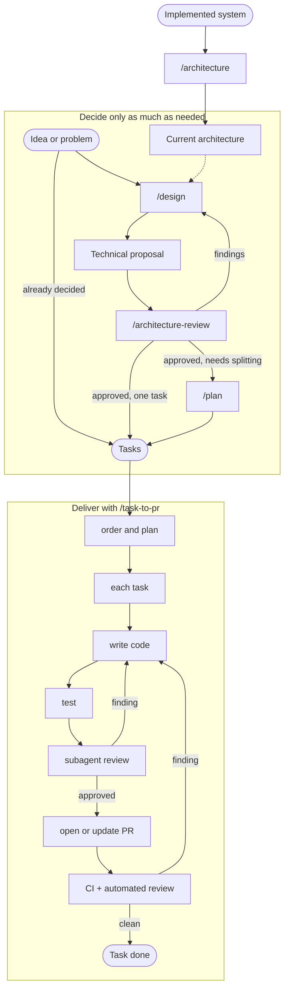

<div align="center">

# Blueprint

**A small set of instructions for AI coding.**

</div>

Blueprint helps agents decide what to build, make focused changes, test them, get an independent review, and open pull requests.

## Start with the work, not the process

Choose the first skill based on what you need.

| If you need to… | Start with | Result |
| --- | --- | --- |
| Explain, document, or audit how an implemented system works | `/architecture` | A checked explanation of how the system works now |
| Specify a feature or change to part of a system | `/design` | A proposed technical design |
| Challenge a technical proposal before implementation | `/architecture-review` | Material flaws, open questions, and a verdict |
| Split a decided feature into work for several agent runs | `/plan` | Ordered tasks in chat or tracker tickets |
| Deliver one or more tasks | `/task-to-pr` | One tested and reviewed pull request per task |
| Prove a change works | `/test` | Acceptance criteria mapped to evidence |
| Review an implementation change | `/review` | Findings and a pre-merge verdict from a fresh subagent |
| Simplify existing code without changing behavior | `/improve` | Clearer, smaller, better-structured code |

Small, decided work can go straight to `/task-to-pr`. Use `/architecture` for the system as it works now. Use `/design` to write a proposal and `/architecture-review` to challenge important technical choices before implementation. The proposal may be in a design, RFC, ADR, architecture document, or issue. Use `/plan` only when the work needs splitting.

## How Blueprint fits together


```mermaid
flowchart TB
    Existing([Implemented system]) --> Architecture["/architecture"]
    Architecture --> Current["Current architecture"]

    subgraph Decide["Decide only as much as needed"]
        Idea([Idea or problem]) --> Design["/design"]
        Idea -->|already decided| Tasks([Tasks])
        Current -.-> Design
        Design --> Proposal["Technical proposal"] --> ArchitectureReview["/architecture-review"]
        ArchitectureReview -->|findings| Design
        ArchitectureReview -->|approved, one task| Tasks
        ArchitectureReview -->|approved, needs splitting| Plan["/plan"] --> Tasks
    end

    subgraph Deliver["Deliver with /task-to-pr"]
        Tasks --> Order["order and plan"] --> Task["each task"] --> Code["write code"] --> Test["test"] --> Review["subagent review"]
        Review -->|finding| Code
        Review -->|approved| PR["open or update PR"] --> Automated["CI + automated review"]
        Automated -->|finding| Code
        Automated -->|clean| Done([Task done])
    end
```

Use `/architecture` when you need to understand or document existing code. Use `/improve` to simplify code without changing what it does. Not every change needs either skill.

The model has two layers:

1. **Repository instructions define policy.** `AGENTS.md` says what good work means in a codebase.
2. **Skills define each kind of work.** Each skill produces one clear result and has a clear stopping point. `/task-to-pr` joins the steps needed to deliver code.

## The seven phase skills

| Skill | Owns | Stops when |
| --- | --- | --- |
| `/architecture` | A checked explanation of the current system, its rules, parts, flows, boundaries, operations, and limits | The explanation is ready for human review |
| `/design` | A spec for a proposed feature or system change | The proposed design is ready for review |
| `/architecture-review` | Independent review of a technical proposal's goal, clarity, choices, risks, limits, and proof | Findings, open questions, and a verdict are reported |
| `/plan` | Ordered tasks that each deliver working behavior, plus useful milestones | The work is ready to hand off |
| `/test` | Automated checks, failure paths, and real-browser proof when relevant | Every criterion is pass, fail, or explicitly unverified |
| `/review` | Independent review of an implementation's correctness, security, regressions, complexity, and proof | Findings and a verdict are reported |
| `/improve` | Behavior-preserving simplification of existing code | Relevant checks prove behavior was preserved |

Writing code is a basic agent ability, not a separate skill. Branching, committing, debugging, browser checks, and feedback are steps inside a workflow.

## Tasks to pull requests

[`skills/task-to-pr/SKILL.md`](skills/task-to-pr/SKILL.md) is the single authority for delivery. It accepts one or more tasks, tickets, pull requests, or a milestone. It waits for prerequisite pull requests to merge, can run independent tasks at the same time, and creates one pull request for each task.

For each task, it:

1. creates or reuses a branch and worktree from the latest default branch;
2. writes and tests the code;
3. asks a fresh subagent that did not write the code to review it;
4. opens or updates a pull request with a short summary and proof;
5. waits for configured CI and automated code review, then fixes, reviews, and replies to every finding.

It leaves pull requests open unless the user asks to merge them.

## Install

Install all eight skills:

```bash
npx skills add owainlewis/blueprint
```

Upgrading from the older set of skills? Follow the [migration guide](MIGRATION.md). A normal update may leave removed skills installed, so the cleanup step matters.

## Repository map

```text
skills/                 seven phase skills and one delivery workflow skill
AGENTS.md                portable repository policy
CLAUDE.md                Claude Code adapter
REVIEW.md                review standard for Blueprint itself
MIGRATION.md             clean upgrade from the old skill set
examples/                reviewed design and planning examples
```

## Examples

The RAG chatbot example follows one idea through the decision flow:

1. [rough project notes](examples/input.md)
2. [reviewed design](examples/rag-chatbot/design.md)
3. [captured chat plan](examples/rag-chatbot/plan.md)

For a larger system-part specification, read the [Dispatch local control-plane design](examples/dispatch-control-plane/design.md).

## Principles

- **Give agents the goal and the rules.** Give agents outcomes, constraints, and proof. Trust them with local mechanics.
- **One skill per phase or delivery outcome.** Skills share one installation and invocation model.
- **Separate current state from proposals.** Architecture documents describe verified implemented reality. Design documents specify future changes.
- **Keep changes reviewable.** Deliver one focused outcome and its proof. A reviewer should not need to separate unrelated work. Keep refactoring separate when it would hide the behavior change.
- **Review choices before code.** Surface material ambiguity and ask for a simpler design when it can deliver the same result with less state, indirection, duplication, or operational work.
- **Review implementation independently.** Check correctness and proof. Do not block on personal taste.
- **Proof is part of the work.** Test changed behavior and affected failure paths. Test behavior that a refactor must preserve. If automated tests cannot exercise the behavior, explain why and give other evidence.
- **Use the real surface.** Browser behavior is checked in a browser. Live PR feedback is read from the PR.
- **Fix the original instruction.** If implementation exposes a bad requirement, update the task or design before continuing.
- **Prefer less.** Keep the smallest complete change, shortest useful instruction, and no duplicate ways to start the same work.
- **Keep irreversible judgment human.** Agents prepare the decision. Humans review designs and merge pull requests unless they explicitly delegate it.

Blueprint is not an issue tracker, agent framework, release system, or reviewer-persona library. It is a compact engineering process for capable coding agents.
