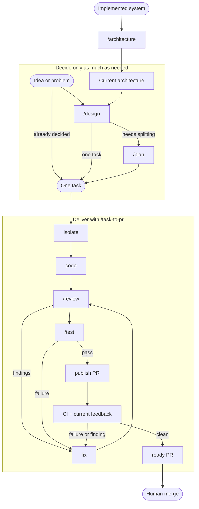

<div align="center">

# Blueprint

**A small set of instructions for AI coding.**

</div>

Blueprint helps agents decide what to build, make one focused change, test it, get an independent review, and open a pull request for a human to merge.

## Start with the work, not the process

Choose the first skill based on what you need.

| If you need to… | Start with | Result |
| --- | --- | --- |
| Explain, document, or audit how an implemented system works | `/architecture` | A checked explanation of how the system works now |
| Specify a feature or change to part of a system | `/design` | A reviewed spec for a proposed change |
| Split a decided feature into work for several agent runs | `/plan` | Ordered tasks in chat or tracker tickets |
| Take one task through delivery | `/task-to-pr` | A tested and reviewed pull request, ready for human merge |
| Complete every issue in a GitHub milestone | `/milestone` | One ready pull request per issue, with human merge checkpoints |
| Prove a change works | `/test` | Acceptance criteria mapped to evidence |
| Get an independent second opinion | `/review` | Findings and a pre-merge verdict from a fresh subagent |
| Simplify existing code without changing behavior | `/improve` | Clearer, smaller, better-structured code |

Small, decided work can go straight to `/task-to-pr`. Use `/architecture` for the system as it works now. Use `/design` when a proposed change needs review. Use `/plan` only when the work needs splitting.

## How Blueprint fits together


```mermaid
flowchart TB
    Existing([Implemented system]) --> Architecture["/architecture"]
    Architecture --> Current["Current architecture"]

    subgraph Decide["Decide only as much as needed"]
        Idea([Idea or problem]) --> Design["/design"]
        Idea -->|already decided| Task([One task])
        Current -.-> Design
        Design -->|one task| Task
        Design -->|needs splitting| Plan["/plan"] --> Task
    end

    subgraph Deliver["Deliver with /task-to-pr"]
        Task --> Isolate["isolate"] --> Code["code"] --> Review["/review"] --> Test["/test"]
        Review -->|findings| Fix["fix"] --> Review
        Test -->|failure| Fix
        Test -->|pass| Publish["publish PR"] --> Validate["CI + current feedback"]
        Validate -->|failure or finding| Fix
        Validate -->|clean| PR["ready PR"]
    end

    PR --> Merge([Human merge])
```

Use `/architecture` when you need to understand or document existing code. Use `/improve` to simplify code without changing what it does. Not every change needs either skill.

The model has two layers:

1. **Repository instructions define policy.** `AGENTS.md` says what good work means in a codebase.
2. **Skills define each kind of work.** Each skill produces one clear result and has a clear stopping point. `/task-to-pr` and `/milestone` join the needed steps.

## The six phase skills

| Skill | Owns | Stops when |
| --- | --- | --- |
| `/architecture` | A checked explanation of the current system, its rules, parts, flows, boundaries, operations, and limits | The explanation is ready for human review |
| `/design` | A spec for a proposed feature or system change | The spec is ready for human review |
| `/plan` | Ordered tasks that each deliver working behavior, plus useful milestones | The work is ready to hand off |
| `/test` | Automated checks, failure paths, and real-browser proof when relevant | Every criterion is pass, fail, or explicitly unverified |
| `/review` | Independent review of correctness, security, regressions, complexity, and proof | Findings and a verdict are reported |
| `/improve` | Behavior-preserving simplification of existing code | Relevant checks prove behavior was preserved |

Writing code is a basic agent ability, not a separate skill. Branching, committing, debugging, browser checks, and feedback are steps inside a workflow.

## One task to one pull request

[`skills/task-to-pr/SKILL.md`](skills/task-to-pr/SKILL.md) is the single authority for delivery. Given a ticket, task, or existing PR, it:

1. codes one focused change in an isolated worktree;
2. gets a fresh independent review;
3. proves the change with tests;
4. opens a pull request;
5. waits for CI and feedback, then repeats review and tests after code changes.

It stops when the pull request is ready for human merge. It never merges without explicit permission.

## One milestone to completed issues

`/milestone` reads a GitHub milestone and orders open issues by dependency and risk. It runs `/task-to-pr` for one issue at a time. It stops for human merge after each ready pull request unless the user explicitly allows merging for that run.

## Install

Install all eight skills:

```bash
npx skills add owainlewis/blueprint
```

Upgrading from the older set of skills? Follow the [migration guide](MIGRATION.md). A normal update may leave removed skills installed, so the cleanup step matters.

## Repository map

```text
skills/                 six phase skills and two delivery workflow skills
AGENTS.md                portable repository policy
CLAUDE.md                Claude Code adapter
REVIEW.md                review standard for Blueprint itself
MIGRATION.md             clean upgrade from the old skill set
examples/                reviewed design and planning examples
```

## Examples

The RAG chatbot example follows one idea through the decision flow:

1. [rough project notes](examples/input.md)
2. [reviewed design](examples/rag-chatbot/design.md)
3. [captured chat plan](examples/rag-chatbot/plan.md)

For a larger system-part specification, read the [Dispatch local control-plane design](examples/dispatch-control-plane/design.md).

## Principles

- **Give agents the goal and the rules.** Give agents outcomes, constraints, and proof. Trust them with local mechanics.
- **One skill per phase or delivery outcome.** Skills share one installation and invocation model.
- **Separate current state from proposals.** Architecture documents describe verified implemented reality. Design documents specify future changes.
- **Keep changes reviewable.** Deliver one focused outcome and its proof. A reviewer should not need to separate unrelated work. Keep refactoring separate when it would hide the behavior change.
- **Use clear review standards.** Check correctness. Ask for a simpler design when it can deliver the same result with less state, indirection, duplication, or operational work. Do not block on personal taste.
- **Proof is part of the work.** Test changed behavior and affected failure paths. Test behavior that a refactor must preserve. If automated tests cannot exercise the behavior, explain why and give other evidence.
- **Use the real surface.** Browser behavior is checked in a browser. Live PR feedback is read from the PR.
- **Fix the original instruction.** If implementation exposes a bad requirement, update the task or design before continuing.
- **Prefer less.** Keep the smallest complete change, shortest useful instruction, and no duplicate ways to start the same work.
- **Keep irreversible judgment human.** Agents prepare the decision. Humans review designs and merge pull requests unless they explicitly delegate it.

Blueprint is not an issue tracker, agent framework, release system, or reviewer-persona library. It is a compact engineering process for capable coding agents.
