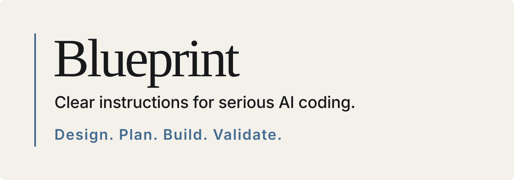

<div align="center">



# Blueprint

**Design. Plan. Build. Validate.**

[Why Blueprint](#why-blueprint) · [Install](#install) · [Choose a skill](#choose-a-skill) · [Read the guides](#guides) · [Contribute](CONTRIBUTING.md)

</div>

Blueprint gives capable coding agents a clear engineering process without turning every change into ceremony. It separates understanding existing code, deciding what to build, and delivering reviewed pull requests.

## Why Blueprint

Agents keep getting better. They need clear standards and useful workflows, not a script for every move.

Blueprint turns long-standing software engineering practice into a small set of skills: understand the system, make decisions before expensive changes, keep each task focused, test the result, and review the work. The skills say what good work looks like and what evidence is needed. They leave the mechanics to the agent.

The set is deliberately small. It contains the core skills its maintainer uses every day to build professional software. There is no agent framework or elaborate setup to maintain. Install the skills and use only the ones the work needs.

## Install

Install all ten skills with one command:

```bash
npx skills add \
  owainlewis/blueprint
```

That is the main installation path. Blueprint works through portable skill files, so the same repository can support Codex, Claude Code, and other compatible coding agents without separate plugin workflows.

## Choose a skill

Most work starts in one of these places:

- **Document an implemented system.** Use [`/architecture`](skills/architecture/SKILL.md) to create or update root `ARCHITECTURE.md` from verified code.
- **Decide how a meaningful change should work.** Start with [`/design`](skills/design/SKILL.md) for a technical design ready for review.
- **Deliver a decided task.** Start with [`/task-to-pr`](skills/task-to-pr/SKILL.md) for a tested, independently reviewed pull request.

Use [`/plan`](skills/plan/SKILL.md) when decided work needs splitting. Use [`/codex-issue-coordinator`](skills/codex-issue-coordinator/SKILL.md) when one Codex task must coordinate a large batch of GitHub issues.

Small, clear changes can go straight to `/task-to-pr`. Blueprint asks for only as much process as the work needs.

## Ten focused skills

- **Document:** [`/architecture`](skills/architecture/SKILL.md)
- **Decide:** [`/design`](skills/design/SKILL.md), [`/architecture-review`](skills/architecture-review/SKILL.md), [`/plan`](skills/plan/SKILL.md)
- **Deliver:** [`/task-to-pr`](skills/task-to-pr/SKILL.md), [`/codex-issue-coordinator`](skills/codex-issue-coordinator/SKILL.md)
- **Check and improve:** [`/test`](skills/test/SKILL.md), [`/review`](skills/review/SKILL.md), [`/improve`](skills/improve/SKILL.md)
- **Present:** [`/html-doc`](skills/html-doc/SKILL.md)

Each skill owns one engineering phase or useful outcome. Repository policy stays in `AGENTS.md`. Writing code, branching, debugging, and committing remain normal agent abilities inside the delivery workflow.

## Guides

- [Choosing the right skill](guides/choosing-a-skill.md) explains where each skill starts and stops.
- [Common Blueprint workflows](guides/workflows.md) shows how the skills fit together for small changes, larger features, existing systems, and issue batches.
- [Examples](examples/) contains reviewed designs and plans you can inspect or reuse.
- [Migration guide](MIGRATION.md) explains how to remove older Blueprint skills before upgrading.
- [Changelog](CHANGELOG.md) records notable changes.

## Project

Blueprint is deliberately small. It is not an issue tracker, an agent runtime, or a release system. It gives coding agents clear instructions for deciding, building, testing, and reviewing software.

Contributions are welcome. Read [CONTRIBUTING.md](CONTRIBUTING.md) before opening a pull request. Security problems should follow [SECURITY.md](SECURITY.md).

Released under the [MIT License](LICENSE).
