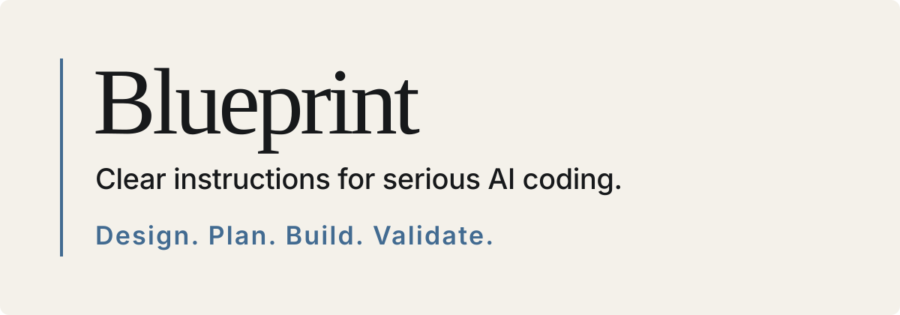

<div align="center">



# Blueprint

**Design. Plan. Build. Validate.**

[Why Blueprint](#why-blueprint) · [Install](#install) · [Choose a skill](#choose-a-skill) · [Read the guides](#guides) · [Contribute](CONTRIBUTING.md)

</div>

Blueprint gives coding agents twelve focused skills. They cover understanding
existing code, deciding what to build, and delivering reviewed pull requests.

## Why Blueprint

Capable agents do not need a script for every move. They need a clear outcome,
the constraints that matter, and proof that the work is done.

Define the product and architecture, specify each meaningful change, then deliver it with tests and review. Each skill gives the agent an outcome and the evidence needed to finish.

Use only the skills the work needs. Small, decided changes can go straight to delivery.

## Install

Install all twelve skills with one command:

```bash
npx skills add \
  owainlewis/blueprint
```

That is the main installation path. Blueprint works through portable skill files, so the same repository can support Codex, Claude Code, and other compatible coding agents without separate plugin workflows.

## Choose a skill

**New project:** use [`/requirements`](skills/requirements/SKILL.md) and [`/architecture`](skills/architecture/SKILL.md). Root `REQUIREMENTS.md` describes the product and its key features. Root `ARCHITECTURE.md` describes the intended technical design, data model, and architecture and data flow diagram. Maintain both as long-running project documents.

**New feature:** use [`/spec`](skills/spec/SKILL.md), then [`/task-to-pr`](skills/task-to-pr/SKILL.md) or [`/factory`](skills/factory/SKILL.md). The spec is the ticket. Both delivery skills make the code changes, test, independently review, pass CI, and repair valid findings. `/task-to-pr` leaves passing PRs open. Explicit `/factory` use adds merging after required approvals and merge gates pass.

Use [`/architecture-review`](skills/architecture-review/SKILL.md) for consequential technical decisions and [`/plan`](skills/plan/SKILL.md) when work needs splitting. Small, decided changes can go straight to delivery. Use [`/codex-issue-coordinator`](skills/codex-issue-coordinator/SKILL.md) for large GitHub issue batches across visible Codex workers.

## Twelve focused skills

- **Define:** [`/requirements`](skills/requirements/SKILL.md), [`/architecture`](skills/architecture/SKILL.md), [`/spec`](skills/spec/SKILL.md)
- **Decide and split:** [`/architecture-review`](skills/architecture-review/SKILL.md), [`/plan`](skills/plan/SKILL.md)
- **Deliver:** [`/task-to-pr`](skills/task-to-pr/SKILL.md), [`/factory`](skills/factory/SKILL.md), [`/codex-issue-coordinator`](skills/codex-issue-coordinator/SKILL.md)
- **Check and improve:** [`/test`](skills/test/SKILL.md), [`/review`](skills/review/SKILL.md), [`/improve`](skills/improve/SKILL.md)
- **Present:** [`/html-doc`](skills/html-doc/SKILL.md)

Each skill owns one engineering phase or delivery outcome. Repository policy stays in `AGENTS.md`. Writing code, branching, debugging, and committing remain normal agent abilities inside delivery.

## Guides

- [Choosing the right skill](guides/choosing-a-skill.md) explains where each skill starts and stops.
- [Common Blueprint workflows](guides/workflows.md) shows how the skills fit together for small changes, larger features, existing systems, and issue batches.
- [Consulting CRM example](examples/) shows requirements, architecture and data flow, a feature spec, and a plan with vertical slices.
- [Migration guide](MIGRATION.md) explains how to remove older Blueprint skills before upgrading.
- [Changelog](CHANGELOG.md) records notable changes.

## Project

Blueprint is deliberately small. It is not an issue tracker, an agent runtime, or a release system. It gives coding agents clear instructions for deciding, building, testing, and reviewing software.

Contributions are welcome. Read [CONTRIBUTING.md](CONTRIBUTING.md) before opening a pull request. Security problems should follow [SECURITY.md](SECURITY.md).

Released under the [MIT License](LICENSE).
