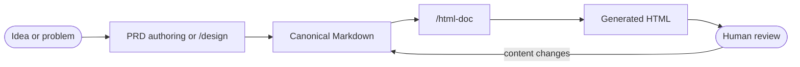

# HTML PRD and design document skill

> **Status:** Proposed for review

## 1. Executive summary

Add an `/html-doc` skill that turns an existing Markdown product requirements document (PRD) or technical design into a clear, static HTML document. The Markdown file remains the source of truth. The HTML adds navigation, stronger visual hierarchy, useful callouts, readable diagrams, responsive layout, and print styles without changing the document's meaning.

The skill is a presentation step, not another product or technical design workflow. This avoids competing with `/design` and prevents requirements from changing during rendering. The main downside is a second file that can drift from its source. The generated page records the source path and content hash, and the skill regenerates rather than edits HTML by hand.

## 2. Context and scope

Markdown is good for writing and source review. Long PRDs and design documents are harder to scan in raw form because summaries, decisions, requirements, risks, diagrams, and open questions have similar visual weight.

The new skill accepts a Markdown file or exact Markdown supplied in the request. It creates one sibling HTML file for people to read in a browser, print, or attach to a review. It preserves all source content and order while changing its presentation.

This design covers PRDs and proposed technical designs. It does not decide product requirements, settle technical choices, host documents, or replace the Markdown source.

## 3. System context



The authoring step owns meaning. `/html-doc` owns presentation. Review comments that change behavior, scope, requirements, or decisions go back into the Markdown source before the page is regenerated.

## 4. Proposed design

### How it works

A user invokes `/html-doc` with a Markdown path and may state whether it is a PRD or design document. The skill reads the complete source and detects the kind only when the user did not provide it. It refuses to guess when the structure is ambiguous.

The skill copies the bundled HTML template to a sibling output such as `docs/payments/prd.html`. It maps the source into semantic HTML in the same order. It adds a document header, status and source metadata, a linked table of contents, and presentation treatments based on section meaning. Unknown sections remain normal sections and are never dropped.

The page uses semantic HTML, inline CSS, and no runtime JavaScript. Mermaid diagrams become sanitized inline SVG during generation and retain an accessible text description. The result works as a local file without a server or network connection.

The skill opens the result in a real browser. It checks desktop and mobile widths, keyboard navigation, diagrams, long tables, code blocks, links, and print preview. It compares the rendered content with the source. It fixes presentation defects in the generated file or template, but sends content defects back to the source.

### Page structure

```text
+------------------------------------------------------------------+
| Document kind  Status                          Source and revision |
| Title                                                            |
| Existing summary from the source                                 |
+-------------------+----------------------------------------------+
| Contents          | Main document                                |
| 1. Problem        |                                              |
| 2. Goals          | Clear section rhythm                         |
| 3. Requirements   | Decision, risk, and question callouts        |
| ...               | Readable tables, code, and diagrams          |
|                   |                                              |
+-------------------+----------------------------------------------+
| Source path and generator version                                |
+------------------------------------------------------------------+
```

On narrow screens, the contents move above the document and the page becomes one column. Print hides navigation and source-control details that do not help the paper reader. Visual callouts use a label, border, icon or shape, and text so color is never the only signal.

### Components and responsibilities

| Component | Owns | Depends on | Does not own |
| --- | --- | --- | --- |
| `SKILL.md` | Input rules, generation workflow, parity checks, browser proof, and stop condition | Repository policy and supplied source | Product or technical decisions |
| HTML template | Page structure, design tokens, responsive layout, print rules, and accessibility defaults | Browser standards | Document content |
| Generated HTML | One reviewable view of one source revision | Markdown source and template | Canonical content or later edits |
| Markdown source | All claims, requirements, decisions, and document order | Its authoring workflow | Browser presentation |

### Decisions

**Keep Markdown canonical.** A paired Markdown and HTML document makes writing, diffing, and agent review simple while giving humans a better reading surface. Making HTML canonical would improve direct presentation but make content changes harder to inspect and merge.

**Make the skill presentation-only.** `/design` already owns technical design in this repository. Letting `/html-doc` also settle requirements or architecture would create two conflicting workflows. A user with only a rough idea must first supply or create the source document.

**Generate a static, offline page.** The output uses inline CSS and generated inline SVG with no fonts, scripts, images, or style sheets fetched at runtime. This makes a file easy to share and avoids broken pages behind network or content-security restrictions. It costs more generation work than loading a web framework.

**Use one restrained visual system for both document kinds.** Both layouts share typography, spacing, navigation, metadata, tables, code, and print behavior. PRDs emphasize users, goals, requirements, and measures. Designs emphasize system context, decisions, invariants, interfaces, failures, and risks. Separate templates would drift and add little value.

**Preserve source order and wording.** Presentation treatments may group a heading with its own content, but may not summarize, rewrite, rank, or omit source claims. This keeps the HTML trustworthy. A separate executive overview may appear only when that overview exists in the source.

## 5. Invariants and requirements

### Invariants

1. Every source heading and content block appears once in the HTML and in the same order.
2. The HTML introduces no new requirement, decision, claim, priority, or status.
3. Content changes happen in Markdown, followed by regeneration. Generated HTML is not hand-edited.
4. The generated page needs no network connection at read time.
5. Navigation, reading order, and meaning remain usable without color, a mouse, or a wide screen.
6. The page identifies the exact source content revision from which it was generated.

### Requirements

- Accept a repository-relative or absolute Markdown path. Also accept exact inline Markdown when the user explicitly provides the full document.
- Support `prd` and `design` document kinds. Prefer an explicit kind and use heading-based detection only when unambiguous.
- Write `<source-basename>.html` beside the source by default. Accept an explicit output path.
- Leave the Markdown source unchanged.
- Show title, document kind, status when supplied, source path, and a SHA-256 source hash in the page header.
- Add a linked table of contents for second-level and third-level headings.
- Give stable, readable anchor IDs to headings and deduplicate repeated headings with numeric suffixes.
- Render Markdown paragraphs, emphasis, links, lists, tasks, tables, blockquotes, code, and fenced diagrams without data loss.
- Use specific treatments for summary, goals, non-goals, requirements, acceptance criteria, decisions, invariants, failures, risks, and open questions when those sections exist.
- Include responsive styles for a 390-pixel viewport and a print stylesheet for A4 and US Letter.
- Use no external runtime assets and no runtime JavaScript.
- Verify the result in a real browser before reporting completion.

## 6. Interfaces and data

The skill accepts these request shapes:

```text
/html-doc docs/billing/prd.md
/html-doc docs/billing/design.md as design
/html-doc docs/billing/design.md --out artifacts/billing-design.html
```

The syntax describes intent rather than a shell command. The skill resolves paths from the repository root, unless the user gives an absolute path.

The generated page includes machine-readable metadata:

```html
<meta name="document-kind" content="design">
<meta name="source-path" content="docs/billing/design.md">
<meta name="source-sha256" content="...">
<meta name="generator" content="blueprint/html-doc@1">
```

The visible header repeats the document kind, source path, and source status. It does not show a generation time because timestamps create noisy diffs without proving content identity.

Heading IDs use a lowercase ASCII slug made from visible heading text. Runs of other characters become one hyphen. Leading and trailing hyphens are removed. An empty result becomes `section`. Repeated IDs receive `-2`, `-3`, and so on in source order. Existing explicit IDs are preserved when they are valid and unique.

### Naming and identity

The source file path identifies the document. Its SHA-256 hash identifies the rendered revision. Renaming the source changes the default output path but not its content identity. If the source is missing or unreadable, the skill creates no output. Inline Markdown has no durable source path, so the skill requires an explicit output path and records `inline-input` as the source.

## 7. Failure behavior and lifecycle

- A missing, unreadable, or non-Markdown source stops generation and names the failed path.
- An ambiguous document kind stops generation and asks for `prd` or `design`.
- Invalid Markdown is preserved as visible text where safe. The skill reports the affected source location instead of silently dropping it.
- A diagram that cannot be rendered remains as a clearly labeled code block. The skill reports that browser proof is incomplete.
- Unsafe raw HTML is escaped by default. If the user explicitly permits trusted raw HTML, it is sanitized before inclusion.
- An existing output file is overwritten only when its generator metadata points to the same source path, or when the user explicitly chose that output. Otherwise the skill stops to avoid replacing unrelated work.
- A failed generation or browser check does not replace a previously valid output. Generation writes a temporary sibling file, verifies it, then moves it into place.
- Regeneration replaces the entire generated page. It never attempts to merge hand edits.
- The skill stops after the HTML passes parity and browser checks. It does not publish or host the file.

## 8. Security, privacy, and operations

Markdown is untrusted input. Text and attributes are HTML-escaped. Links allow `http`, `https`, `mailto`, relative paths, and fragment targets. Other URL schemes are rendered as text. External links use `rel="noopener noreferrer"`.

Generated SVG allows only the elements and attributes needed for diagrams. It excludes scripts, event attributes, embedded HTML, and remote resources. The page uses no runtime JavaScript. A restrictive content security policy blocks scripts, objects, frames, and network connections.

The skill reads one source file and writes one output file. A default maximum source size of 2 MiB prevents accidental rendering of generated data or logs. The skill stops with a clear error at that limit. It never sends document content to an external service.

## 9. Acceptance criteria

- Given representative PRD and design Markdown fixtures, the skill creates sibling HTML pages and leaves both sources byte-for-byte unchanged.
- Every source heading, paragraph, list item, table cell, code block, and diagram label appears once and in source order in the rendered document.
- The page header contains the correct kind, source path, status, and SHA-256 hash.
- Repeated, Unicode-only, and punctuation-only headings receive unique working anchors according to the naming rules.
- The table of contents links to every second-level and third-level heading.
- A generated page opens from disk with network access disabled and has no failed runtime resource requests.
- At 390, 768, and 1440 CSS pixels, text does not overlap, navigation remains usable, code scrolls within its container, and tables remain readable without widening the page.
- Keyboard-only navigation can reach the skip link, table of contents, document links, and section targets in a clear order with a visible focus indicator.
- Screen-reader inspection finds one page title, one `main` landmark, ordered headings without skipped levels introduced by the template, useful link names, and text alternatives for diagrams.
- Print preview on A4 and US Letter hides navigation, preserves headings with their first content block where practical, repeats table headers, and does not clip code or diagrams.
- Script tags, event attributes, unsafe URL schemes, embedded HTML, and remote SVG resources in a hostile fixture do not execute or enter the generated DOM.
- A browser check failure or interrupted generation leaves the previous verified output unchanged.
- An unrelated existing HTML file is not overwritten without explicit user direction.

## 10. Test approach

- Keep one compact PRD fixture and one compact design fixture containing every supported Markdown block and semantic section.
- Compare extracted normalized text and block order between each source and generated page. Separately assert source files are unchanged.
- Use hostile Markdown fixtures for raw HTML, unsafe links, SVG content, duplicate headings, deeply nested lists, wide tables, and long unbroken code.
- Serve nothing and disable browser networking while opening each output through a local file URL.
- Run browser checks at 390, 768, and 1440 CSS pixels. Capture screenshots for review and inspect overflow, focus order, landmarks, headings, anchors, and console errors.
- Open print preview for A4 and US Letter and inspect each page for clipping and isolated headings.
- Force diagram conversion, verification, and final replacement failures. Confirm that each failure is reported and that an earlier valid output remains byte-for-byte unchanged.
- Run the repository's skill review against the new instruction and template. Check that `/html-doc` stays a presentation outcome and does not duplicate PRD or design decisions.

## 11. Risks and tradeoffs

| Risk | Consequence | Mitigation |
| --- | --- | --- |
| Markdown and HTML drift | Reviewers read stale requirements | Record the source hash, regenerate whole files, and forbid hand edits |
| Visual treatment changes meaning | A callout can imply priority or status not present in source | Map only known section roles and preserve wording and order |
| Generated HTML creates noisy diffs | Pull requests become harder to review | Keep output deterministic and omit timestamps or random IDs |
| Complex Markdown exceeds the template | Content is clipped or dropped | Preserve unknown blocks plainly and prove parity with adversarial fixtures |
| Offline diagram generation varies by environment | A document can lose its clearest visual | Bundle or pin the generation path during implementation and retain labeled source fallback |

## 12. Open questions

- Should generated HTML be committed beside Markdown by default, or treated as a local review artifact? This changes repository policy and does not block implementing the skill.
- Which pinned diagram renderer can meet the offline, sanitization, and portability requirements without adding a large bundle? This blocks implementation of rendered Mermaid diagrams.
- Does the first version need exact text parity for inline formatting such as footnotes and definition lists, or may unsupported syntax remain in a source block? This blocks final fixture selection, not the basic workflow.

## 13. Out of scope

- Deciding PRD content, product priorities, or technical architecture
- Editing the Markdown source during presentation work
- A browser-based editor or review-comment system
- Hosting, publishing, access control, or analytics
- PDF generation
- Slide decks or marketing pages
- Live synchronization between Markdown and an open browser
