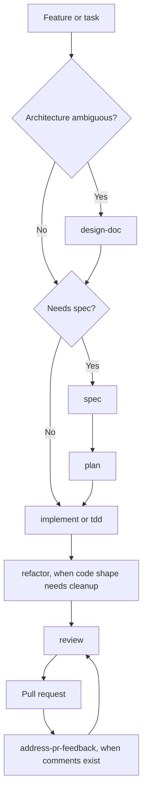
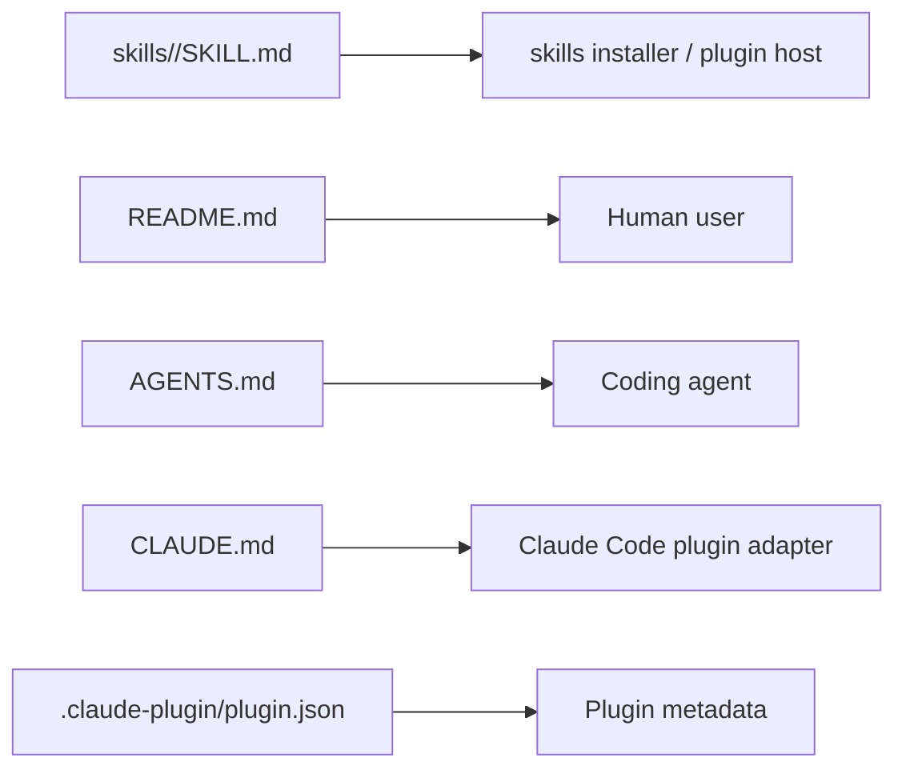

# Design: Blueprint Skill Expansion

## Status

Draft

## Summary

Blueprint needs a small set of new skills that cover architecture thinking, code cleanup, and PR review feedback without turning the project into a sprawling workflow catalogue. Add `design-doc`, `refactor`, and `address-pr-feedback` as focused skills with clear stopping points and update the public docs so agents and humans can discover them.

## Context and Scope

Blueprint encodes software engineering workflows as standalone skills in `skills/<name>/SKILL.md`. The existing flow covers spec, plan, implement, test-first implementation, review, browser verification, visual explanation, compression, branching, and committing.

The gap is after and before implementation:

- Before implementation, complex architecture choices need a lightweight artifact that captures tradeoffs before `spec`.
- After implementation, code sometimes needs behavior-preserving cleanup before review.
- After a PR opens, GitHub review comments need triage and valid fixes without blindly obeying every comment.

This design covers adding those three skills and wiring them into the README, repo agent instructions, Claude plugin metadata, and Claude adapter notes.

## Goals

- Add a `design-doc` skill for lightweight architecture design docs.
- Add a `refactor` skill for behavior-preserving code simplification.
- Add an `address-pr-feedback` skill for GitHub PR comment triage and fixes.
- Keep each skill dense, tool-agnostic, and useful to solo developers.
- Preserve Blueprint's existing principle: focused skills, not a broad catalogue.

## Non-Goals

- Create a full architecture review process.
- Add ADR or PRFAQ skills in this change.
- Add GitHub automation that posts replies, resolves threads, or pushes branches automatically.
- Replace `spec`; design docs feed into specs when architecture needs review first.
- Turn refactoring into feature work or broad cleanup.

## Constraints

- Skills should remain short enough for agents to follow reliably.
- New skills must live under `skills/<name>/SKILL.md` with YAML frontmatter.
- README and adapter docs must use the same skill names as the filesystem.
- The repo has no package manifest or executable test suite, so verification is documentation and metadata focused.
- `address-pr-feedback` should prefer GitHub tools when available but work with `gh` as a fallback.

## Proposed Design

Add three skills:

```text
skills/design-doc/SKILL.md
skills/refactor/SKILL.md
skills/address-pr-feedback/SKILL.md
```

Update documentation surfaces:

```text
README.md
AGENTS.md
CLAUDE.md
.claude-plugin/plugin.json
```

The revised workflow becomes:



### Skill Responsibilities

`design-doc` writes `docs/<design-slug>/design.md` and stops. It captures context, goals, non-goals, constraints, proposed design, alternatives, tradeoffs, cross-cutting concerns, rollout, open questions, and the recommended decision.

`refactor` improves code shape without changing behavior. It asks the agent to understand the target code, find simplifications, make small behavior-preserving edits, and verify. It avoids language-specific smell lists so it works across projects.

`address-pr-feedback` locates a GitHub PR, reads the diff and comments, classifies each comment, fixes valid issues, verifies, and reports what was addressed or skipped. Review comments are treated as input, not commands.

## Architecture Views

### Skill Discovery



The same skill names must appear consistently across all discovery surfaces.

## Interfaces and Data

Each new skill uses the existing skill file contract:

```yaml
---
name: <skill-name>
description: "<short behavior and trigger>"
user-invocable: true
argument-hint: "<expected input>"
---
```

No runtime data model changes are required.

## Alternatives Considered

### Fold `design-doc` into `spec`

This keeps the skill list smaller, but it blurs two different jobs. A design doc explores architecture and tradeoffs; a spec turns decided scope into agent-executable instructions. Keeping them separate helps solo developers avoid ceremony while still having the option to think before coding.

### Keep `refactor` inside `implement`

This was Blueprint's previous stance. It works for small cleanup during implementation, but it hides a common workflow: "the code works, now make it simpler." A dedicated skill gives agents permission to focus on code shape while preserving behavior.

### Reuse `review` for PR feedback

`review` finds issues. `address-pr-feedback` responds to existing review comments, judges whether they are valid, and implements fixes. The direction of work is different enough to justify a separate skill.

### Add ADR and PRFAQ immediately

Both are useful, but adding five documentation-oriented skills at once would make Blueprint feel less focused. They can be added later if the first design-document skill proves useful.

## Tradeoffs

- Adding three skills makes Blueprint broader, but each covers a frequent engineering moment with a clear boundary.
- `address-pr-feedback` depends on GitHub access for full value, but the workflow still degrades cleanly when only `gh` is available.
- `refactor` is intentionally less prescriptive than Claude Code's built-in simplify behavior, which gives the model more judgment but fewer mechanical checks.
- `design-doc` creates a durable artifact, but the skill explicitly skips itself when the design is obvious.

## Cross-Cutting Concerns

### Simplicity

Each skill should remain a workflow, not a reference manual. Long checklists are avoided unless they materially improve agent behavior.

### Safety

`refactor` must preserve public contracts, data shape, error behavior, and user-visible output unless the user explicitly asks otherwise.

`address-pr-feedback` must not resolve threads, post replies, push, or mark checks complete unless the user asks.

### Maintainability

The README, AGENTS.md, CLAUDE.md, plugin metadata, and filesystem paths must stay in sync when skills are added or renamed.

### Verification

This repo is mostly Markdown. Verification should include JSON validation for plugin metadata, stale-name searches, and `git diff --check`.

## Rollout and Migration

1. Add the three skill files.
2. Update README skill lists, workflow diagram, and agent instructions.
3. Update AGENTS.md and CLAUDE.md.
4. Update plugin metadata description.
5. Run documentation checks.
6. Commit and open a PR.

Backout is simple: remove the skill directories and revert the documentation references.

## Open Questions

- Should `adr` become a separate Amazon/AWS-style decision-log skill?
- Should `pr-faq` become a separate Amazon Working Backwards skill for product and tutorial planning?
- Should `address-pr-feedback` eventually post replies and resolve GitHub threads, or remain local-only by default?

## Decision

Add `design-doc`, `refactor`, and `address-pr-feedback` now. Keep ADR and PRFAQ as likely follow-up skills rather than expanding this change.
