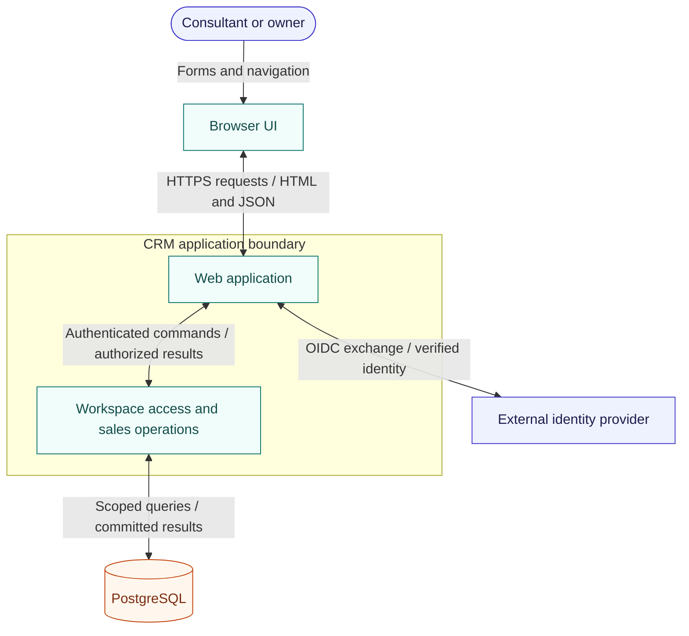

# Consulting CRM architecture

> Decision status: proposed teaching example.
> Implementation status: no CRM code, infrastructure, or runtime proof exists in Blueprint.

## Intended system

Use one web application and one PostgreSQL database. The application serves the
browser UI and same-origin JSON endpoints. It owns authorization, sales rules,
and transactions. The database is the source of truth. An external OpenID
Connect provider authenticates people; the CRM decides which workspace they can
access. Follow-ups are queried when the page opens, so this scope needs no queue
or scheduler.

The browser crosses the application trust boundary on every request. The server
verifies identity, checks membership, and scopes database access. The browser
never connects to PostgreSQL or decides authorization. The sign-in arrows
summarize the browser redirect and server code exchange, not a direct browser
access token grant.

## Responsibilities and dependencies

- Browser UI: accessible forms, pipeline and due-list views, submission state,
  and useful errors. It does not enforce access rules on the server's behalf.
- Web application: sign-in, server sessions, request validation, and responses.
- Sales operations: membership checks, ownership, stage rules, and transactions.
- Database access: parameterized, workspace-scoped queries and schema constraints.

Keep these as modules within one deployment. UI depends on server contracts;
sales operations do not depend on UI components. Avoid separate services for
contacts, opportunities, and reminders: capture needs one atomic transaction.

## Data model

Every ID is a server-generated UUID. Timestamps use UTC. A due date is a calendar
date interpreted in the workspace's IANA time zone, not a midnight UTC timestamp.

| Entity | Fields and relationships | Rules |
|---|---|---|
| Workspace | id, name, time_zone | One firm's boundary. Operator configures a valid time zone. |
| Member | id, workspace_id, identity_issuer, identity_subject, display_name, active | Identity issuer and subject identify one member globally in this version. Email is not identity. |
| Company | id, workspace_id, name | Duplicate names allowed; no automatic merging. |
| Contact | id, workspace_id, company_id, name, email nullable | Belongs to one company in the same workspace. |
| Opportunity | id, workspace_id, company_id, contact_id, owner_member_id, title, stage, created_at | Contact belongs to that company; stage is one of the five fixed values. |
| Activity | id, workspace_id, opportunity_id, actor_member_id, kind, body nullable, occurred_at | Append-only history. Kinds: lead_created, follow_up_scheduled, stage_changed, note, call. |
| Follow-up | id, workspace_id, opportunity_id, assignee_member_id, summary, due_date, completed_at nullable | Assignee must be active when assigned. Completion is a later feature. |

Use foreign keys on `(workspace_id, id)` to prevent cross-workspace relationships.
Constrain an opportunity's `(workspace_id, company_id, contact_id)` to the matching
contact tuple. Index opportunities by workspace and stage; index open follow-ups
by workspace and due date. Activities are ordered by occurred_at then id.
Members are deactivated rather than deleted so historical attribution survives.
No record deletion or automated retention policy is included in this scope.
Agree retention with the firm before storing real personal data.

Two infrastructure tables support these entities: Session holds a hashed opaque
session token, member ID, and expiry; Submission holds workspace ID, actor ID,
request key, operation, normalized payload, and result IDs. Submission enforces
one result per actor and operation key; it is not a business entity.

## Critical flows and invariants

**INV-1: workspace isolation.** Derive workspace from the authenticated member,
never a client-supplied workspace ID. Check active membership on every request.
All business queries include that workspace. Enforce matching relationships with
foreign keys; prove denial using two workspaces and guessed record IDs.

**INV-2: atomic lead capture.** Insert company, contact, opportunity, creation
activity, and submission result in one transaction. Return success only after
commit. Inject failures after each insert and prove no partial lead survives.

**INV-3: safe submission retries.** For each mutating create operation, store the
request key and normalized payload with its result in the same transaction.
A retry with the same payload returns that result; a different payload gets a
conflict. Concurrent retries serialize through a unique constraint. Keep entries
for the lifetime of the workspace in this version. A failed transaction saves
neither records nor a completed submission entry.

**INV-4: attributable changes.** Save a business change and its activity together.
Never show an activity for a rolled-back change. Test both rows and their actor.

Capture uses the current member as owner. Scheduling checks the opportunity and
assignee in the same workspace, then inserts the follow-up and activity together.
Membership checks and assignment use row locks within the write transaction so
deactivation cannot race the authorization decision. Reads return 404 for absent
or foreign records without confirming another workspace's record exists.

## Security and operations

Use OpenID Connect authorization code flow with PKCE, state, and nonce. Validate
the issuer, audience, signature, and token expiry. Store provider secrets only
on the server. Use an opaque server session with an eight-hour expiry; the cookie
is HttpOnly, Secure, SameSite=Lax, and Path=/. Sign-out invalidates the session.
Mutations require a session-bound CSRF token. Escape stored text when rendering.
Do not log contact data, request bodies, session tokens, or provider tokens.

An operator provisions workspace and member rows using verified provider issuer
and subject before sign-in. Provisioning UI and public signup are outside scope.
The first feature includes the login path and operator setup instructions, not
an assumption that an authentication shell already exists.

Deploy the web application behind HTTPS with a managed PostgreSQL instance.
Only the app and authorized operators can connect to the database. Track request
errors, latency, database failures, and denied writes without personal fields.
Back up the database and rehearse a restore before a real pilot. Use additive
schema changes for these first features; preserve stored leads when rolling back
application code. No legacy data migration is needed for this new system.

## Decisions, operating expectations, and proof

A single application and relational database make the lead transaction easy to
reason about. Separate services would add partial failure and coordination costs
without a requirement that justifies them. Keeping spreadsheets is a credible
alternative for one person; this brief chooses a shared app to enforce access,
link records, and make next actions visible. That choice brings hosting, identity,
and backup work.

Assume one small firm per workspace and interactive use by a small team. This is
a design assumption, not a measured load profile. Workload, latency, availability,
recovery targets, and hosting budget must be agreed before production. Validate
them with representative data and restore tests rather than inventing promises.

Test relational constraints and concurrency against PostgreSQL, not an in-memory
substitute. Test authenticated requests from two workspaces. Prove forms and
navigation in a real browser, including mobile layout and keyboard use. The
[capture lead spec](docs/capture-lead/spec.md) defines the first feature's proof.
Stage changes, manual activity notes, and follow-up completion remain future work.
