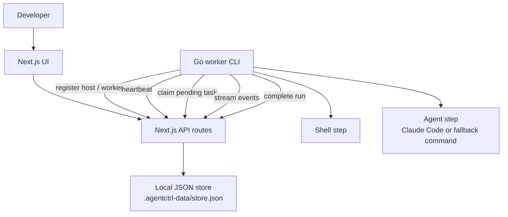
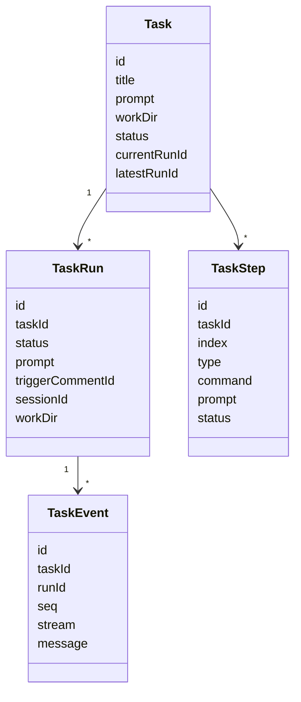
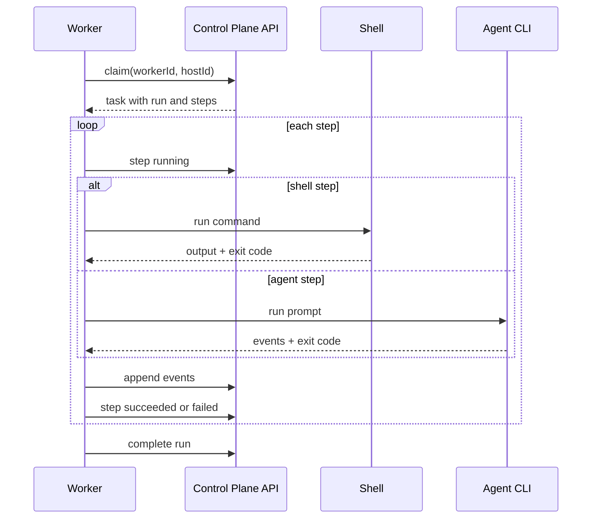
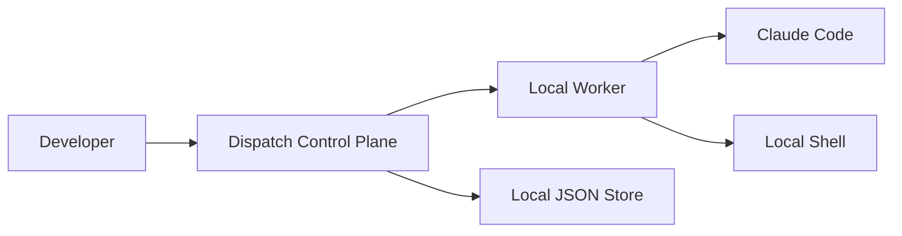
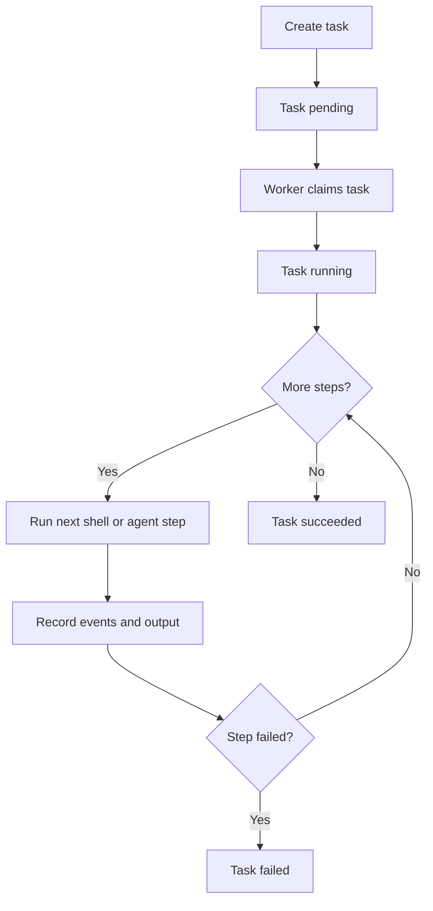

# Design: Dispatch Local Agent Control Plane

## Status

Draft

## Summary

Dispatch is a local-first control plane for delegated agent work. A Next.js app owns the UI, API routes, and JSON-backed state. A Go worker process registers itself, long-polls for pending tasks, runs shell and agent steps, streams events back, and reports completion. This design documents the current minimal architecture and the tradeoffs behind keeping orchestration explicit rather than hiding it inside a workflow engine.

## Context and Scope

The `dispatch` repo contains a prototype for running AI agents as delegated workers instead of interactive terminal sessions.

Current repo layout:

```text
control-plane/   Next.js UI, API routes, local store, shared types
worker/          Go worker CLI
docs/            specs, architecture notes, mockups
scripts/         local helper commands, including fake Claude
```

The control plane stores data in `.agentctrl-data/store.json` by default. The worker registers a host and worker, polls the control plane, claims one task at a time, executes task steps, streams task events, and completes the task. Claude Code is the intended real runtime; `scripts/fake-claude` supports local smoke testing.

This design covers the local v1 architecture, not the eventual production design with Postgres, auth, multi-tenant projects, budgets, or agent-created task trees.

## Goals

- Let a developer create tasks from a web UI or API.
- Let one or more local workers claim and run tasks.
- Support ordered task steps: shell steps and agent steps.
- Capture task runs, comments, and event streams for review.
- Support Claude Code sessions so replies to a completed task can continue the same task context.
- Keep the prototype easy to run with `just dev` plus a separate worker command.

## Non-Goals

- Production durability, horizontal control-plane scaling, or multi-user auth.
- Managing worker machines or provisioning workspaces.
- Hiding checkout, setup, branch, or push behavior behind special workflow types.
- Supporting every agent runtime equally in v1.
- Building a full distributed scheduler.

## Constraints

- The control plane is a Next.js app with API routes under `control-plane/app/api`.
- The worker is a Go CLI under `worker/cmd/agentctrl-worker`.
- Storage is local JSON, so concurrent writes and long-term durability are intentionally limited.
- One worker runs one task at a time.
- Task lifecycle is currently `pending -> running -> succeeded | failed`.
- Task steps must be explicit so users can compose checkout, setup, agent, test, and push behavior themselves.

## Proposed Design

Dispatch uses a control-plane / worker split.



### Control Plane

The control plane owns durable state for the prototype:

- hosts
- workers
- tasks
- task runs
- task steps
- comments
- events

The API creates tasks, returns current state to UI pages, accepts host and worker registration, lets workers claim tasks, records step status, appends events, and marks runs complete.

The store is implemented in `control-plane/lib/store.ts`. All mutations happen through `withStore`, which reads the JSON file, mutates an in-memory object, and writes it back.

### Worker

The worker CLI:

1. Registers a host with labels such as `local` or `macos`.
2. Registers a worker attached to that host.
3. Heartbeats on each polling loop.
4. Claims a pending task when available.
5. Runs the task's steps sequentially.
6. Streams system/stdout/stderr/agent events back to the control plane.
7. Completes the run and task with `succeeded` or `failed`.

For agent steps, the worker uses a structured Claude Code adapter when the command basename is `claude`. Other commands use the generic fallback contract:

```text
<command> -p "<task prompt>"
```

### Tasks and Runs

A task is the user-facing work item. A run is an execution attempt for that task. A task can have multiple runs, which enables follow-up replies after an initial task completes.



### Step Execution

Steps execute in order. A shell step runs with `sh -lc`. An agent step runs Claude Code or the fallback command. A failed step stops the task and reports failure.



## Architecture Views

### System Context



### Runtime View



## Interfaces and Data

The current TypeScript model is the contract between UI, API routes, local store, and worker responses.

Important types:

- `Host`: machine identity and labels
- `Worker`: runtime process attached to a host
- `Task`: user-facing unit of work
- `TaskStep`: ordered shell or agent operation
- `TaskRun`: execution attempt with optional Claude session ID
- `TaskComment`: user, agent, or system comment
- `TaskEvent`: ordered event stream for audit and UI display

Task creation accepts a title, prompt, optional working directory, and optional step definitions. If no usable steps are provided, the control plane creates a default agent step using the task prompt.

## Alternatives Considered

### Put the worker inside the Next.js app

This would make local startup simpler, but it couples task execution to the web server process. A separate worker better matches the long-term architecture where workers run on different machines and the control plane only coordinates.

### Use Postgres immediately

Postgres would improve durability, concurrency, and queryability, but it adds setup friction. Local JSON is enough for the v1 prototype and keeps the core loop easy to inspect.

### Make tasks a single prompt only

A single prompt is simpler, but real delegated work often needs checkout, setup, agent execution, tests, and push steps. Explicit shell and agent steps keep those operations visible and composable.

### Hide git and workspace behavior inside Dispatch

Hardcoding worktrees, clones, branches, and pushes would make the product opinionated too early. Keeping them as shell steps lets each project encode its own workflow.

## Tradeoffs

- Local JSON keeps the prototype simple but is not safe for high-concurrency writes.
- Long-polling is easy to implement and debug but less efficient than a push-based worker protocol.
- Explicit steps make workflows transparent but require users to compose more up front.
- A Go worker adds a second language to the repo but gives a small, portable process for task execution.
- Claude Code receives first-class adapter behavior, while other runtimes only get the generic command contract.

## Cross-Cutting Concerns

### Reliability

Workers heartbeat and claim one task at a time. The prototype has basic failure reporting, but lease expiry, reclaiming abandoned tasks, and durable concurrency should be revisited before production.

### Observability

Task events are first-class records with sequence numbers, stream names, messages, and timestamps. This gives the UI enough data to show what happened during a run.

### Security

The prototype runs shell commands and agent CLIs on machines the developer controls. There is no sandbox, auth boundary, or secret isolation in the local v1. Production use would need authentication, scoped worker tokens, secret handling, and workspace isolation.

### Maintainability

The shared TypeScript types keep the control-plane model explicit. The risk is drift between the TypeScript API contract and the Go worker structs, since there is no generated client.

### Operations

Developers start the control plane with `just dev` and start workers separately. This makes the control plane and worker lifecycle visible during development.

## Rollout and Migration

The current architecture is already suitable for a local prototype:

1. Run the Next.js control plane.
2. Start a fake worker with `scripts/fake-claude`.
3. Create a task with shell and/or agent steps.
4. Verify task events, runs, and completion in the UI.
5. Start a Claude Code worker for real agent runs.

The likely next migration is replacing the JSON store with Postgres while preserving the same task, run, step, comment, and event concepts.

## Open Questions

- Should task status include a human review state between `running` and terminal states?
- How should failed tasks be retried while preserving run history?
- Should the Go worker consume an OpenAPI-generated client to prevent API contract drift?
- What is the minimum auth model for local network use?
- When should agent-created child tasks enter the model?

## Decision

Keep Dispatch v1 as a local-first control plane with a Next.js API/UI, JSON-backed state, and a separate Go worker. Preserve explicit shell and agent steps as the core composition primitive. Defer production durability, auth, and agent-created task trees until the local delegation loop is proven.
