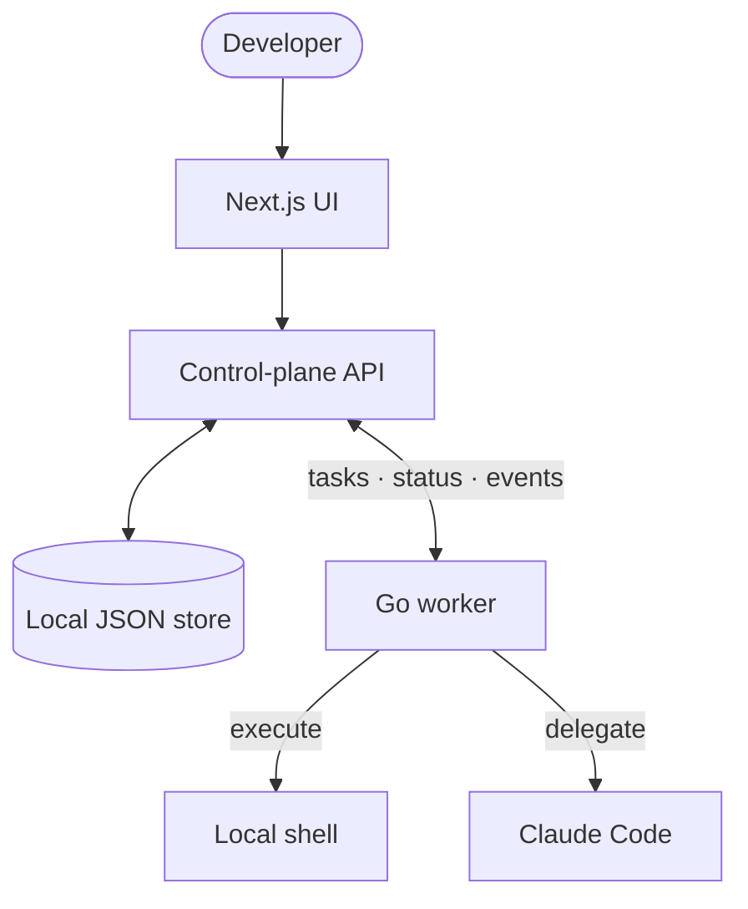
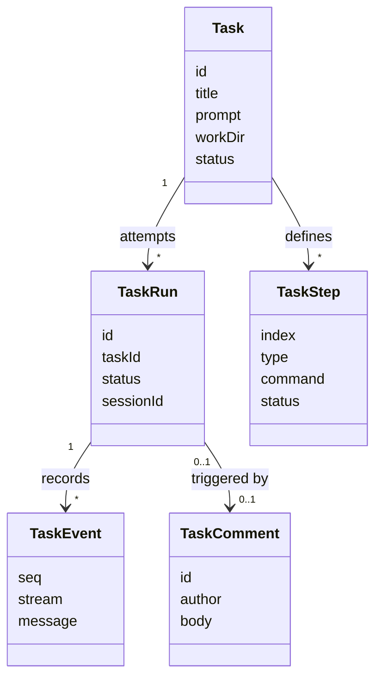
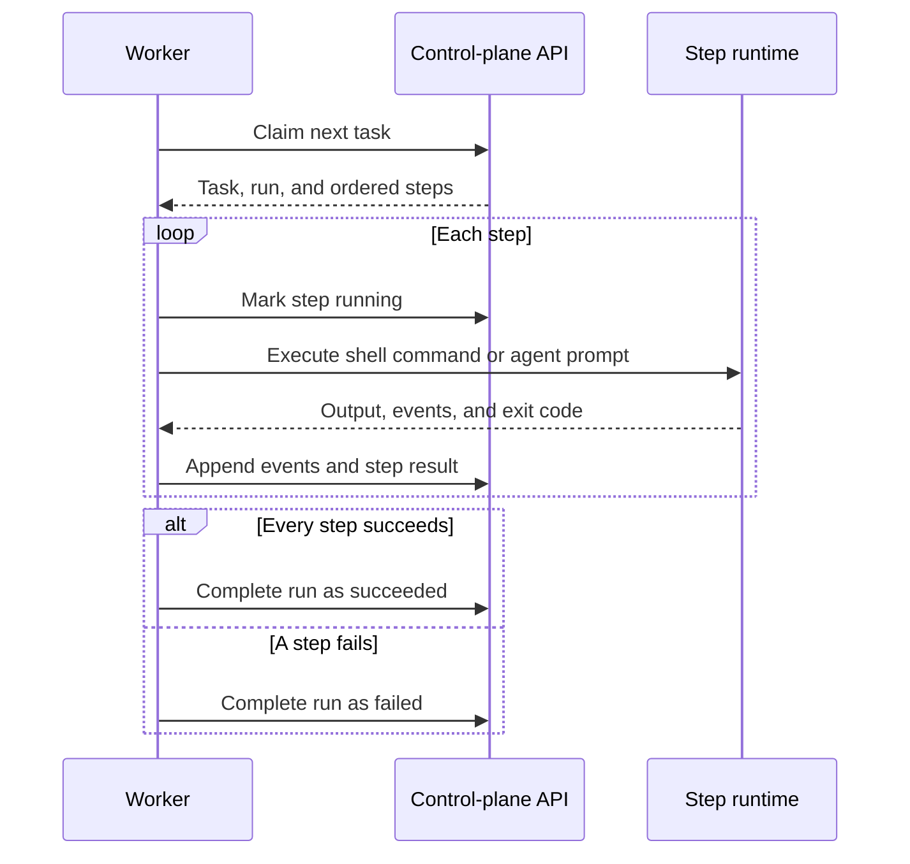

# Dispatch local agent control plane

> **Status:** Proposed for review
>
> **Scope:** Local-first v1 architecture

## What and why

Dispatch lets a developer delegate agent work from a web control plane instead of managing every run in an interactive terminal. A local worker claims tasks, runs explicit shell and agent steps, streams evidence back, and preserves enough run history for review and follow-up.

The first version should prove this delegation loop without committing to production infrastructure. It favors inspectable local state and explicit execution over hidden automation.

## Requirements

- Developers can create tasks from a web UI or API.
- One or more local workers can register, heartbeat, claim tasks, and report completion.
- Tasks contain ordered shell and agent steps.
- Runs retain comments, status, and ordered event streams for review.
- Follow-up replies can continue a completed Claude Code session.
- The control plane starts with `just dev`; workers run as separate processes.
- Checkout, setup, test, and push behavior remains explicit in task steps.

## Acceptance criteria

- A developer can create a task and see it move from `pending` to `running` to `succeeded` or `failed`.
- A worker claims at most one task at a time and executes its steps in order.
- Shell and agent output appears in the task event stream with stable sequence numbers.
- A failed step stops the remaining steps and records the failure.
- A follow-up comment creates a new run and can reuse the prior Claude session ID.
- The full local flow works with `scripts/fake-claude` before a real agent runtime is required.

## Design

Dispatch uses a control-plane and worker split. The Next.js application owns the UI, API, shared TypeScript model, and JSON-backed state. A separate Go process owns local execution.



### Control plane

The control plane stores hosts, workers, tasks, runs, steps, comments, and events in `.agentctrl-data/store.json`. API routes create tasks, serve UI state, register workers, assign pending work, append events, and complete runs.

All mutations pass through `withStore` in `control-plane/lib/store.ts`, which reads the file, changes an in-memory object, and writes the result. This is sufficient for a local prototype but is not a production concurrency model.

### Worker

The worker:

1. registers its host and worker identity;
2. heartbeats while polling;
3. claims one pending task;
4. executes its steps sequentially;
5. streams system, stdout, stderr, and agent events;
6. completes the run and task as `succeeded` or `failed`.

Claude Code has a structured adapter. Other agent commands use the fallback contract:

```text
<command> -p "<task prompt>"
```

### Tasks, runs, and events

A task is the user-facing unit of work. A run is one execution attempt. A task can have several runs so a follow-up can continue the same work without rewriting history.



### Execution



## Interfaces and data

The shared TypeScript model is the contract between the UI, API, store, and worker responses.

| Type | Purpose |
| --- | --- |
| `Host` | Machine identity and labels |
| `Worker` | Runtime process attached to a host |
| `Task` | User-facing work item and current state |
| `TaskStep` | Ordered shell or agent operation |
| `TaskRun` | Execution attempt and optional Claude session ID |
| `TaskComment` | User, agent, or system comment |
| `TaskEvent` | Ordered output or lifecycle event |

Task creation accepts a title, prompt, optional working directory, and optional step definitions. When no usable steps are supplied, the control plane creates one default agent step from the task prompt.

## Failure behavior

- A failed step stops the task and records its output and exit status.
- A worker claims only one task, preventing parallel execution inside one process.
- Heartbeats expose disconnected workers, but v1 does not reclaim abandoned tasks automatically.
- Corrupt or concurrent JSON writes are local-prototype risks; production use requires transactional storage.
- Shell commands and agent runtimes execute with the local user's permissions. There is no sandbox or secret boundary in v1.

## Test approach

- Start the control plane and a worker using `scripts/fake-claude`.
- Create a task containing both shell and agent steps.
- Verify ordered execution, event sequence numbers, and terminal status in the UI.
- Force a step failure and verify later steps do not run.
- Add a follow-up comment and verify a new run preserves the previous history and session ID.
- Repeat the happy path with a real Claude Code worker before declaring the adapter complete.

## Risks

| Risk | Consequence | Mitigation for v1 |
| --- | --- | --- |
| JSON storage | Lost updates under concurrent writes | Keep v1 local and serialize mutations through `withStore` |
| Long polling | Extra latency and repeated requests | Accept the tradeoff until the delegation loop is proven |
| TypeScript and Go models drift | Runtime contract failures | Keep the model small; consider generated clients before production |
| Local command execution | Host access and secret exposure | Limit v1 to developer-controlled machines and document the trust boundary |
| Explicit task steps | More setup for users | Provide useful defaults without hiding the execution model |

## Alternatives considered

- **Run workers inside Next.js.** Simpler startup, but task execution would share the web server lifecycle and make remote workers harder later.
- **Start with Postgres.** Better durability and concurrency, but unnecessary setup before the local loop is validated.
- **Represent every task as one prompt.** Smaller model, but no explicit checkout, setup, test, or push steps.
- **Hide Git and workspace operations.** Easier demos, but forces project-specific policy into Dispatch too early.

## Rollout

1. Prove the complete flow with the fake agent runtime.
2. Run real local Claude Code tasks and follow-ups.
3. Validate failure reporting and abandoned-worker behavior.
4. Replace JSON with Postgres while preserving task, run, step, comment, and event concepts.
5. Add authentication, worker tokens, secret handling, and workspace isolation before networked or multi-user use.

## Out of scope

- Production durability or horizontally scaled control planes
- Multi-user authentication and tenant isolation
- Worker-machine provisioning
- A distributed scheduler or lease-recovery system
- Budgets and agent-created task trees
- Equal first-class support for every agent runtime
