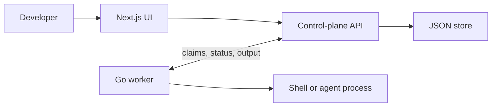

# Dispatch local agent control plane

> **Status:** Proposed for review
>
> **Scope:** Local V1

## 1. Requirements: what and why

A developer wants to give work to coding agents and inspect results without watching several terminals. Build a local web application for creating tasks, seeing progress, reading output, and sending follow-up instructions.

A task can contain ordered shell commands and agent prompts. Repository setup, tests, and Git operations remain explicit steps. Support one control-plane process and developer-controlled workers. Production durability, multi-user access, machine provisioning, automatic recovery, and agent-created task trees are out of scope.

## 2. User experience

The developer enters a title, prompt, optional working directory, and steps. Omitting steps creates one agent step. The task appears pending, then running when a worker picks it up. Its page shows each step, ordered output, and the final result.

If a step fails, the page shows its failure and later steps are skipped. A follow-up on a finished task queues a new attempt while keeping previous results. Only the first comment queues that attempt; further comments remain in history. With a prior Claude session, the follow-up can continue that conversation.

A worker appears disconnected once its last heartbeat is at least 15 seconds old. Its task remains open until the developer marks the abandoned attempt failed and submits a follow-up. Recovery closes the recorded attempt; it cannot stop a process on an unreachable worker. The developer checks that process before retrying commands with side effects.

Store corruption or a failed write produces an operator-visible error and preserves the last complete state. V1 requires manual history cleanup as data grows.

## 3. Technical design and choices

### Components and storage

```mermaid
flowchart LR
    Developer[Developer] --> UI[Next.js UI]
    UI --> API[Control-plane API]
    API --> Store[JSON store]
    Worker[Go worker] <-->|claims, status, output| API
    Worker --> Runtime[Shell or agent process]
```

Use Next.js for the UI and API, with a separate Go worker for process execution. This keeps task lifetimes independent of the web server, at the cost of running two processes. Start the control plane with `just dev`.

Use one JSON store for tasks, runs, steps, comments, and events. Serialize every mutation through `withStore` and atomically replace the file. This avoids a database setup step but limits the service to one control-plane process. Refuse to mutate corrupt data; a failed replacement leaves the previous file intact. Keep worker API contracts in shared fixtures so TypeScript and Go stay consistent.

A task owns its reusable step definitions and comments. Each claim creates a new run with separate step results, an immutable worker owner, and the effective prompt. The control plane generates opaque IDs and allocates increasing event sequence numbers. Workers execute commands and report results; the API owns scheduling and stored status.

### Claims, execution, and follow-up

Task creation accepts `{title, prompt, working_directory?, steps?}`. Workers register, heartbeat every 5 seconds, and poll for work every 2 seconds while idle. Claiming atomically assigns one pending task and creates its run. A worker may own only one running run; another claim returns `409/worker_busy` without changing a task.

Steps execute in index order. Shell steps execute the supplied shell command. Agent prompts are passed as a single literal argument, with no shell interpolation. Every report includes worker ID and run ID. Reject non-owner reports, invalid transitions, and changes to finished runs.

The first follow-up on a terminal task stores its comment ID as a pending trigger. The next claim consumes it in the same write that creates the run. Build the prompt from the original task prompt plus the triggering text under `Follow-up:`. The first Claude step may resume the previous session; later Claude steps start new sessions. Keep the latest returned session ID with the run. This supports continuation while preserving each attempt's history.

### Failure and operations

A failed or interrupted run keeps completed steps, fails the active step or first pending step, and skips remaining pending steps. Manual recovery uses that same threshold: the last heartbeat must be at least 15 seconds old. It records `worker_lost`. Late reports cannot reopen it. There is no automatic reassignment because the old process may still have side effects.

Worker shutdown stops polling, sends `SIGTERM` to its child, and escalates to `SIGKILL` after 10 seconds. Report `worker_shutdown` when the API is reachable; otherwise use manual recovery. Web shutdown stops new claims and finishes the active store mutation. Restart reloads history; restarting a worker does not resume an old command automatically.

Commands use the worker user's permissions. There is no sandbox, authentication, or tenant isolation. Keep the service on developer-controlled machines and networks. Output grows without a capacity promise; document manual cleanup. Logs identify tasks and runs without duplicating command-output secrets into metadata.

## 4. Acceptance and proof

Use `scripts/fake-claude` for deterministic worker tests before exercising a real runtime. The application must provide `just test` for API/store contract tests and worker process tests. Check the actual UI in a browser.

| ID | Done when | How to check |
|---|---|---|
| AC-1 | A mixed shell/agent task shows ordered progress, output, and terminal status. | Start `just dev` and a worker with the fake runtime. Submit a task in the browser and inspect each step and event sequence. |
| AC-2 | Claims assign a task once and a worker owns at most one running run. | Race two workers for one task; attempt a second claim from a busy worker and assert no other task changes. |
| AC-3 | Failure stops later steps and only the owner can report progress. | Fail a middle step; submit non-owner and invalid-transition reports; verify preserved completed results and skipped pending work. |
| AC-4 | Follow-up creates one new attempt with its own results and the correct prompt. | Race comments, restart before claiming, then inspect the trigger, prior history, literal prompt argument, and Claude session continuation. |
| AC-5 | Recovery is guarded and terminal history cannot be rewritten. | Stop heartbeats; reject recovery while the last heartbeat is less than 15 seconds old and allow it at 15 seconds. Recover before, during, and after step execution; reject late output and completion. |
| AC-6 | Shutdown follows the declared deadlines and preserves stored history. | Use a child that ignores `SIGTERM`; verify escalation and failure reporting. Interrupt a store mutation and confirm completion before web shutdown. |
| AC-7 | Store failures preserve the last complete file. | Corrupt a copy, fail a replacement, and simulate disk exhaustion. Assert visible errors and unchanged prior data. |
| AC-8 | The real adapter works beyond the fake runtime. | Repeat task creation and follow-up with Claude Code; verify output and session reuse in the browser. |

## 5. Open questions

What should replace manual history cleanup and recovery for unattended use? Recommended next step: design retention and leases before expanding beyond local V1. This does not block the scoped local version.
