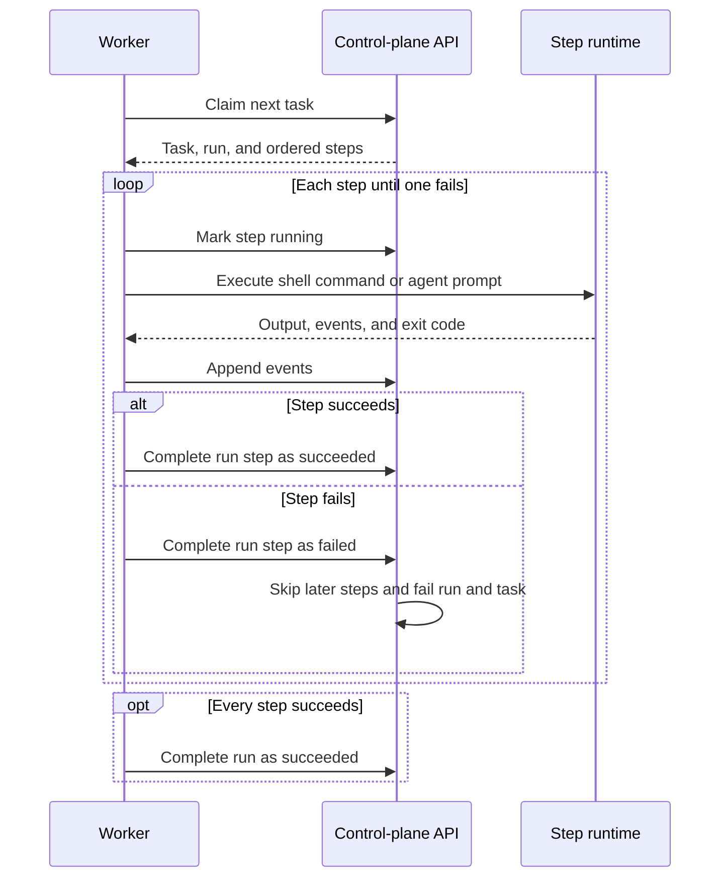

# Dispatch local agent control plane

> **Status:** Proposed for review
>
> **Scope:** Local-first v1
>
> **Example:** Reviewed golden output

## 1. Executive summary

Dispatch gives a developer a local web page for giving work to coding agents and checking the results. This web app is the control plane: it stores tasks and decides what runs next. A separate worker runs shell commands and agent prompts, then sends output back to the page.

The first version uses Next.js for the web app, a Go worker, and one JSON file for data. This makes the system easy to run and inspect, but it is not safe or reliable enough for a shared production service.

## 2. Context and scope

Today, a developer must start and watch each agent in a terminal. Dispatch adds a local task queue, run history, and web page. Checkout, setup, test, and push commands stay visible in each task.

V1 covers one local control-plane process and developer-controlled workers. It does not promise production durability, multi-user isolation, remote-machine provisioning, or automatic recovery of abandoned tasks.

## 3. System context


```mermaid
flowchart TB
    Developer([Developer]) --> UI["Next.js UI"]
    UI --> API["Control-plane API"]
    API <--> Store[("Local JSON store")]
    Worker["Go worker"] <-->|tasks, status, events| API
    Worker -->|execute| Shell["Local shell"]
    Worker -->|delegate| Agent["Claude Code or compatible command"]
```

The web app decides which task runs next and stores task status and history. Workers run local processes, but they do not choose task order or own stored data.

## 4. Proposed design

### How it works

A developer creates a task with a title and prompt. The task may also name a working directory and an ordered set of steps. If it has no usable steps, the web app creates one agent step from the prompt.

A worker registers and sends a heartbeat every 5 seconds. While idle, it asks for work every 2 seconds. The web app changes one pending task to running and creates its run in a single write before returning the steps.

The worker runs each step in order. It marks the step as running, then sends four kinds of event: system messages, standard output (`stdout`), standard error (`stderr`), and agent events. Each event has a stable sequence number. The worker then records the result. A failed step marks every later step as skipped. If every step succeeds, the worker marks the run and task as succeeded.

A user can follow up after a task has `succeeded` or `failed`. In one write, the web app changes the task back to `pending` and stores the new comment as its trigger. The next worker claim consumes that trigger and creates exactly one linked run.

The first run uses the task prompt. A follow-up run uses the original prompt followed by the triggering comment under a `Follow-up:` label. More comments are saved while the task is pending or running, but they do not queue more runs.

When the previous run has a Claude session ID, the first Claude step resumes that session with the follow-up prompt and keeps the earlier history. Later Claude steps start new sessions with the same prompt. The run stores the latest session ID it receives.


```mermaid
sequenceDiagram
    participant W as Worker
    participant API as Control-plane API
    participant R as Step runtime

    W->>API: Claim next task
    API-->>W: Task, run, and ordered steps
    loop Each step until one fails
        W->>API: Mark step running
        W->>R: Execute shell command or agent prompt
        R-->>W: Output, events, and exit code
        W->>API: Append events
        alt Step succeeds
            W->>API: Complete run step as succeeded
        else Step fails
            W->>API: Complete run step as failed
            API->>API: Skip later steps and fail run and task
        end
    end
    opt Every step succeeds
        W->>API: Complete run as succeeded
    end
```

### Components and responsibilities

| Component | Owns | Depends on | Does not own |
| --- | --- | --- | --- |
| Next.js UI | Task creation and review experience | Control-plane API | Task state or process execution |
| Control-plane API | Validation, assignment, status transitions, and event ordering | Store | Local command execution |
| JSON store | Durable local task, run, step, comment, and event records | Local filesystem | Concurrency across control-plane processes |
| Go worker | Host identity, polling, heartbeats, and sequential step execution | Control-plane API and local runtimes | Scheduling or durable history |
| Agent adapter | Structured Claude invocation and session continuation | Agent runtime | Task policy or Git behavior |

### Decisions

**Keep execution outside Next.js.** Running workers inside the web server would simplify startup, but task lifetimes would share the web process and make separate or remote workers harder later.

**Start with serialized JSON storage.** Postgres would improve concurrency and durability, but adds setup before the local delegation loop is validated. All mutations therefore pass through one `withStore` path that reads, changes, and atomically replaces the file.

**Represent work as ordered steps.** A single prompt is smaller, but it cannot make checkout, setup, test, and push behavior explicit. Defaults may create one agent step without hiding the step model.

**Keep repository operations explicit.** Dispatch executes the supplied steps rather than embedding project-specific Git and workspace policy.

## 5. Invariants and requirements

### Invariants

1. Each running run has one owning worker, and each worker owns at most one running run.
2. A worker executes a run's steps in ascending index order.
3. A failed step marks every later step in that run skipped before the run becomes failed.
4. Event sequence numbers increase monotonically within a run.
5. A terminal-task follow-up stores at most one pending trigger, which a claim consumes into exactly one new run without rewriting earlier history.
6. The control plane, not a worker, is authoritative for task and run status.

### Requirements

- Developers can create tasks from a web UI or API.
- One or more local workers can register, heartbeat, claim tasks, and report completion.
- Tasks contain ordered shell and agent steps.
- Tasks retain comments. Runs retain status and ordered event streams for review.
- Follow-up replies on terminal tasks can continue the previous Claude Code session.
- A developer can recover an abandoned run after its worker has been disconnected for at least 15 seconds, then submit a follow-up to retry it.
- The control plane starts with `just dev`; workers run as separate processes.
- Checkout, setup, test, and push behavior remains explicit in task steps.

## 6. Interfaces and data

The shared TypeScript model is the contract used by the UI, API, store, and worker responses.

| Type | Purpose |
| --- | --- |
| `Host` | Machine identity and labels |
| `Worker` | Runtime process attached to a host |
| `Task` | User-facing work item, current state, and optional pending trigger comment ID |
| `TaskStep` | Reusable ordered shell or agent definition |
| `TaskRun` | Execution attempt, immutable worker ID, effective prompt, status, failure reason, optional trigger comment ID, and optional Claude session ID |
| `TaskRunStep` | Per-run step status, timing, exit result, and failure reason |
| `TaskComment` | Task-owned user, agent, or system comment |
| `TaskEvent` | Ordered output or lifecycle event |

Task creation accepts a title, prompt, optional working directory, and optional step definitions. When no usable steps are supplied, the control plane creates one default agent step from the task prompt.

Every comment belongs to one task and cannot change. The first follow-up on a finished task moves it to `pending` and stores that comment ID as the trigger.

A successful claim makes these changes in one write:

1. Copy the trigger ID and resolved prompt to the new run.
2. Record the claiming worker ID as the run owner.
3. Clear the trigger from the task.

The first claim copies the task prompt because it has no follow-up. Every claim response includes the prompt to run. The JSON file keeps a pending trigger across web app restarts. Since writes run one at a time, only one of several comments can move a finished task to `pending`. The other comments stay in history but link to no run.

The worker protocol uses these operations:

```text
POST /api/tasks                            -> created pending task
POST /api/tasks/{task_id}/comments         -> recorded comment and queue result
POST /api/workers/register                 -> host and worker record
POST /api/workers/{worker_id}/heartbeat    -> refreshed heartbeat
POST /api/workers/{worker_id}/claim        -> task, run, and run steps; no work; or worker_busy
POST /api/runs/{run_id}/steps/{index}/start
POST /api/runs/{run_id}/events
POST /api/runs/{run_id}/steps/{index}/complete
POST /api/runs/{run_id}/complete
POST /api/runs/{run_id}/fail               -> worker-reported run failure
POST /api/runs/{run_id}/recover            -> guarded manual recovery
```

Task status moves from `pending` to `running`, then to `succeeded` or `failed`. A follow-up can move a finished task back to `pending`.

A run is created only after a worker claims a task. Its status is `running`, `succeeded`, or `failed`. Each step moves from `pending` to `running`, then to `succeeded` or `failed`. After a failure, unstarted steps move to `skipped`.

A worker that already owns a running run receives `409` with `worker_busy` when it tries to claim more work. The claim changes no task. Every worker update includes its worker ID. The web app rejects the update unless that ID owns the run. It also rejects invalid status changes and all updates to finished runs.

Claude Code has a structured adapter. Every agent step receives the run's effective prompt. Other agent commands receive that prompt as a direct argument without shell interpolation:

```text
argv[0] = <command>
argv[1] = -p
argv[2] = <run effective prompt>
```

### Naming and identity

On first start, a worker creates an opaque host ID, which carries no user data, and stores it in its local configuration directory. Later worker processes reuse that ID. Startup fails if the identity file exists but cannot be read.

Deleting the file creates a new host identity on the next start. Existing records keep the old ID. Each process registration receives a new opaque worker ID. A restart therefore keeps the host identity but creates a new worker session.

The control plane generates opaque IDs for tasks, runs, comments, and events. A task step is identified by its task ID and stable zero-based index. Event sequence numbers are allocated by the control plane, not accepted from workers. A resumed Claude session ID is provider metadata attached to a run and never used as Dispatch identity.

## 7. Failure behavior and lifecycle

- A failed step records its output and exit status, marks later run steps skipped, marks the run and task failed, and stops execution.
- A worker claims one task at a time. The UI marks it disconnected when no heartbeat arrives for 15 seconds, but V1 does not reassign its running task automatically.
- A developer may recover an abandoned run only after its worker has been disconnected for at least 15 seconds. One store write marks the running step as failed with reason `worker_lost`. If no step is running, it fails the first pending step. It then skips later pending steps and fails the run and task. If all steps had succeeded, it keeps those results and fails only the run and task with reason `worker_lost`.
- Worker event, step, completion, and failure reports with a missing or different worker ID are rejected.
- After manual recovery, the control plane rejects late events and completion reports from the abandoned run because terminal history cannot be rewritten.
- A corrupt store file stops mutations and reports an operator-visible error instead of replacing the file with empty state.
- A failed store replacement leaves the previous complete file in place.
- Restarting the control plane reloads the JSON store. Restarting a worker registers a new worker session and does not silently resume an in-flight command.
- Control-plane shutdown stops new claims and lets the active serialized store mutation finish before exit.
- Worker shutdown stops polling and sends `SIGTERM` to an active child process. It waits up to 10 seconds, then sends `SIGKILL`. It reports the run and task as failed with reason `worker_shutdown`. The running step, or next pending step, fails and later pending steps are skipped. Completed steps keep their results. If the worker cannot reach the web app, the run stays open until the developer recovers it.

## 8. Security, privacy, and operations

Shell commands and agent runtimes execute with the worker user's permissions. V1 has no sandbox, secret boundary, authentication, or tenant isolation and must stay on developer-controlled machines and networks.

Each worker runs at most one task at a time. It sends a heartbeat every 5 seconds and asks for work every 2 seconds while idle. One web app process runs all file changes one at a time.

Task events and output make the JSON file grow without a limit in V1. If a write fails, including when the disk is full, the API shows an error and keeps the previous complete file. The UI and docs must explain manual cleanup and that this version has no production capacity promise.

The control plane exposes worker heartbeat age, task and run status, step exit codes, and ordered event history. Logs include task and run IDs but must not copy secrets from command output into separate metadata.

## 9. Acceptance criteria

- A developer can create a task and see it move from `pending` to `running` to `succeeded` or `failed`.
- A worker claims at most one task at a time and executes its steps in order.
- Concurrent claim requests assign a pending task to at most one worker.
- A worker keeps one host ID across restarts, receives a new worker ID for each process, and appears disconnected after 15 seconds without a heartbeat.
- Shell and agent output appears in the task event stream with stable sequence numbers.
- A failed step stops the remaining steps and records the failure.
- Every run has separate step status and exit records; a follow-up never resets or reuses an earlier run's step records.
- A user follow-up on a succeeded or failed task persists its comment ID as the pending trigger. The next claim consumes that marker to create exactly one linked run, preserves previous history, and can reuse the prior Claude session ID. Extra or concurrent comments before that claim do not replace the marker or create extra runs.
- The initial run uses the task prompt. A follow-up run uses the original task prompt plus the labeled triggering comment body, and its first Claude agent step receives that resolved text when resuming the prior session.
- Agent prompts containing quotes or shell syntax arrive as one literal process argument.
- A corrupt store or failed file replacement does not reset existing state.
- Worker shutdown sends `SIGTERM`, escalates to `SIGKILL` after 10 seconds, and reports interrupted work as failed with reason `worker_shutdown` when the control plane is reachable.
- A developer can recover abandoned work only after its worker has been disconnected for at least 15 seconds. Recovery handles disconnection before the first step, during a step, between steps, and after the last step but before run completion according to the documented atomic transition.
- Late events or completion reports cannot change a manually failed run.
- A worker that does not own a run cannot append events or change its step, run, or task state.
- The full local flow works with `scripts/fake-claude` before a real agent runtime is required.

## 10. Test approach

- Start the control plane and a worker using `scripts/fake-claude`.
- Create a task containing both shell and agent steps and verify ordered execution, event sequence numbers, and terminal status in the UI.
- Race two workers against one pending task and verify only one claim succeeds.
- Give one worker two pending tasks, claim once, then verify its second claim returns `409` with `worker_busy` and leaves the other task pending.
- Restart a worker and verify the host ID is stable, the worker ID changes, and the old worker becomes disconnected after 15 seconds.
- Force a step failure and verify later run steps become skipped without starting.
- Run a follow-up and verify it receives new run-step records while the previous run's records remain unchanged.
- Add follow-ups to succeeded and failed tasks and verify each next claim creates exactly one linked run without rewriting history. Restart the control plane before the claim and verify the pending trigger survives. Race two follow-up comments and verify exactly one becomes the trigger while both remain in task history.
- Inspect the claim and fake Claude invocation to verify an initial run receives the task prompt. Verify a follow-up run receives the original prompt plus one labeled copy of the triggering comment body in the resumed first Claude step.
- Submit event, step, completion, and failure reports with a different worker ID and verify every mutation is rejected.
- Pass a prompt containing spaces, quotes, `$()`, and semicolons through the fallback adapter and verify it arrives as one literal argument without shell execution.
- Corrupt a copied store and force a replacement failure to verify the original state is not replaced.
- Interrupt the control plane during a store mutation and verify the mutation finishes before exit.
- Interrupt a worker during active work and verify `SIGTERM`, 10-second escalation, and the `worker_shutdown` failure when the control plane is reachable.
- Make the control plane unreachable during worker shutdown, then verify the disconnected-worker recovery action is unavailable before 15 seconds. After 15 seconds, exercise recovery after claim but before step start, during a step, between steps, and after the final step but before run completion. Verify `worker_lost`, failed and skipped step states where applicable, and failed run and task state. Submit a late event and completion report from the old worker and verify both are rejected.
- Repeat the happy path with a real Claude Code worker before declaring the adapter complete.

## 11. Risks and tradeoffs

| Risk | Consequence | Mitigation for V1 |
| --- | --- | --- |
| JSON storage | Lost updates or slow rewrites as history grows | Run one control-plane process, serialize mutations, and replace files atomically |
| Abandoned tasks | A crashed worker can leave work running forever | Expose stale heartbeat and a guarded manual failure action; automatic leases are out of scope |
| TypeScript and Go models drift | Runtime contract failures | Keep the worker API small and cover it with shared fixtures |
| Local command execution | Host access and secret exposure | Limit V1 to developer-controlled machines and document the trust boundary |
| Explicit task steps | More setup for users | Provide useful defaults without hiding the execution model |

## 12. Open questions

- What event retention or compaction policy should replace manual cleanup before production use? This does not block local V1.
- What lease and idempotency model should reclaim abandoned tasks? This blocks distributed or unattended use, not local V1.

## 13. Out of scope

- Production durability or horizontally scaled control planes
- Multi-user authentication and tenant isolation
- Worker-machine provisioning
- A distributed scheduler or automatic lease recovery
- Budgets and agent-created task trees
- Equal first-class support for every agent runtime
