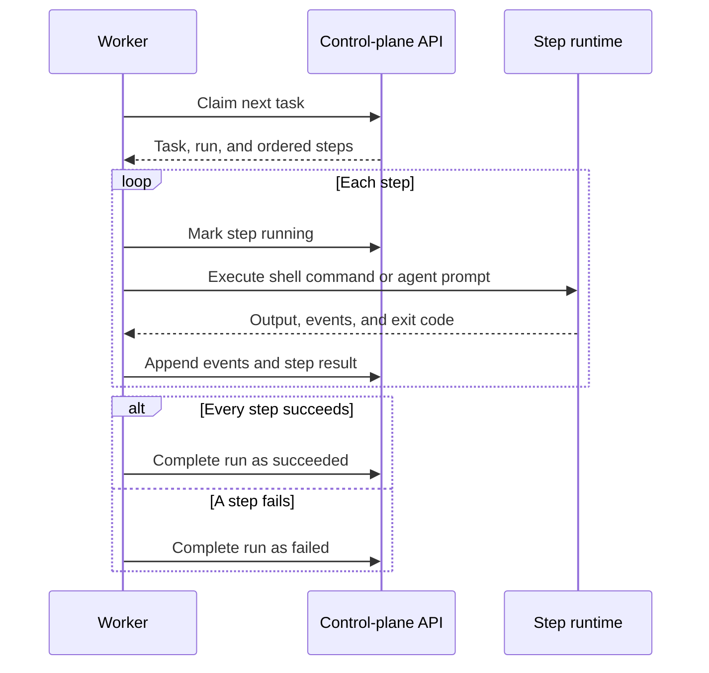

# Dispatch local agent control plane

> **Status:** Proposed for review
>
> **Scope:** Local-first v1

## 1. Executive summary

Dispatch lets a developer delegate agent work from a web control plane instead of managing every run in an interactive terminal. A local worker claims tasks, runs explicit shell and agent steps, streams evidence back, and preserves enough run history for review and follow-up.

Use a Next.js control plane with JSON-backed local state and a separate Go worker for execution. This proves the delegation loop with inspectable state and explicit commands, while accepting single-process storage and developer-machine trust boundaries that are unsuitable for production.

## 2. Context and scope

The current workflow requires a developer to start and supervise each agent in a terminal. Dispatch adds a local task queue, execution history, and web UI without hiding checkout, setup, test, or push behavior inside the platform.

V1 covers one local control-plane process and developer-controlled workers. It does not promise production durability, multi-user isolation, remote-machine provisioning, or automatic recovery of abandoned tasks.

## 3. System context


```mermaid
flowchart TB
    Developer([Developer]) --> UI["Next.js UI"]
    UI --> API["Control-plane API"]
    API <--> Store[("Local JSON store")]
    Worker["Go worker"] <-->|tasks, status, events| API
    Worker -->|execute| Shell["Local shell"]
    Worker -->|delegate| Agent["Claude Code or compatible command"]
```

The control plane is authoritative for task definitions, assignments, status, and history. Workers own local process execution but do not decide task ordering or durable state.

## 4. Proposed design

### How it works

A developer creates a task containing a title, prompt, working directory, and ordered steps. A worker registers, heartbeats, and polls for work. The control plane atomically changes one pending task to running and creates a run before returning its steps.

The worker executes each step in order. It marks the step running, streams system, stdout, stderr, and agent events with stable sequence numbers, and records the result. A failed step stops later steps. If every step succeeds, the worker completes the run and task as succeeded.

A follow-up comment on a completed task creates a new run. When the previous run recorded a Claude session ID, the new agent step can resume that session while preserving the earlier history.


```mermaid
sequenceDiagram
    participant W as Worker
    participant API as Control-plane API
    participant R as Step runtime

    W->>API: Claim next task
    API-->>W: Task, run, and ordered steps
    loop Each step
        W->>API: Mark step running
        W->>R: Execute shell command or agent prompt
        R-->>W: Output, events, and exit code
        W->>API: Append events and step result
    end
    alt Every step succeeds
        W->>API: Complete run as succeeded
    else A step fails
        W->>API: Complete run as failed
    end
```

### Components and responsibilities

| Component | Owns | Depends on | Does not own |
| --- | --- | --- | --- |
| Next.js UI | Task creation and review experience | Control-plane API | Task state or process execution |
| Control-plane API | Validation, assignment, status transitions, and event ordering | Store | Local command execution |
| JSON store | Durable local task, run, step, comment, and event records | Local filesystem | Concurrency across control-plane processes |
| Go worker | Polling, heartbeats, and sequential step execution | Control-plane API and local runtimes | Scheduling or durable history |
| Agent adapter | Structured Claude invocation and session continuation | Agent runtime | Task policy or Git behavior |

### Decisions

**Keep execution outside Next.js.** Running workers inside the web server would simplify startup, but task lifetimes would share the web process and make separate or remote workers harder later.

**Start with serialized JSON storage.** Postgres would improve concurrency and durability, but adds setup before the local delegation loop is validated. All mutations therefore pass through one `withStore` path that reads, changes, and atomically replaces the file.

**Represent work as ordered steps.** A single prompt is smaller, but it cannot make checkout, setup, test, and push behavior explicit. Defaults may create one agent step without hiding the step model.

**Keep repository operations explicit.** Dispatch executes the supplied steps rather than embedding project-specific Git and workspace policy.

## 5. Invariants and requirements

### Invariants

1. At most one worker owns a task run at a time.
2. A worker executes a run's steps in ascending index order.
3. A failed step prevents every later step in that run from starting.
4. Event sequence numbers increase monotonically within a run.
5. A follow-up creates a new run and never rewrites earlier run history.
6. The control plane, not a worker, is authoritative for task and run status.

### Requirements

- Developers can create tasks from a web UI or API.
- One or more local workers can register, heartbeat, claim tasks, and report completion.
- Tasks contain ordered shell and agent steps.
- Runs retain comments, status, and ordered event streams for review.
- Follow-up replies can continue a completed Claude Code session.
- The control plane starts with `just dev`; workers run as separate processes.
- Checkout, setup, test, and push behavior remains explicit in task steps.

## 6. Interfaces and data

The shared TypeScript model is the contract used by the UI, API, store, and worker responses.

| Type | Purpose |
| --- | --- |
| `Host` | Machine identity and labels |
| `Worker` | Runtime process attached to a host |
| `Task` | User-facing work item and current state |
| `TaskStep` | Ordered shell or agent operation |
| `TaskRun` | Execution attempt and optional Claude session ID |
| `TaskComment` | User, agent, or system comment |
| `TaskEvent` | Ordered output or lifecycle event |

Task creation accepts a title, prompt, optional working directory, and optional step definitions. When no usable steps are supplied, the control plane creates one default agent step from the task prompt.

Claude Code has a structured adapter. Other agent commands use this fallback contract:

```text
<command> -p "<task prompt>"
```

### Naming and identity

The control plane generates opaque IDs for hosts, workers, tasks, runs, comments, and events. A task step is identified by its task ID and stable zero-based index. Event sequence numbers are allocated by the control plane, not accepted from workers. A resumed Claude session ID is provider metadata attached to a run and never used as Dispatch identity.

## 7. Failure behavior and lifecycle

- A failed step records its output and exit status, marks the run and task failed, and stops remaining steps.
- A worker claims one task at a time. Loss of its heartbeat makes the worker visibly disconnected, but V1 does not reassign its running task automatically.
- A corrupt store file stops mutations and reports an operator-visible error instead of replacing the file with empty state.
- A failed store replacement leaves the previous complete file in place.
- Restarting the control plane reloads the JSON store. Restarting a worker registers a new worker session and does not silently resume an in-flight command.
- Shutdown stops new claims, lets the active store mutation finish, and terminates worker child processes before exit.

## 8. Security, privacy, and operations

Shell commands and agent runtimes execute with the worker user's permissions. V1 has no sandbox, secret boundary, authentication, or tenant isolation and must stay on developer-controlled machines and networks.

Each worker runs at most one task at a time. One control-plane process serializes all store mutations. Task events and output grow the JSON file without a retention cap in V1, so the UI and documentation must describe manual cleanup and the lack of a production capacity guarantee.

The control plane exposes worker heartbeat age, task and run status, step exit codes, and ordered event history. Logs include task and run IDs but must not copy secrets from command output into separate metadata.

## 9. Acceptance criteria

- A developer can create a task and see it move from `pending` to `running` to `succeeded` or `failed`.
- A worker claims at most one task at a time and executes its steps in order.
- Concurrent claim requests assign a pending task to at most one worker.
- Shell and agent output appears in the task event stream with stable sequence numbers.
- A failed step stops the remaining steps and records the failure.
- A follow-up comment creates a new run, preserves previous history, and can reuse the prior Claude session ID.
- A corrupt store or failed file replacement does not reset existing state.
- The full local flow works with `scripts/fake-claude` before a real agent runtime is required.

## 10. Test approach

- Start the control plane and a worker using `scripts/fake-claude`.
- Create a task containing both shell and agent steps and verify ordered execution, event sequence numbers, and terminal status in the UI.
- Race two workers against one pending task and verify only one claim succeeds.
- Force a step failure and verify later steps do not run.
- Add a follow-up comment and verify a new run preserves previous history and session ID.
- Corrupt a copied store and force a replacement failure to verify the original state is not replaced.
- Interrupt the control plane and worker during active work to verify shutdown and restart behavior.
- Repeat the happy path with a real Claude Code worker before declaring the adapter complete.

## 11. Risks and tradeoffs

| Risk | Consequence | Mitigation for V1 |
| --- | --- | --- |
| JSON storage | Lost updates or slow rewrites as history grows | Run one control-plane process, serialize mutations, and replace files atomically |
| Abandoned tasks | A crashed worker can leave work running forever | Expose stale heartbeat and document manual recovery; automatic leases are out of scope |
| TypeScript and Go models drift | Runtime contract failures | Keep the worker API small and cover it with shared fixtures |
| Local command execution | Host access and secret exposure | Limit V1 to developer-controlled machines and document the trust boundary |
| Explicit task steps | More setup for users | Provide useful defaults without hiding the execution model |

## 12. Open questions

- What event retention or compaction policy should replace manual cleanup before production use? This does not block local V1.
- What lease and idempotency model should reclaim abandoned tasks? This blocks distributed or unattended use, not local V1.

## 13. Out of scope

- Production durability or horizontally scaled control planes
- Multi-user authentication and tenant isolation
- Worker-machine provisioning
- A distributed scheduler or automatic lease recovery
- Budgets and agent-created task trees
- Equal first-class support for every agent runtime
