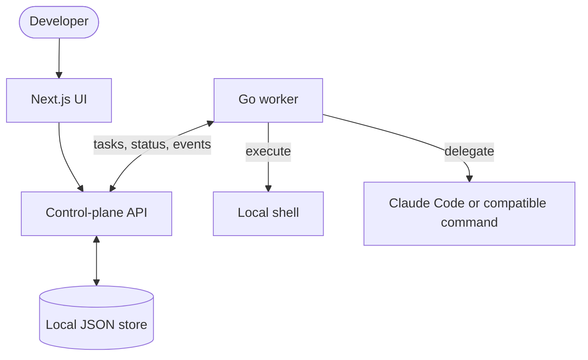
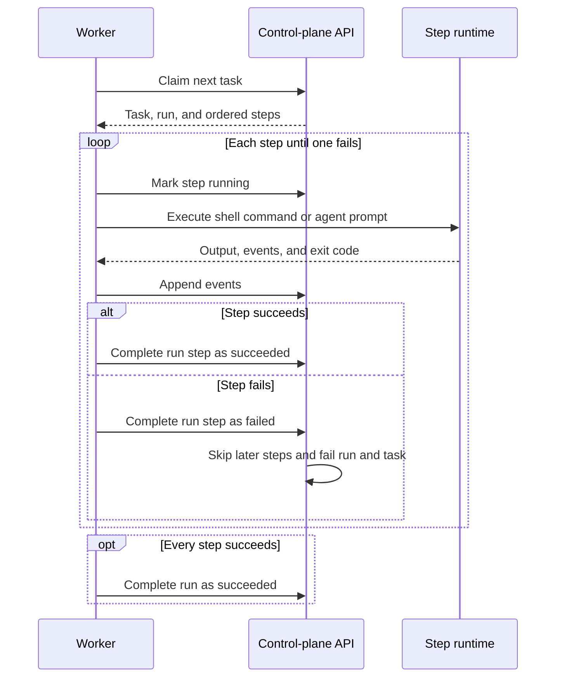

# Dispatch local agent control plane

> **Status:** Proposed for review
>
> **Scope:** Local-first v1
>
> **Example:** Reviewed golden output

## 1. Executive summary

Dispatch lets a developer delegate agent work from a web control plane instead of managing every run in an interactive terminal. A local worker claims tasks, runs explicit shell and agent steps, streams evidence back, and preserves enough run history for review and follow-up.

Use a Next.js control plane with JSON-backed local state and a separate Go worker for execution. This proves the delegation loop with inspectable state and explicit commands, while accepting single-process storage and developer-machine trust boundaries that are unsuitable for production.

## 2. Context and scope

The current workflow requires a developer to start and supervise each agent in a terminal. Dispatch adds a local task queue, execution history, and web UI without hiding checkout, setup, test, or push behavior inside the platform.

V1 covers one local control-plane process and developer-controlled workers. It does not promise production durability, multi-user isolation, remote-machine provisioning, or automatic recovery of abandoned tasks.

## 3. System context


```mermaid
flowchart TB
    Developer([Developer]) --> UI["Next.js UI"]
    UI --> API["Control-plane API"]
    API <--> Store[("Local JSON store")]
    Worker["Go worker"] <-->|tasks, status, events| API
    Worker -->|execute| Shell["Local shell"]
    Worker -->|delegate| Agent["Claude Code or compatible command"]
```

The control plane is authoritative for task definitions, assignments, status, and history. Workers own local process execution but do not decide task ordering or durable state.

## 4. Proposed design

### How it works

A developer creates a task containing a title and prompt, with an optional working directory and optional ordered steps. When no usable steps are supplied, the control plane creates one default agent step from the prompt. A worker registers, heartbeats every 5 seconds, and polls every 2 seconds while idle. The control plane atomically changes one pending task to running and creates a run before returning its steps.

The worker executes each step in order. It marks the run-specific step record running, streams system, stdout, stderr, and agent events with stable sequence numbers, and records the result. A failed step marks every later run step skipped. If every step succeeds, the worker completes the run and task as succeeded.

A user follow-up on a terminal task, either `succeeded` or `failed`, atomically changes the task back to `pending` and stores that comment ID as the pending trigger. The next claim consumes the pending trigger and creates one run linked to it in the same store mutation. An initial run uses the task prompt. A follow-up run stores an effective prompt containing the original task prompt followed by the triggering comment body under a `Follow-up:` label. Further comments while the task is pending or running are recorded but do not queue more runs. When the previous run recorded a Claude session ID, the first Claude agent step in the new run resumes that session with the effective prompt while preserving the earlier history. Any later Claude agent steps start new sessions with the same effective prompt, and the run records the most recently returned session ID.


```mermaid
sequenceDiagram
    participant W as Worker
    participant API as Control-plane API
    participant R as Step runtime

    W->>API: Claim next task
    API-->>W: Task, run, and ordered steps
    loop Each step until one fails
        W->>API: Mark step running
        W->>R: Execute shell command or agent prompt
        R-->>W: Output, events, and exit code
        W->>API: Append events
        alt Step succeeds
            W->>API: Complete run step as succeeded
        else Step fails
            W->>API: Complete run step as failed
            API->>API: Skip later steps and fail run and task
        end
    end
    opt Every step succeeds
        W->>API: Complete run as succeeded
    end
```

### Components and responsibilities

| Component | Owns | Depends on | Does not own |
| --- | --- | --- | --- |
| Next.js UI | Task creation and review experience | Control-plane API | Task state or process execution |
| Control-plane API | Validation, assignment, status transitions, and event ordering | Store | Local command execution |
| JSON store | Durable local task, run, step, comment, and event records | Local filesystem | Concurrency across control-plane processes |
| Go worker | Host identity, polling, heartbeats, and sequential step execution | Control-plane API and local runtimes | Scheduling or durable history |
| Agent adapter | Structured Claude invocation and session continuation | Agent runtime | Task policy or Git behavior |

### Decisions

**Keep execution outside Next.js.** Running workers inside the web server would simplify startup, but task lifetimes would share the web process and make separate or remote workers harder later.

**Start with serialized JSON storage.** Postgres would improve concurrency and durability, but adds setup before the local delegation loop is validated. All mutations therefore pass through one `withStore` path that reads, changes, and atomically replaces the file.

**Represent work as ordered steps.** A single prompt is smaller, but it cannot make checkout, setup, test, and push behavior explicit. Defaults may create one agent step without hiding the step model.

**Keep repository operations explicit.** Dispatch executes the supplied steps rather than embedding project-specific Git and workspace policy.

## 5. Invariants and requirements

### Invariants

1. Each running run has one owning worker, and each worker owns at most one running run.
2. A worker executes a run's steps in ascending index order.
3. A failed step marks every later step in that run skipped before the run becomes failed.
4. Event sequence numbers increase monotonically within a run.
5. A terminal-task follow-up stores at most one pending trigger, which a claim consumes into exactly one new run without rewriting earlier history.
6. The control plane, not a worker, is authoritative for task and run status.

### Requirements

- Developers can create tasks from a web UI or API.
- One or more local workers can register, heartbeat, claim tasks, and report completion.
- Tasks contain ordered shell and agent steps.
- Tasks retain comments. Runs retain status and ordered event streams for review.
- Follow-up replies on terminal tasks can continue the previous Claude Code session.
- A developer can recover an abandoned run after its worker has been disconnected for at least 15 seconds, then submit a follow-up to retry it.
- The control plane starts with `just dev`; workers run as separate processes.
- Checkout, setup, test, and push behavior remains explicit in task steps.

## 6. Interfaces and data

The shared TypeScript model is the contract used by the UI, API, store, and worker responses.

| Type | Purpose |
| --- | --- |
| `Host` | Machine identity and labels |
| `Worker` | Runtime process attached to a host |
| `Task` | User-facing work item, current state, and optional pending trigger comment ID |
| `TaskStep` | Reusable ordered shell or agent definition |
| `TaskRun` | Execution attempt, immutable worker ID, effective prompt, status, failure reason, optional trigger comment ID, and optional Claude session ID |
| `TaskRunStep` | Per-run step status, timing, exit result, and failure reason |
| `TaskComment` | Task-owned user, agent, or system comment |
| `TaskEvent` | Ordered output or lifecycle event |

Task creation accepts a title, prompt, optional working directory, and optional step definitions. When no usable steps are supplied, the control plane creates one default agent step from the task prompt.

Every comment belongs to one task and is immutable. When the first terminal-task follow-up moves the task to `pending`, the task stores that comment ID as its pending trigger. A successful claim atomically copies the ID and resolved effective prompt to the new run, records the claiming worker ID as the immutable owner, and clears the trigger from the task. An initial claim copies the task prompt instead. The claim response includes this effective prompt. The JSON store preserves the trigger across control-plane restarts, and serialized mutation means only one of several concurrent comments can perform the terminal-to-pending transition. Other comments have no run link.

The worker protocol uses these operations:

```text
POST /api/tasks                            -> created pending task
POST /api/tasks/{task_id}/comments         -> recorded comment and queue result
POST /api/workers/register                 -> host and worker record
POST /api/workers/{worker_id}/heartbeat    -> refreshed heartbeat
POST /api/workers/{worker_id}/claim        -> task, run, and run steps; no work; or worker_busy
POST /api/runs/{run_id}/steps/{index}/start
POST /api/runs/{run_id}/events
POST /api/runs/{run_id}/steps/{index}/complete
POST /api/runs/{run_id}/complete
POST /api/runs/{run_id}/fail               -> worker-reported run failure
POST /api/runs/{run_id}/recover            -> guarded manual recovery
```

Task status moves from `pending` to `running` to `succeeded` or `failed`. A follow-up can move a terminal task back to `pending`. Run status is `running`, `succeeded`, or `failed`; a run is created only by a successful claim. Run-step status moves from `pending` to `running` to `succeeded` or `failed`, while unstarted steps after a failure move from `pending` to `skipped`. A claim from a worker that already owns a running run returns `409` with `worker_busy` and changes no task. Every worker mutation includes its worker ID, and the control plane rejects it unless it matches the run's immutable owner. The control plane also validates every transition and rejects updates to terminal runs.

Claude Code has a structured adapter. Every agent step receives the run's effective prompt. Other agent commands receive that prompt as a direct argument without shell interpolation:

```text
argv[0] = <command>
argv[1] = -p
argv[2] = <run effective prompt>
```

### Naming and identity

On first start, a worker generates an opaque host ID and stores it in its local configuration directory. Later worker processes reuse that host ID and fail startup if the identity file exists but cannot be read. Deleting the file deliberately creates a new host identity on the next start; existing records keep the old ID. Each process registration receives a new opaque worker ID, so a restart preserves host identity but creates a new worker session.

The control plane generates opaque IDs for tasks, runs, comments, and events. A task step is identified by its task ID and stable zero-based index. Event sequence numbers are allocated by the control plane, not accepted from workers. A resumed Claude session ID is provider metadata attached to a run and never used as Dispatch identity.

## 7. Failure behavior and lifecycle

- A failed step records its output and exit status, marks later run steps skipped, marks the run and task failed, and stops execution.
- A worker claims one task at a time. The UI marks it disconnected when no heartbeat arrives for 15 seconds, but V1 does not reassign its running task automatically.
- A developer may recover an abandoned run only after the owning worker has been disconnected for at least 15 seconds. One atomic store mutation marks a running step failed with reason `worker_lost`, or the lowest-index pending step when none is running, then marks later pending steps skipped and marks the run and task failed. If every run step already succeeded but the worker disappeared before completing the run, recovery preserves those step results and marks only the run and task failed with reason `worker_lost`.
- Worker event, step, completion, and failure reports with a missing or different worker ID are rejected.
- After manual recovery, the control plane rejects late events and completion reports from the abandoned run because terminal history cannot be rewritten.
- A corrupt store file stops mutations and reports an operator-visible error instead of replacing the file with empty state.
- A failed store replacement leaves the previous complete file in place.
- Restarting the control plane reloads the JSON store. Restarting a worker registers a new worker session and does not silently resume an in-flight command.
- Control-plane shutdown stops new claims and lets the active serialized store mutation finish before exit.
- Worker shutdown stops polling, sends `SIGTERM` to an active child process, waits up to 10 seconds, then sends `SIGKILL`. It then reports the run and task failed with reason `worker_shutdown`. The same transition rule fails the running step or next pending step and skips later pending steps; if all steps succeeded, their results remain unchanged. If the worker cannot reach the control plane, the run remains non-terminal until the developer uses the disconnected-worker recovery action.

## 8. Security, privacy, and operations

Shell commands and agent runtimes execute with the worker user's permissions. V1 has no sandbox, secret boundary, authentication, or tenant isolation and must stay on developer-controlled machines and networks.

Each worker runs at most one task at a time, heartbeats every 5 seconds, and polls every 2 seconds only while idle. One control-plane process serializes all store mutations. Task events and output grow the JSON file without a retention cap in V1. If a write or atomic replacement fails, including from a full disk, the API returns an operator-visible error and keeps the previous complete file. The UI and documentation must describe manual cleanup and the lack of a production capacity guarantee.

The control plane exposes worker heartbeat age, task and run status, step exit codes, and ordered event history. Logs include task and run IDs but must not copy secrets from command output into separate metadata.

## 9. Acceptance criteria

- A developer can create a task and see it move from `pending` to `running` to `succeeded` or `failed`.
- A worker claims at most one task at a time and executes its steps in order.
- Concurrent claim requests assign a pending task to at most one worker.
- A worker keeps one host ID across restarts, receives a new worker ID for each process, and appears disconnected after 15 seconds without a heartbeat.
- Shell and agent output appears in the task event stream with stable sequence numbers.
- A failed step stops the remaining steps and records the failure.
- Every run has separate step status and exit records; a follow-up never resets or reuses an earlier run's step records.
- A user follow-up on a succeeded or failed task persists its comment ID as the pending trigger. The next claim consumes that marker to create exactly one linked run, preserves previous history, and can reuse the prior Claude session ID. Extra or concurrent comments before that claim do not replace the marker or create extra runs.
- The initial run uses the task prompt. A follow-up run uses the original task prompt plus the labeled triggering comment body, and its first Claude agent step receives that resolved text when resuming the prior session.
- Agent prompts containing quotes or shell syntax arrive as one literal process argument.
- A corrupt store or failed file replacement does not reset existing state.
- Worker shutdown sends `SIGTERM`, escalates to `SIGKILL` after 10 seconds, and reports interrupted work as failed with reason `worker_shutdown` when the control plane is reachable.
- A developer can recover abandoned work only after its worker has been disconnected for at least 15 seconds. Recovery handles disconnection before the first step, during a step, between steps, and after the last step but before run completion according to the documented atomic transition.
- Late events or completion reports cannot change a manually failed run.
- A worker that does not own a run cannot append events or change its step, run, or task state.
- The full local flow works with `scripts/fake-claude` before a real agent runtime is required.

## 10. Test approach

- Start the control plane and a worker using `scripts/fake-claude`.
- Create a task containing both shell and agent steps and verify ordered execution, event sequence numbers, and terminal status in the UI.
- Race two workers against one pending task and verify only one claim succeeds.
- Give one worker two pending tasks, claim once, then verify its second claim returns `409` with `worker_busy` and leaves the other task pending.
- Restart a worker and verify the host ID is stable, the worker ID changes, and the old worker becomes disconnected after 15 seconds.
- Force a step failure and verify later run steps become skipped without starting.
- Run a follow-up and verify it receives new run-step records while the previous run's records remain unchanged.
- Add follow-ups to succeeded and failed tasks and verify each next claim creates exactly one linked run without rewriting history. Restart the control plane before the claim and verify the pending trigger survives. Race two follow-up comments and verify exactly one becomes the trigger while both remain in task history.
- Inspect the claim and fake Claude invocation to verify an initial run receives the task prompt. Verify a follow-up run receives the original prompt plus one labeled copy of the triggering comment body in the resumed first Claude step.
- Submit event, step, completion, and failure reports with a different worker ID and verify every mutation is rejected.
- Pass a prompt containing spaces, quotes, `$()`, and semicolons through the fallback adapter and verify it arrives as one literal argument without shell execution.
- Corrupt a copied store and force a replacement failure to verify the original state is not replaced.
- Interrupt the control plane during a store mutation and verify the mutation finishes before exit.
- Interrupt a worker during active work and verify `SIGTERM`, 10-second escalation, and the `worker_shutdown` failure when the control plane is reachable.
- Make the control plane unreachable during worker shutdown, then verify the disconnected-worker recovery action is unavailable before 15 seconds. After 15 seconds, exercise recovery after claim but before step start, during a step, between steps, and after the final step but before run completion. Verify `worker_lost`, failed and skipped step states where applicable, and failed run and task state. Submit a late event and completion report from the old worker and verify both are rejected.
- Repeat the happy path with a real Claude Code worker before declaring the adapter complete.

## 11. Risks and tradeoffs

| Risk | Consequence | Mitigation for V1 |
| --- | --- | --- |
| JSON storage | Lost updates or slow rewrites as history grows | Run one control-plane process, serialize mutations, and replace files atomically |
| Abandoned tasks | A crashed worker can leave work running forever | Expose stale heartbeat and a guarded manual failure action; automatic leases are out of scope |
| TypeScript and Go models drift | Runtime contract failures | Keep the worker API small and cover it with shared fixtures |
| Local command execution | Host access and secret exposure | Limit V1 to developer-controlled machines and document the trust boundary |
| Explicit task steps | More setup for users | Provide useful defaults without hiding the execution model |

## 12. Open questions

- What event retention or compaction policy should replace manual cleanup before production use? This does not block local V1.
- What lease and idempotency model should reclaim abandoned tasks? This blocks distributed or unattended use, not local V1.

## 13. Out of scope

- Production durability or horizontally scaled control planes
- Multi-user authentication and tenant isolation
- Worker-machine provisioning
- A distributed scheduler or automatic lease recovery
- Budgets and agent-created task trees
- Equal first-class support for every agent runtime
