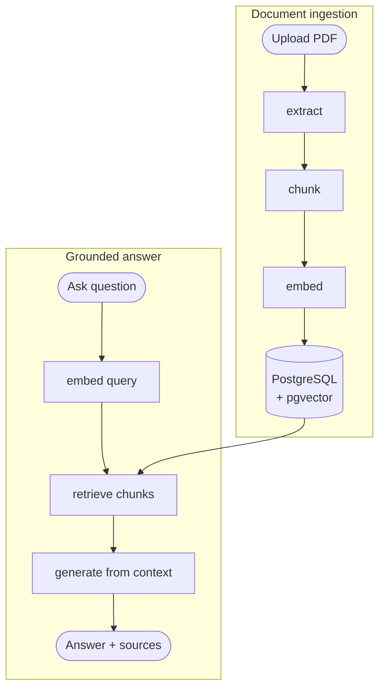

# RAG Chatbot API

> **Status:** Reviewed example
>
> **Source:** [`examples/input.md`](../input.md)

## What and why

Build a Python API that lets one user upload PDFs and ask questions answered from their contents. Answers must be grounded in retrieved chunks so the service does not invent information outside the uploaded documents.

## Requirements

- Upload a PDF, extract text, chunk it, embed it, and store the document and chunks.
- List uploaded documents with basic metadata.
- Delete a document and all related chunks and embeddings.
- Answer a question with an answer and source references from relevant chunks.
- Return a fixed no-information response when no relevant chunk exists.
- Run locally with Docker Compose using FastAPI and PostgreSQL with pgvector.
- Keep configuration in environment variables and OpenAI calls replaceable in tests.

## Acceptance criteria

- `POST /api/v1/documents` accepts a PDF and returns its ID, filename, upload time, and chunk count.
- `GET /api/v1/documents` lists uploaded documents.
- `DELETE /api/v1/documents/{id}` removes the document and makes its chunks unavailable to retrieval.
- `POST /api/v1/chat` returns a grounded answer and ordered source references for known fixture content.
- Chat with no relevant content returns `{"answer":"No relevant information found in uploaded documents.","sources":[]}`.
- Non-PDF uploads return `400`, missing deletions return `404`, and upstream OpenAI failures return `502`, all with the documented error shape.
- The full test suite passes against PostgreSQL with pgvector while OpenAI calls are mocked.

## Design

Use FastAPI for HTTP, PostgreSQL with pgvector for metadata and vector search, and the OpenAI API for embeddings and answer generation. Keep OpenAI behind a small adapter so tests can replace embedding and chat calls with deterministic fakes.



Store one row per document and many related chunk rows. Each chunk holds text, position, embedding, and document ID. Database cascading removes chunks when a document is deleted.

Use fixed-size chunks of about 500 tokens with about 50 tokens of overlap. For chat, embed the question, retrieve at most five chunks by vector similarity, and send only those chunks to the answer generator. Return sources in relevance order.

## Interfaces and data

```text
POST   /api/v1/documents      -> {id, filename, uploaded_at, chunk_count}
GET    /api/v1/documents      -> [{id, filename, uploaded_at, chunk_count}]
DELETE /api/v1/documents/{id} -> {deleted: true}
POST   /api/v1/chat           -> {answer, sources: [{document_id, filename, chunk_index, content}]}
Errors                        -> {error: {code, message}}
```

Error codes are `bad_request`, `not_found`, and `upstream_error`.

## Failure behavior

- Reject a non-PDF upload with `400` and `bad_request`.
- Return `404` and `not_found` when deleting a missing document.
- Return `502` and `upstream_error` when embedding or chat generation fails.
- Return the fixed no-information response with status `200` when retrieval has no relevant chunks.
- Fail startup clearly when required database configuration is missing.

## Test approach

- Use `pytest` and `httpx` for endpoint tests.
- Test persistence and vector behavior against PostgreSQL with pgvector.
- Mock OpenAI calls with deterministic embeddings and answers.
- Use a small PDF fixture containing known text to prove grounded chat and source references.
- Cover upload, list, delete, relevant chat, no-result chat, and the `400`, `404`, and `502` paths.

## Risks

- Text extraction quality varies across PDFs. Keep V1 to text PDFs and fail clearly when no text can be extracted.
- A fixed relevance threshold may miss useful chunks or include weak ones. Make the threshold configurable and cover the boundary with deterministic tests.
- Deleting a document must not leave retrievable vectors. Enforce this in the database and prove it through the public API.

## Out of scope

- Authentication or multiple users
- Conversation history, streaming, or reranking
- Non-PDF formats or OCR
- Retrieval tuning beyond the simple V1 defaults
- Cloud deployment beyond local Docker Compose
