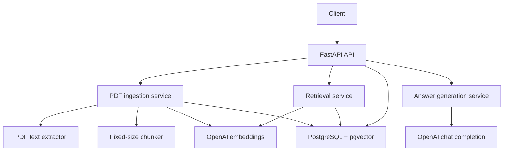
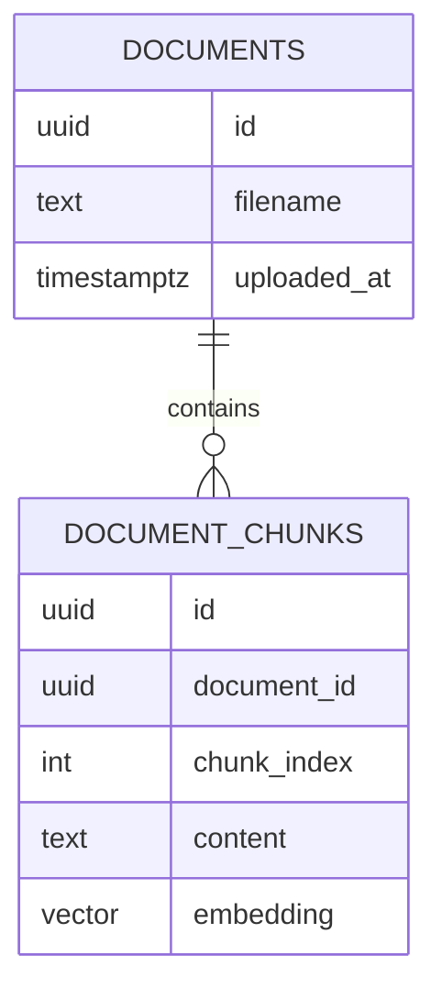
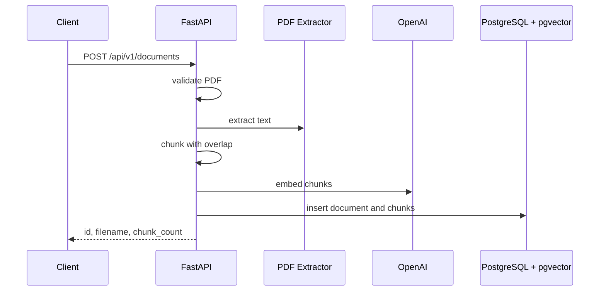
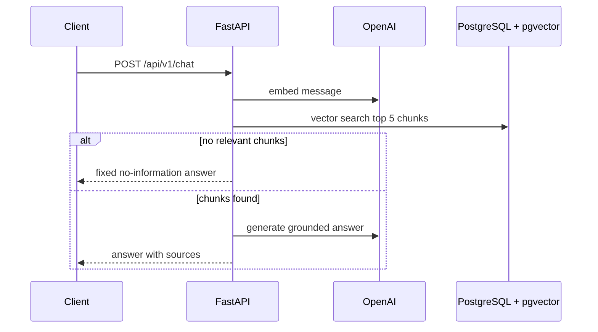

# Design: RAG Chatbot API

## Status

Draft

## Summary

Build a small, single-user Python RAG chatbot API using FastAPI, PostgreSQL with pgvector, and the OpenAI API. The service accepts PDF uploads, extracts and chunks text, stores embeddings beside document metadata, and answers questions only from retrieved chunks with source references. The recommended architecture keeps ingestion, retrieval, and answer generation inside one deployable API backed by one database so the first version stays easy to run and reason about.

## Context and Scope

The input brief asks for a simple API where users upload PDF documents, then ask questions grounded in those documents. The first version uses:

- FastAPI for HTTP endpoints
- PostgreSQL with pgvector for document metadata, chunks, and embedding search
- OpenAI for embeddings and chat completion
- Docker Compose for local API and database startup
- UV for Python package management

This design covers the local V1 architecture and technical boundaries for ingestion, retrieval, answer generation, and storage. It does not cover production authentication, multi-user isolation, cloud deployment, streaming responses, or advanced retrieval tuning.

## Goals

- Upload a PDF, extract text, chunk it, embed each chunk, and store the result.
- Answer a chat question using the most relevant stored chunks.
- Return source references with generated answers.
- List uploaded documents and delete a document with its chunks.
- Keep the system deployable locally with Docker Compose.
- Keep the architecture small enough for one implementation pass per major feature slice.

## Non-Goals

- Authentication, authorization, or multi-user tenancy.
- Conversation history or multi-turn memory.
- Non-PDF document ingestion.
- Streaming chat responses.
- Managed cloud deployment.
- Sophisticated chunking, reranking, hybrid search, or prompt evaluation pipelines.

## Constraints

- The API is a greenfield Python service.
- The database must be PostgreSQL with pgvector.
- Embeddings and chat completion use the OpenAI API.
- Package management uses UV.
- Docker Compose must run both the API and PostgreSQL locally.
- Fixed-size chunks with overlap are sufficient for V1.
- The service is single-user and has no auth in this version.

## Proposed Design

Use a modular FastAPI service with separate components for document ingestion, vector storage, retrieval, and answer generation. PostgreSQL remains the system of record for both document metadata and chunk embeddings.



### API Layer

FastAPI owns request validation, response shaping, and HTTP error mapping. The public V1 endpoints are:

- `POST /api/v1/documents`
- `GET /api/v1/documents`
- `DELETE /api/v1/documents/{id}`
- `POST /api/v1/chat`

The API should keep responses JSON-only and use a consistent error envelope:

```text
{error: {code, message}}
```

### Document Ingestion

`POST /api/v1/documents` accepts one uploaded PDF. The ingestion flow:

1. Validate that the upload is a PDF.
2. Extract text from the PDF.
3. Split text into fixed-size chunks with overlap.
4. Generate embeddings for each chunk through OpenAI.
5. Store the document row and chunk rows in PostgreSQL.
6. Return the document ID, filename, and chunk count.

Chunking should default to about 500 tokens with about 50 tokens of overlap. The implementation can use an approximate token-aware splitter as long as chunks are stable and bounded.

### Retrieval and Chat

`POST /api/v1/chat` accepts a user message. The chat flow:

1. Embed the user message.
2. Query pgvector for the top 5 nearest chunks.
3. If no relevant chunks are available, return the fixed no-information response.
4. Build a prompt containing the retrieved chunks and an instruction to answer only from those chunks.
5. Call OpenAI chat completion.
6. Return the answer with source references ordered by retrieval relevance.

The API should avoid fabricating answers when retrieval misses. The fixed miss response is:

```json
{"answer":"No relevant information found in uploaded documents.","sources":[]}
```

### Storage

PostgreSQL stores both metadata and vector-searchable chunks:



Use cascading deletes or an explicit transaction so deleting a document also removes its chunks and embeddings.

## Architecture Views

### Upload Flow



### Chat Flow



## Interfaces and Data

Expected public response shapes:

```text
POST /api/v1/documents -> {id, filename, chunk_count}
GET  /api/v1/documents -> [{id, filename, uploaded_at, chunk_count}]
DELETE /api/v1/documents/{id} -> {deleted: true}
POST /api/v1/chat      -> {answer, sources: [{content, document_id}]}
Errors                 -> {error: {code, message}}
```

Important error behavior:

- Non-PDF uploads return `400` with `bad_request`.
- Missing document deletion returns `404` with `not_found`.
- OpenAI embedding or chat failures return `502` with `upstream_error`.

## Alternatives Considered

### Use a separate vector database

A dedicated vector database could add specialized retrieval features, but it introduces another service and operational surface. pgvector is enough for V1 and keeps metadata and embeddings in one transactional store.

### Store uploaded files on disk or object storage

Persisting original PDFs would support later reprocessing and download behavior, but the brief only requires grounded answers, listing, and deletion. Storing extracted chunks avoids file lifecycle complexity in the first version.

### Add authentication immediately

Auth is necessary for production, but the brief explicitly says single-user and no auth for now. Adding it now would distract from the ingestion and retrieval contracts that define the core behavior.

### Implement advanced retrieval

Hybrid search, reranking, metadata filters, and adaptive chunking can improve answer quality. They also make the first version harder to test and tune. Fixed-size chunking with top-5 vector retrieval is the simpler baseline.

## Tradeoffs

- One API service is easy to run locally, but ingestion work can block request handling for large PDFs.
- pgvector keeps storage simple, but retrieval quality depends on embedding configuration and indexing choices.
- Fixed-size chunking is predictable, but it may split semantically related text.
- Mocking OpenAI in tests keeps verification deterministic, but it does not prove production model quality.
- Not storing original PDFs reduces storage complexity, but it limits future reprocessing unless documents are uploaded again.

## Cross-Cutting Concerns

### Reliability

Document upload should use a transaction for metadata and chunk inserts so partial ingestion does not leave orphaned rows. OpenAI failures should fail the request clearly with `502` and should not store incomplete documents.

### Performance

Embedding multiple chunks happens during upload. This is acceptable for V1, but large PDFs may need background jobs later. Add a pgvector index once the implementation has a known embedding dimension.

### Security and Privacy

The first version has no auth, so it should be treated as local-only. The service sends extracted document text to OpenAI for embeddings and answer generation; that data flow should be visible in configuration and docs.

### Observability

Basic request logging and structured OpenAI error logging are enough for V1. Avoid logging full document text or prompts by default because uploaded PDFs may contain sensitive content.

### Operations

Docker Compose should start the API and PostgreSQL with pgvector. Configuration should come from environment variables, including database URL and OpenAI API key.

## Rollout and Migration

This is a greenfield service, so rollout is a phased build rather than a migration:

1. Create the FastAPI shell, configuration, Docker Compose, and database connection.
2. Add document and chunk tables with pgvector enabled.
3. Implement PDF ingestion and embedding.
4. Add listing and deletion.
5. Add retrieval-backed chat.
6. Add integration tests for main flows and error paths.

## Open Questions

- Which PDF extraction library should the implementation choose for V1?
- Which OpenAI embedding and chat models should be pinned at implementation time?
- Should the service store original PDFs once the first version works?

## Decision

Proceed with a single FastAPI service backed by PostgreSQL with pgvector and OpenAI. Keep ingestion synchronous, use fixed-size chunks with overlap, retrieve the top 5 chunks for chat, and return a fixed no-information answer when retrieval does not find relevant context. Revisit background jobs, auth, stored originals, and retrieval quality improvements after the V1 API behavior is implemented and covered by tests.
