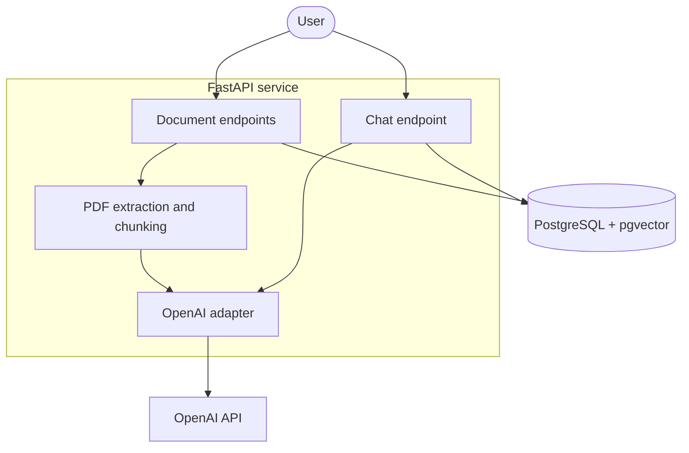

# RAG Chatbot API

> **Status:** Proposed for review
>
> **Source:** [`examples/input.md`](../input.md)
>
> **Example:** Reviewed golden output

## 1. Executive summary

Build a small API where one person can upload PDFs and ask questions about them. Each answer must use the uploaded text and show which parts it used. If the documents do not contain the answer, the API says so.

Use FastAPI, OpenAI, and PostgreSQL with its pgvector search extension. Keep uploads in the request instead of using a background job. This makes the first version easier to run and test, but large uploads take longer.

## 2. Context and scope

The project starts with no application. The first version must support the full local path from PDF upload to an answer based on that PDF. It must also list and delete documents. It runs with Docker Compose and assumes one trusted user, so login and separation between users are outside this design.

## 3. System context


```mermaid
flowchart TB
    subgraph API["FastAPI service"]
        Upload["Document endpoints"]
        Chat["Chat endpoint"]
        Extract["PDF extraction and chunking"]
        Provider["OpenAI adapter"]
    end

    User([User]) --> Upload
    User --> Chat
    Upload --> Extract --> Provider
    Chat --> Provider
    Upload --> DB[("PostgreSQL + pgvector")]
    Chat --> DB
    Provider --> OpenAI["OpenAI API"]
```

The API checks requests and runs each step in the right order. PostgreSQL stores the documents and text chunks. OpenAI turns text into vectors for search and writes answers, but it stores no application data.

## 4. Proposed design

### How it works

For upload, the API checks the file and extracts its text. It splits the text into overlapping chunks and asks OpenAI to turn them into search vectors, called embeddings. It writes the document and all chunks in one database transaction. It returns document details only after that transaction succeeds.

For chat, the API turns the question into a vector and compares it with each text chunk. It calculates similarity as `1 - (embedding <=> query_embedding)` in pgvector. A chunk qualifies when its score is at least `RAG_RELEVANCE_THRESHOLD`. This value defaults to `0.75` and must be between `0` and `1`, including both limits.

The API retrieves at most five matching chunks. If none match, it returns the fixed no-information response. Otherwise it sends only those chunks to OpenAI. It returns the answer and sources in score order. Equal scores are ordered by document ID and then chunk index.

Deleting a document removes its chunks through a database cascade. Later retrieval therefore cannot return deleted content.

### Components and responsibilities

| Component | Owns | Depends on | Does not own |
| --- | --- | --- | --- |
| FastAPI routes | HTTP validation and response shapes | Application services | Persistence or provider-specific calls |
| Ingestion and chat services | Use-case ordering and failure mapping | Repository and OpenAI adapter | HTTP details |
| PostgreSQL repository | Documents, chunks, embeddings, and vector queries | PostgreSQL with pgvector | Answer generation |
| OpenAI adapter | Provider request and response translation | OpenAI API | Retrieval policy or durable state |

### Decisions

**Use PostgreSQL with pgvector.** This keeps metadata and vectors in one transactional store. A separate vector database could scale independently, but it would add another service and consistency boundary before V1 needs either.

**Use fixed-size chunks.** Chunks are about 500 tokens with about 50 tokens of overlap. Semantic chunking may improve retrieval, but fixed chunking is easier to reason about and test for the initial product.

**Use a relevance threshold before generation.** Returning a fixed no-information response is safer than asking the model to answer from weak context. The threshold is configurable because useful values vary by embedding model and content.

## 5. Invariants and requirements

### Invariants

1. The answer generator receives no document context except the chunks returned in that response's source list.
2. A deleted document has no chunks available to retrieval.
3. A failed upload leaves no document or chunk rows behind.
4. Provider failures never appear as successful grounded answers.

### Requirements

- Upload a PDF, extract text, chunk it, embed it, and store the document and chunks.
- List uploaded documents with basic metadata.
- Delete a document and all related chunks and embeddings.
- Answer a question with an answer and ordered source references from relevant chunks.
- Return a fixed no-information response when no relevant chunk exists.
- Run locally with Docker Compose using FastAPI and PostgreSQL with pgvector.
- Use `uv` for Python package and environment management.
- Keep configuration in environment variables and OpenAI calls replaceable in tests.
- Expose a health endpoint that reports whether the API can reach PostgreSQL.

## 6. Interfaces and data

```text
GET    /health                -> {status: "ok"}
POST   /api/v1/documents      <- multipart/form-data with one file field
                              -> {id, filename, uploaded_at, chunk_count}
GET    /api/v1/documents      -> [{id, filename, uploaded_at, chunk_count}]
DELETE /api/v1/documents/{id} -> {deleted: true}
POST   /api/v1/chat           <- {message}
                              -> {answer, sources: [{document_id, filename, chunk_index, content}]}
Errors                        -> {error: {code, message}}
```

Error codes are `bad_request`, `payload_too_large`, `not_found`, `internal_error`, `service_unavailable`, and `upstream_error`.

Store one row per document and many related chunk rows. Each chunk holds its text, zero-based position, embedding, and document ID. The document foreign key cascades on delete.

`RAG_RELEVANCE_THRESHOLD` configures the minimum inclusive cosine similarity and defaults to `0.75`. Startup accepts both `0` and `1` and fails unless the value is numeric and satisfies `0 <= value <= 1`.

`SERVER_GRACEFUL_SHUTDOWN_SECONDS` configures the shutdown deadline and defaults to `10`. Startup fails unless it is an integer from `1` through `60`.

`DATABASE_URL` and `OPENAI_API_KEY` are required. Startup fails before serving traffic when either setting is missing.

### Naming and identity

The service generates an opaque UUID for each uploaded document. The original filename is display metadata and never forms identity. Chunk identity is the document UUID plus its zero-based position, which remains stable for the lifetime of that document.

## 7. Failure behavior and lifecycle

- Reject a non-PDF or a PDF with no extractable text using `400` and `bad_request`.
- Reject a PDF over 25 MiB using `413` and `payload_too_large`.
- Return `404` and `not_found` when deleting a missing document.
- Return `502` and `upstream_error` when embedding or answer generation fails.
- Return `503` and `service_unavailable` when `/health` cannot reach PostgreSQL. The health check does not call OpenAI.
- Return `500` and `internal_error` when a document or chat database operation fails. A failed upload transaction rolls back before this response is returned.
- Return the fixed no-information response with status `200` when retrieval has no qualifying chunks.
- Return `400` and `bad_request` when the chat message is missing or empty.
- Fail startup before serving traffic when required database or OpenAI configuration is missing.
- On shutdown, stop accepting new requests and wait up to `SERVER_GRACEFUL_SHUTDOWN_SECONDS` for in-flight requests. After the deadline, cancel remaining requests and let open database transactions roll back.

## 8. Security, privacy, and operations

V1 is for one trusted local user. It has no authentication, authorization, or tenant isolation and must not be exposed as a shared public service. Document text is sent to OpenAI for embeddings and relevant chunks are sent again for answer generation.

Uploads are limited to 25 MiB and rejected before extraction when larger. Chat retrieves at most five chunks. Docker Compose owns local service startup and persistent database storage.

## 9. Acceptance criteria

- `POST /api/v1/documents` accepts a PDF up to 25 MiB and returns its ID, filename, upload time, and chunk count.
- `GET /health` returns `200` with `{"status":"ok"}` when the API can reach PostgreSQL and `503` with `service_unavailable` when it cannot.
- Uploading a non-PDF, an empty-text PDF, or a file over 25 MiB returns `400` with `bad_request`, `400` with `bad_request`, or `413` with `payload_too_large` respectively and creates no rows.
- `GET /api/v1/documents` lists uploaded documents.
- `DELETE /api/v1/documents/{id}` removes the document and makes its chunks unavailable to retrieval.
- `POST /api/v1/chat` returns a grounded answer and ordered source references for known fixture content.
- Chat retrieves at most five qualifying chunks, and the mocked answer generator receives exactly the same ordered chunk content returned in `sources`.
- A chunk with cosine similarity exactly equal to `RAG_RELEVANCE_THRESHOLD` qualifies; a lower score does not.
- Chunks with equal similarity are ordered by document ID and then chunk index.
- Threshold configuration accepts `0` and `1` and rejects non-numeric values, values below `0`, and values above `1` before startup.
- Chat with no relevant content returns `{"answer":"No relevant information found in uploaded documents.","sources":[]}`.
- After a failed upload or document deletion, chat for that document's fixture content returns the fixed no-information response with no sources.
- A missing or empty chat message returns `400` with `bad_request`.
- Missing deletion returns `404`, and upstream OpenAI failures return `502`, both with the documented error shape.
- A forced upload persistence failure returns `500` with `internal_error` and leaves no document or chunk rows.
- Database failures while listing, deleting, or retrieving for chat return `500` with `internal_error`.
- Startup fails before serving traffic when `DATABASE_URL` or `OPENAI_API_KEY` is missing or when either bounded numeric setting is invalid.
- Shutdown stops new requests, gives in-flight requests 10 seconds by default, then cancels remaining work without committing a partial upload.
- The full test suite passes against PostgreSQL with pgvector while OpenAI calls are mocked.
- `uv sync --frozen` and `uv run pytest` are the supported local dependency and test commands.

## 10. Test approach

- Use `pytest` and `httpx` for endpoint tests.
- Test persistence and vector behavior against PostgreSQL with pgvector.
- Mock OpenAI calls with deterministic embeddings and answers.
- Use a small PDF fixture containing the sentence "PostgreSQL with pgvector stores the embeddings." to prove grounded chat and source references.
- Use deterministic embeddings that produce scores equal to, immediately below, and immediately above `RAG_RELEVANCE_THRESHOLD`.
- Create more than five qualifying chunks, then assert that retrieval, generator context, and returned sources use the same ordered first five chunks.
- Cover threshold configuration at `0`, at `1`, below `0`, above `1`, and with a non-numeric value.
- Start a deliberately slow upload, request shutdown, and cover completion before the configured deadline and cancellation with transaction rollback after it.
- Cover upload, list, delete, relevant chat, no-result chat, transaction rollback, and the `400`, `404`, `413`, `500`, and `502` paths.
- Cover health with PostgreSQL available and unavailable, missing or empty chat messages, and database failures during list, delete, and chat retrieval.
- Cover startup with each required setting missing.
- Assert through the public API that a deleted document and a failed upload leave no retrievable chunks.

## 11. Risks and tradeoffs

- Text extraction quality varies across PDFs. V1 accepts text PDFs only and fails clearly when no text can be extracted.
- A fixed relevance threshold may miss useful chunks or include weak ones. Make the threshold configurable and cover the boundary with deterministic tests.
- Synchronous embedding makes upload latency proportional to document size. The 25 MiB limit bounds the initial risk; background ingestion remains outside V1.
- Sending document text to OpenAI may not suit sensitive documents. The README must disclose that boundary.

## 12. Open questions

None block task breakdown. Authentication, provider selection, and asynchronous ingestion require new designs if the deployment scope expands beyond one trusted user.

## 13. Out of scope

- Authentication, multiple users, or tenant isolation
- Conversation history, streaming, or reranking
- Non-PDF formats or OCR
- Retrieval tuning beyond the simple V1 defaults
- Background ingestion
- Cloud deployment beyond local Docker Compose
