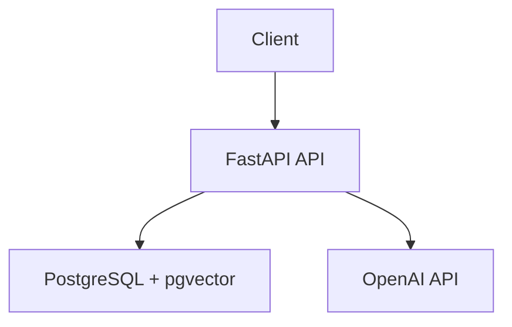

# RAG Chatbot API

## What

Build a Python API that lets a user upload PDF documents and ask questions answered from those documents. Keep it simple, single-user, and grounded in retrieved content so the API returns a clear "no information" response instead of hallucinating.

## Requirements

**Functional**

- Upload a PDF, extract text, chunk it, embed it, and store the document with its chunks
- Ask a question and return an answer plus source references from the most relevant chunks
- List uploaded documents with basic metadata
- Delete a document and all associated chunks and embeddings
- Return `400` for non-PDF uploads, `404` for missing documents, and `502` for upstream OpenAI failures

**Non-functional**

- Run locally with Docker Compose for the API and PostgreSQL
- Use PostgreSQL with pgvector for embeddings
- Keep configuration in environment variables
- Keep API responses JSON and consistent across endpoints

## Design



- Use FastAPI for the HTTP layer, PostgreSQL + pgvector for storage and retrieval, and the OpenAI API for embeddings and answer generation.
- Keep chunking simple: fixed-size chunks with overlap are enough for this version.
- Store documents and chunks so listing, deletion, retrieval, and source references all work without extra services.
- Return source references with chat responses so callers can see what grounded the answer.

**API shapes**

```text
POST /api/v1/documents -> {id, filename, chunk_count}
GET  /api/v1/documents -> [{id, filename, uploaded_at, chunk_count}]
POST /api/v1/chat      -> {answer, sources: [{content, document_id}]}
DELETE /api/v1/documents/{id} -> {deleted: true}
```

## Testing Strategy

- Use `pytest` with `httpx` for endpoint tests
- Test database behavior against a real PostgreSQL + pgvector instance
- Mock OpenAI calls so tests are deterministic and fast
- Cover the main flows: upload, list, delete, chat with relevant chunks, chat with no relevant chunks, and the expected error cases
- Do not spend time testing framework internals or third-party library behavior

## Out of Scope

- Authentication or multi-user behavior
- Conversation history or multi-turn chat
- Non-PDF document formats
- Fancy chunking or retrieval tuning
- Cloud deployment beyond local Docker Compose
