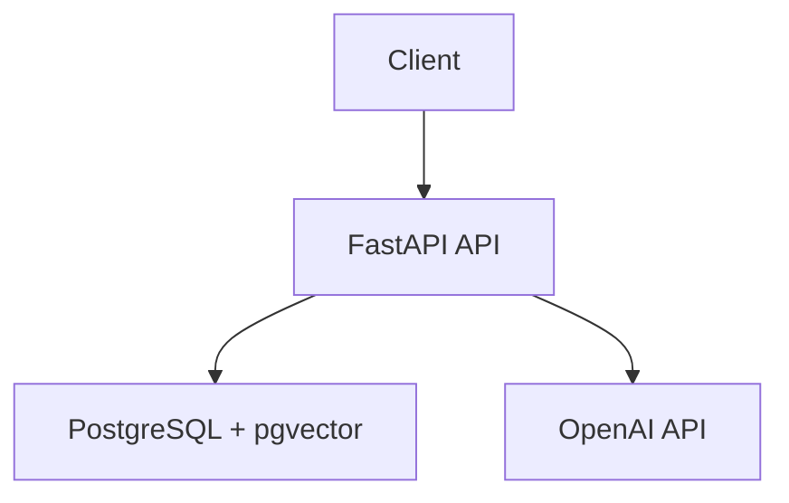

# RAG Chatbot API

## Summary

Build a Python API that lets one user upload PDFs and ask questions answered from those PDFs. The API must ground answers in retrieved chunks and return a fixed no-information response when the uploaded documents do not contain relevant content.

## Background

This is a greenfield FastAPI service using PostgreSQL with pgvector and the OpenAI API. The first version has no auth, no conversation history, and no non-PDF formats. Local development and verification use Docker Compose for the API and database. Python packages are managed with `uv`.

## Requirements

**Functional**

- Upload a PDF, extract text, chunk it, embed it, and store the document with its chunks
- Ask a question and return an answer plus source references from the most relevant chunks
- List uploaded documents with basic metadata
- Delete a document and all associated chunks and embeddings
- Return consistent JSON errors for non-PDF uploads, missing documents, and upstream OpenAI failures
- When no relevant chunks are found, return `{"answer":"No relevant information found in uploaded documents.","sources":[]}`

**Non-functional**

- Run locally with Docker Compose for the API and PostgreSQL
- Use PostgreSQL with pgvector for embeddings
- Keep configuration in environment variables
- Keep API responses JSON and consistent across endpoints
- Keep OpenAI calls mockable in tests

## Design



Use FastAPI for the HTTP layer, PostgreSQL with pgvector for document and vector storage, and the OpenAI API for embeddings and answer generation. Keep the OpenAI client behind a small adapter so tests can replace embedding and chat calls with deterministic fakes.

Store each uploaded PDF as one document row plus many chunk rows. Each chunk stores its text, position, embedding, and document reference. Deleting a document must remove its chunks and embeddings.

Use fixed-size chunks of about 500 tokens with about 50 tokens of overlap. For chat, embed the incoming message, retrieve the top 5 chunks by vector similarity, and send only those chunks as context to the answer generator. Return sources ordered by relevance.

**API shapes**

```text
POST /api/v1/documents -> {id, filename, uploaded_at, chunk_count}
GET  /api/v1/documents -> [{id, filename, uploaded_at, chunk_count}]
POST /api/v1/chat      -> {answer, sources: [{document_id, filename, chunk_index, content}]}
DELETE /api/v1/documents/{id} -> {deleted: true}
Errors -> {error: {code, message}}
```

Important defaults:

- `POST /api/v1/chat` with no relevant matches returns `{"answer":"No relevant information found in uploaded documents.","sources":[]}`
- Error codes use `bad_request`, `not_found`, and `upstream_error`.
- Chat requests retrieve at most 5 chunks.

## Decisions

- Storage: use PostgreSQL with pgvector, because document metadata and vector search can stay in one database.
- Chunking: use fixed-size chunks of about 500 tokens with about 50 tokens of overlap, because simple predictable chunking is enough for V1.
- Retrieval: use top 5 chunks per chat request, because it keeps prompts small while giving the answer generator enough context.
- OpenAI calls in tests: mock them, because integration tests should not depend on external network calls or model variance.
- No relevant chunks: return the fixed "No relevant information found in uploaded documents." response, because hallucination is worse than an explicit miss.

## Behavior That Must Not Change

- Deleting a document also deletes its chunks and embeddings, verified by listing documents and ensuring deleted chunks cannot be retrieved.
- API errors use `{error: {code, message}}`, verified by endpoint tests for `400`, `404`, and `502`.
- Chat answers include source references from stored chunks, verified by a chat test against a known PDF fixture.

## Error Behavior

- Non-PDF upload returns `400` with `bad_request`.
- Missing document deletion returns `404` with `not_found`.
- OpenAI embedding or chat failures return `502` with `upstream_error`.
- No relevant chunks returns `200` with the fixed no-information answer and an empty `sources` array.

## Test Plan

- Use `pytest` with `httpx` for endpoint tests
- Test database behavior against a real PostgreSQL + pgvector instance
- Mock OpenAI calls so tests are deterministic and fast
- Cover the main flows: upload, list, delete, chat with relevant chunks, chat with no relevant chunks, and the expected error cases
- Include a small PDF fixture containing known text, such as `Blueprint uses PostgreSQL with pgvector for embeddings.`

## Out of Scope

- Authentication or multi-user behavior
- Conversation history or multi-turn chat
- Non-PDF document formats
- Fancy chunking or retrieval tuning
- Cloud deployment beyond local Docker Compose
- Testing framework internals or third-party library behavior
