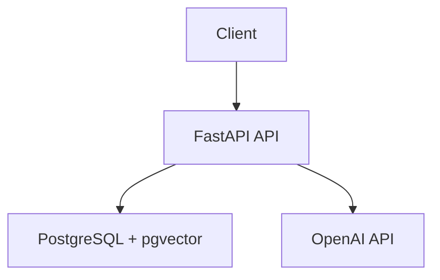

# RAG Chatbot API

## What

Build a FastAPI service that lets a single user upload PDF documents, store their embeddings in PostgreSQL with pgvector, and ask questions answered from the uploaded content with source references.

## Context

This is a greenfield API. The input specifies FastAPI, PostgreSQL with pgvector, OpenAI for embeddings and chat completion, UV for package management, and Docker Compose for local development. The first version should stay intentionally small: PDFs only, no auth, no multi-user behavior, no conversation history, and simple fixed-size chunking.

## Requirements

- `POST /api/v1/documents` accepts a PDF, extracts text, chunks it, embeds each chunk, stores the document and chunks, and returns `{id, filename, chunk_count}`.
- `GET /api/v1/documents` returns uploaded documents with `id`, `filename`, `uploaded_at`, and `chunk_count`.
- `DELETE /api/v1/documents/{id}` deletes the document and its chunks, returning `{deleted: true}`.
- `POST /api/v1/chat` accepts a message, retrieves relevant chunks, calls OpenAI chat completion with grounded context, and returns `{answer, sources}`.
- Source references include the stored chunk content and document ID.
- Non-PDF uploads return `400`; deleting a missing document returns `404`; OpenAI failures return `502`.
- If no relevant chunks are found, chat returns `{"answer":"No relevant information found in uploaded documents.","sources":[]}`.
- The service runs locally with Docker Compose for the API and PostgreSQL.
- Configuration comes from environment variables.

## Design

Use FastAPI for HTTP, PostgreSQL with pgvector for metadata and vector search, and OpenAI for embeddings and answer generation.



Suggested components:

- `app/main.py`: FastAPI app and router registration.
- `app/api/documents.py`: upload, list, and delete endpoints.
- `app/api/chat.py`: chat endpoint.
- `app/core/config.py`: environment-backed settings.
- `app/db/session.py`: database engine/session setup.
- `app/models.py`: document and chunk tables.
- `app/services/pdf.py`: PDF text extraction.
- `app/services/chunking.py`: fixed-size chunking with overlap.
- `app/services/openai.py`: embedding and chat adapters.
- `docker-compose.yml`: API and PostgreSQL with pgvector.

Use fixed-size chunks of roughly 500 tokens with roughly 50 tokens of overlap. Store chunks with embeddings, document ID, text content, and position. Retrieve the top 5 chunks by vector similarity for each chat request. Build the chat prompt from retrieved chunks and instruct the model to answer only from provided context.

API shapes:

```text
POST   /api/v1/documents      -> {id, filename, chunk_count}
GET    /api/v1/documents      -> [{id, filename, uploaded_at, chunk_count}]
DELETE /api/v1/documents/{id} -> {deleted: true}
POST   /api/v1/chat           -> {answer, sources: [{content, document_id}]}
Errors                         -> {error: {code, message}}
```

## Decisions

- Store metadata and embeddings in PostgreSQL with pgvector so the first version needs only one persistent service.
- Use fixed-size chunking because the requested V1 does not need retrieval tuning.
- Retrieve the top 5 chunks to keep prompts small while giving the model enough context.
- Mock OpenAI calls in tests so verification does not depend on network access or model variance.
- Return an explicit no-information answer when retrieval finds no useful context, because hallucination is worse than an empty result.

## Invariants

- Deleting a document deletes its chunks and embeddings.
- Chat answers must be grounded in retrieved chunks and include source references.
- Error responses use `{error: {code, message}}`.
- OpenAI API failures are surfaced as `502` with `upstream_error`.

## Error Behavior

- Non-PDF upload: `400` with `bad_request`.
- Missing document on delete: `404` with `not_found`.
- OpenAI embedding or chat failure: `502` with `upstream_error`.
- No relevant chunks: `200` with the fixed no-information answer and an empty `sources` array.

## Testing Strategy

- Use `pytest` and `httpx` for endpoint tests.
- Run database tests against PostgreSQL with pgvector.
- Mock OpenAI embeddings and chat completions with deterministic responses.
- Cover upload, list, delete, chat with relevant chunks, chat with no relevant chunks, and `400`, `404`, and `502` errors.
- Include a PDF fixture with text such as `Blueprint uses PostgreSQL with pgvector for embeddings.`

## Out of Scope

- Authentication and multi-user behavior.
- Conversation history or streaming.
- Non-PDF document formats.
- Advanced chunking, reranking, or retrieval tuning.
- Cloud deployment beyond local Docker Compose.
