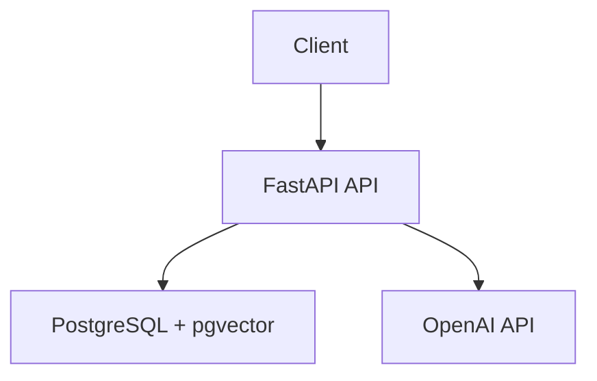

# RAG Chatbot API

## What

Build a Python API that lets a user upload PDF documents and ask questions answered from those documents. Keep it simple, single-user, and grounded in retrieved content so the API returns a clear "no information" response instead of hallucinating.

## Context

Greenfield FastAPI service using PostgreSQL with pgvector and the OpenAI API. The first version has no auth, no conversation history, and no non-PDF formats. Docker Compose is part of the local development surface.

Version-sensitive choices were checked while writing this spec so the implementation does not start from stale platform defaults.

## Requirements

**Functional**

- Upload a PDF, extract text, chunk it, embed it, and store the document with its chunks
- Ask a question and return an answer plus source references from the most relevant chunks
- List uploaded documents with basic metadata
- Delete a document and all associated chunks and embeddings
- Return `400` for non-PDF uploads, `404` for missing documents, and `502` for upstream OpenAI failures
- When no relevant chunks are found, return `{"answer":"No relevant information found in uploaded documents.","sources":[]}`

**Non-functional**

- Run locally with Docker Compose for the API and PostgreSQL
- Use PostgreSQL with pgvector for embeddings
- Keep configuration in environment variables
- Keep API responses JSON and consistent across endpoints

## Design



- Use FastAPI for the HTTP layer, PostgreSQL + pgvector for storage and retrieval, and the OpenAI API for embeddings and answer generation.
- Use fixed-size chunks of about 500 tokens with about 50 tokens of overlap.
- Store documents and chunks so listing, deletion, retrieval, and source references all work without extra services.
- Retrieve the top 5 chunks for each chat request and return sources ordered by relevance.
- Return source references with chat responses so callers can see what grounded the answer.

**API shapes**

```text
POST /api/v1/documents -> {id, filename, chunk_count}
GET  /api/v1/documents -> [{id, filename, uploaded_at, chunk_count}]
POST /api/v1/chat      -> {answer, sources: [{content, document_id}]}
DELETE /api/v1/documents/{id} -> {deleted: true}
Errors -> {error: {code, message}}
```

Important defaults:

- `POST /api/v1/chat` with no relevant matches returns `{"answer":"No relevant information found in uploaded documents.","sources":[]}`
- Error codes use `bad_request`, `not_found`, and `upstream_error`

## Decisions

- **Storage**: use PostgreSQL with pgvector.
  - **Alternatives considered**: separate vector database; SQLite plus external vector store.
  - **Why this one**: document metadata and vector search can stay in one database, which keeps V1 simple.
  - **Reversible**: Yes, but migrating embeddings later would require a data migration.

- **Chunking**: use fixed-size chunks of about 500 tokens with about 50 tokens of overlap.
  - **Alternatives considered**: semantic chunking; document-structure-aware chunking.
  - **Why this one**: predictable chunking is enough for V1 and easier to test.
  - **Reversible**: Yes. Store chunk metadata so a later migration can re-chunk documents.

- **Retrieval**: retrieve the top 5 chunks per chat request.
  - **Alternatives considered**: top 3; top 10; reranking.
  - **Why this one**: top 5 keeps prompts small while giving the answer generator enough context.
  - **Reversible**: Yes. Make the value configurable.

- **OpenAI calls in tests**: mock embeddings and chat completions.
  - **Alternatives considered**: integration tests against the live OpenAI API.
  - **Why this one**: tests should be deterministic, fast, and not dependent on network calls or model variance.
  - **Reversible**: Yes. Add optional live smoke tests later if needed.

- **No relevant chunks**: return the fixed "No relevant information found in uploaded documents." response.
  - **Alternatives considered**: ask the model to answer anyway; return a low-confidence answer.
  - **Why this one**: hallucination is worse than an explicit miss.
  - **Reversible**: Yes. The response policy can evolve once retrieval quality is measured.

## Versions

- Python: use Python 3.14 for the API runtime. Python 3.14.3 is the current stable bugfix release in the Python 3.14 series. Source: https://blog.python.org/2026/02/python-3143-and-31312-are-now-available/
- FastAPI: pin FastAPI `0.136.1` initially. This is the current PyPI release and keeps the app on a reviewed framework version instead of an unbounded latest install. Source: https://pypi.org/project/fastapi/
- PostgreSQL: use PostgreSQL 18 for local Docker Compose and production-compatible defaults. PostgreSQL 18 is the current major release line. Source: https://www.postgresql.org/download/
- pgvector: use pgvector `0.8.2` or a matching `pgvector/pgvector:pg18` image that includes PostgreSQL 18 support. Source: https://github.com/pgvector/pgvector
- OpenAI chat model: use `gpt-5.2` for answer generation unless cost or latency requires a smaller model. Source: https://platform.openai.com/docs/models
- OpenAI embedding model: use `text-embedding-3-large` for embeddings unless cost requires `text-embedding-3-small`. Source: https://platform.openai.com/docs/guides/embeddings

## Invariants

- Deleting a document also deletes its chunks and embeddings, verified by listing documents and ensuring deleted chunks cannot be retrieved.
- API errors use `{error: {code, message}}`, verified by endpoint tests for `400`, `404`, and `502`.
- Chat answers include source references from stored chunks, verified by a chat test against `tests/fixtures/test.pdf`.

## Error Behavior

- Non-PDF upload returns `400` with `bad_request`.
- Missing document deletion returns `404` with `not_found`.
- OpenAI embedding or chat failures return `502` with `upstream_error`.
- No relevant chunks returns `200` with the fixed no-information answer and an empty `sources` array.

## Testing Strategy

- Use `pytest` with `httpx` for endpoint tests
- Test database behavior against a real PostgreSQL + pgvector instance
- Mock OpenAI calls so tests are deterministic and fast
- Cover the main flows: upload, list, delete, chat with relevant chunks, chat with no relevant chunks, and the expected error cases
- Do not spend time testing framework internals or third-party library behavior

## Out of Scope

- Authentication or multi-user behavior
- Conversation history or multi-turn chat
- Non-PDF document formats
- Fancy chunking or retrieval tuning
- Cloud deployment beyond local Docker Compose
