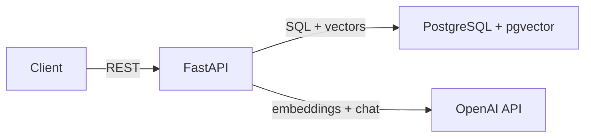

# RAG Chatbot API

## What
A Python API that lets users upload PDF documents, then ask natural language questions and get answers grounded in the uploaded content. Built for developers integrating document Q&A into their applications. Single-user, no auth.

## Requirements

**Functional:**
- Accept PDF uploads, extract text, chunk it, embed it, and store it
- Accept chat messages, retrieve relevant chunks via vector similarity, return AI-generated answers with source references
- List uploaded documents with metadata (name, upload time, chunk count)
- Delete a document and all associated chunks and embeddings
- When no relevant chunks exist for a query, return a clear "no information" response — don't hallucinate
- Non-PDF uploads return 400
- Requests for non-existent documents return 404
- OpenAI API failures return 502 with a useful error message

**Non-functional:**
- PDF processing completes within 30 seconds for docs under 50 pages
- Chat responses return within 5 seconds for collections under 1000 chunks
- Runs locally via Docker Compose with no external dependencies beyond the OpenAI API
- All API responses follow a consistent JSON structure

## Design



**Stack:** FastAPI, SQLAlchemy async, PostgreSQL + pgvector, OpenAI API, UV for package management.

**Key decisions:**
- **pgvector over dedicated vector DB** — one database for relational data and vectors. Sufficient at this scale. Avoids external dependency.
- **Fixed-size chunking** — ~500 tokens with ~50 token overlap. Simple and predictable.
- **text-embedding-3-small** — 1536 dimensions. Good balance of quality and cost.
- **5 chunks per query** — default retrieval count. Enough context without exceeding limits.

**Components:**
- **API Layer** — REST endpoints under `/api/v1/`. Takes uploads, serves queries, returns JSON.
- **Ingestion Service** — Takes an uploaded file, extracts text, chunks, embeds, stores. Caller can depend on: document is persisted with all chunks and embeddings before return.
- **Retrieval Service** — Takes a query string, returns ranked chunks. Each chunk has: content, document_id, similarity score. Sorted by relevance descending.
- **Chat Service** — Takes a message and retrieved chunks, returns an answer with source references. When given no chunks, returns a "no information" response.

**Key API response shapes:**

```
POST /api/v1/documents → {id, filename, chunk_count}
GET  /api/v1/documents → [{id, filename, uploaded_at, chunk_count}]
POST /api/v1/chat      → {answer, sources: [{content, document_id}]}
```

## Testing Strategy
- **Framework:** pytest with httpx AsyncClient for endpoint testing
- **Test against real dependencies:** Use a test PostgreSQL container with pgvector for database tests. Vector similarity queries must hit real pgvector, not mocks.
- **Mock external APIs:** Mock OpenAI embeddings and chat completion calls — return deterministic vectors and responses so tests are fast and reproducible.
- **What to test:**
  - Upload → chunk → embed → store pipeline (verify chunks and embeddings are persisted)
  - Chat flow with relevant chunks (verify answer includes source references)
  - Chat flow with no relevant chunks (verify "no information" response)
  - Document deletion cascades (verify chunks are removed)
  - Error cases: non-PDF upload (400), missing document (404), OpenAI failure (502)
- **What NOT to test:** FastAPI framework routing, SQLAlchemy query building, PDF parsing library internals

## Out of Scope
- Authentication and authorization
- Multi-user or multi-tenant support
- Conversation history or multi-turn chat
- Non-PDF document formats
- Cloud deployment (Docker Compose only)
