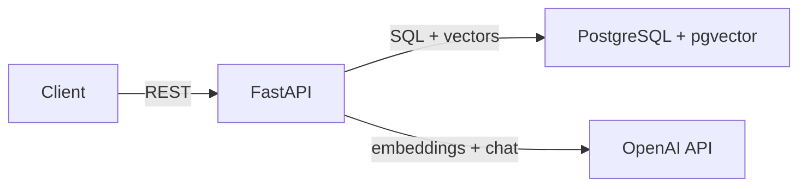

# RAG Chatbot API

## What
A Python API that lets users upload PDF documents, then ask natural language questions and get answers grounded in the uploaded content. Built for developers integrating document Q&A into their applications. Single-user, no auth.

## Requirements
- Accept PDF uploads, extract text, chunk it, embed it, and store it
- Accept chat messages, retrieve relevant chunks via vector similarity, return AI-generated answers with source references
- List uploaded documents with metadata (name, upload time, chunk count)
- Delete a document and all associated chunks/embeddings
- When no relevant chunks exist for a query, say so — don't hallucinate
- PDF processing completes within 30 seconds for docs under 50 pages
- Chat responses return within 5 seconds for collections under 1000 chunks
- Runs locally via Docker Compose with no external dependencies beyond OpenAI API

## Design



**Stack:** FastAPI, SQLAlchemy async, PostgreSQL + pgvector, OpenAI API, UV for package management.

**Key decisions:**
- **pgvector over dedicated vector DB** — one database for relational data and vectors. Sufficient at this scale. Avoids external dependency.
- **Fixed-size chunking** — ~500 tokens with ~50 token overlap. Simple and predictable.
- **text-embedding-3-small** — 1536 dimensions. Good balance of quality and cost.
- **5 chunks per query** — enough context without exceeding limits.

**Components:**
- **API Layer** — REST endpoints under `/api/v1/`. Takes uploads, serves queries, returns JSON.
- **Ingestion Service** — Takes an uploaded file, extracts text, chunks, embeds, stores. Caller can depend on: document is persisted with all chunks and embeddings before return.
- **Retrieval Service** — Takes a query string, returns ranked chunks. Each chunk has: content, document_id, similarity score. Sorted by relevance descending.
- **Chat Service** — Takes a message and retrieved chunks, returns an answer with source references. When given no chunks, returns a "no information" response.

**File structure:**
```
rag-api/
├── app/
│   ├── main.py              # FastAPI app, lifespan, router mounting
│   ├── config.py            # Settings via pydantic-settings
│   ├── database.py          # SQLAlchemy async engine and session
│   ├── models/
│   │   └── document.py      # Document and Chunk SQLAlchemy models
│   ├── schemas/
│   │   ├── documents.py     # Pydantic request/response schemas
│   │   └── chat.py          # Chat request/response schemas
│   ├── routers/
│   │   ├── documents.py     # Document CRUD endpoints
│   │   └── chat.py          # Chat endpoint
│   └── services/
│       ├── ingestion.py     # PDF processing, chunking, embedding
│       ├── retrieval.py     # Vector similarity search
│       └── chat.py          # Prompt building, LLM call
├── tests/
│   ├── test_documents.py
│   └── test_chat.py
├── docker-compose.yml
├── Dockerfile
└── pyproject.toml
```

## Tasks

### 1. Project skeleton and database connection
**Context:** A Python RAG chatbot API using FastAPI and PostgreSQL with pgvector. Uses UV for package management. This task sets up the foundation — a running app with a database connection.
**Build:**
1. Initialize the project with UV and add dependencies (fastapi, uvicorn, sqlalchemy async, asyncpg, pgvector, pydantic-settings)
2. Create the FastAPI app with a health check endpoint
3. Set up SQLAlchemy async engine configured via environment variables
4. Create Docker Compose with the API + PostgreSQL (pgvector enabled)
**Verify:** `docker compose up`, then `curl http://localhost:8000/health` returns `{"status": "ok"}`

### 2. Document models and ingestion endpoint
**Context:** A RAG chatbot API that stores PDFs as text chunks with vector embeddings. Uses SQLAlchemy async with PostgreSQL and pgvector. OpenAI text-embedding-3-small (1536 dimensions). Chunks ~500 tokens with ~50 overlap.
**Build:**
1. Create Document model (id, filename, uploaded_at, chunk_count) and Chunk model (id, document_id, content, embedding vector(1536), chunk_index)
2. Create POST `/api/v1/documents` that accepts a PDF, extracts text, chunks, embeds, and stores
3. Create GET `/api/v1/documents` and DELETE `/api/v1/documents/{id}`
**Verify:** `curl -F "file=@test.pdf" http://localhost:8000/api/v1/documents` returns document ID and chunk count. `curl http://localhost:8000/api/v1/documents` lists it. Delete returns 200, then list shows it gone.

### 3. Chat endpoint with retrieval
**Context:** A RAG chatbot API with documents stored as embedded chunks in pgvector. The chat endpoint takes a question, finds relevant chunks via vector similarity, and generates an answer using OpenAI chat completion. Answers include source references. No relevant chunks = "no information" response.
**Build:**
1. Create a retrieval service that embeds the query and searches pgvector for top-5 similar chunks
2. Create a chat service that builds a prompt from chunks and calls OpenAI chat completion
3. Create POST `/api/v1/chat` that wires retrieval → chat → response with sources
**Verify:** Upload a document, then `curl -X POST http://localhost:8000/api/v1/chat -H "Content-Type: application/json" -d '{"message": "..."}'` returns an answer with sources. Unrelated query returns "no information."

### 4. Error handling and tests
**Context:** A RAG chatbot API with document upload, listing, deletion, and chat endpoints. All responses need consistent JSON structure and proper error handling.
**Build:**
1. Define Pydantic response schemas for all endpoints
2. Add error handling: non-PDF uploads (400), missing documents (404), OpenAI failures (502)
3. Write integration tests using pytest with httpx AsyncClient and mocked OpenAI calls
**Verify:** `pytest` — all tests pass. `curl -F "file=@test.txt" http://localhost:8000/api/v1/documents` returns 400.

## Out of Scope
- Authentication and authorization
- Multi-user or multi-tenant support
- Conversation history or multi-turn chat
- Non-PDF document formats
- Cloud deployment (Docker Compose only)
