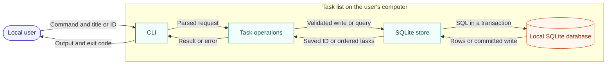

# Task list architecture

> Decision status: proposed teaching example.
> Implementation status: no application is implemented in Blueprint.

## Summary

A Python CLI reads commands and stores tasks in one SQLite database. SQLite is
the source of truth. The design supports the [product requirements](REQUIREMENTS.md)
without a server or third-party runtime dependency.

The user sends a command through the CLI and task operations to the store. Writes commit before a success result returns; reads return ordered task rows. All components and data stay on the user's computer.

## Responsibilities and dependencies

- **CLI:** parse arguments, select the database, print results, and choose exit codes. It does not execute SQL.
- **Task operations:** validate titles and apply add, list, and complete rules. They do not print output.
- **SQLite store:** create the schema, execute queries, and commit writes. It does not decide user-facing messages.

Dependencies point from the CLI to task operations to the store. These can be
small modules in one program; separate services or a generic storage framework
would add no value here.

## Data model

`task` is the only entity. There are no relationships to other entities.

| Field | Storage | Rule |
|---|---|---|
| id | INTEGER PRIMARY KEY AUTOINCREMENT | Database-generated stable identity; never reused. |
| title | TEXT NOT NULL | Trimmed title following the product's validation rules. |
| state | TEXT NOT NULL DEFAULT 'open' | CHECK restricts values to 'open' or 'done'. |

A task starts open and may become done. Completed tasks stay stored but leave
the unfinished list. No deletion or retention expiry is planned. Duplicate
titles have separate IDs. Task operations own the title rule; the store owns
identity and the persisted state constraint.

## Runtime and consistency

On startup, open the selected database and create the table if absent. Reject
an incompatible existing schema rather than guessing a migration.

Add validates before writing, inserts one task in a transaction, commits, then
prints the ID. List selects open tasks ordered by ID. Complete changes open to
done in a transaction; an already-done task succeeds unchanged.

**INV-1:** print a success message only after the write commits. Enforce this
through operation return timing; test a failed commit and a restart after a
successful write.

**INV-2:** validation failure does not change task data. Validate before the
write; compare stored rows before and after invalid requests.

SQLite coordinates local writers. Set a five-second lock timeout. If a lock or
storage error remains, roll back and return a storage error; do not retry or
claim success. Close the database on every exit.

## Local operation and tradeoffs

Use Python's standard `argparse`, `sqlite3`, and `unittest` modules. The CLI runs
on the user's computer; there is no network or deployment service. Default to
`tasks.sqlite3` in the working directory, with an explicit `--db` override.
Require its parent directory to exist.

Task titles may contain personal information. Rely on local filesystem access;
do not log titles or SQL values. No application authentication is needed for
this local scope. The database is not encrypted, so this design does not protect
against someone who can read the file.

SQLite provides transactions without another service. The working-directory
default keeps setup small but creates a separate list in each directory; use
`--db` to share a file between directories. Future schema changes need a migration
spec and compatibility checks.

## Proof and open decisions

Use temporary databases to test restart persistence, validation, state
constraints, failed writes, and CLI output. The first [feature spec](docs/add-and-list/spec.md)
defines add and list proof. Complete is designed but outside that feature.

Open decisions: None. Runtime proof remains pending until the application exists.
