# Label Reference

Labels are the control plane for Blueprint's unattended loops: each label marks a state or a property, and exactly one loop or human moves an issue out of each state. This is the canonical reference; [loops.md](loops.md) shows the loops that act on them.

## Namespaces

Namespaces separate dimensions that flat labels mix together:

| Namespace | Dimension | Values |
|---|---|---|
| `agent:*` | The loop state machine | `ready`, `working`, `complete` |
| `needs:*` | What the issue is waiting on | `spec`, `human` |
| `risk:*` | Autonomy gate: blast radius if the work goes wrong | `low`, `high` |
| `type:*` | Classification for reporting | `feature`, `bug`, `chore` |
| (none) | Dependency on another issue | `blocked` |

`agent:*`, `needs:*`, and `blocked` drive the loops. `risk:*` gates which work runs unattended. `type:*` is optional metadata and never affects loop behavior.

## State Machine

```mermaid
%%{init: {"theme": "base", "themeVariables": {"fontFamily": "Inter, ui-sans-serif, system-ui", "fontSize": "18px", "primaryTextColor": "#f8fafc", "tertiaryTextColor": "#f8fafc", "lineColor": "#94a3b8", "edgeLabelBackground": "#020617"}}}%%
flowchart LR
    Filed([Issue filed<br/>by an agent])
    Spec["needs:spec<br/>open decisions"]
    Ready["agent:ready<br/>definition of ready met"]
    Working["agent:working<br/>claimed"]
    Complete["agent:complete<br/>PR awaiting review"]
    Human["needs:human<br/>blocked on a decision"]
    Closed([Closed<br/>PR merged])

    Filed -->|decision-complete| Ready
    Filed -->|open decisions| Spec
    Spec -->|"spec reviewed,<br/>human flips"| Ready
    Ready -->|"work loop claims,<br/>atomic swap"| Working
    Working -->|PR opens| Complete
    Working -->|blocker hit| Human
    Working -->|"stale claim<br/>(24h, no activity)"| Ready
    Human -->|human answers| Ready
    Complete -->|human merges| Closed

    classDef start fill:#0f172a,stroke:#38bdf8,stroke-width:3px,color:#f8fafc,font-size:18px;
    classDef waiting fill:#431407,stroke:#fb923c,stroke-width:3px,color:#ffedd5,font-size:18px;
    classDef ready fill:#172554,stroke:#60a5fa,stroke-width:3px,color:#eff6ff,font-size:18px;
    classDef working fill:#052e16,stroke:#4ade80,stroke-width:3px,color:#f0fdf4,font-size:18px;
    classDef review fill:#831843,stroke:#f472b6,stroke-width:3px,color:#fdf2f8,font-size:18px;

    class Filed,Closed start;
    class Spec,Human waiting;
    class Ready ready;
    class Working working;
    class Complete review;
```



`blocked` sits alongside any state: `plan` applies it to tasks with unmet dependencies, the body links the blocking issue, and the work loop removes it once the blocker closes.

## Reference

| Label | Means | Set by | Moves on when |
|---|---|---|---|
| `needs:spec` | Real problem, open decisions | The agent filing the issue | Spec loop writes a spec; a human reviews it and flips the label to `agent:ready` |
| `agent:ready` | Meets the definition of ready | Filing agent, `plan`, or a human after spec review | Work loop claims it and swaps to `agent:working` |
| `agent:working` | Claimed by a worker | Work loop, atomically at claim time | PR opens and it swaps to `agent:complete`; a blocker routes it to `needs:human`; or the claim goes stale (24h, no branch or PR activity) and releases back to `agent:ready` |
| `agent:complete` | PR open, awaiting human review | Work loop, when the PR opens | Merge closes the issue; feedback runs through the review loop |
| `blocked` | Waiting on another issue, linked in the body | `plan`, when filing dependent tasks | Work loop removes it once the blocking issue closes |
| `needs:human` | A decision only a human can make, explained in a comment | Any loop, on a blocker | A human answers in the comments and relabels `agent:ready`, or closes the issue |
| `risk:low` | Small blast radius; safe for unattended work | The agent filing the issue | Never moves |
| `risk:high` | Large blast radius; attended sessions only | The agent filing the issue | Never moves |
| `type:feature` / `type:bug` / `type:chore` | Classification for reporting | The agent filing the issue | Never moves; not part of the loop |

## The Risk Gate

Risk is judged once, at filing: what breaks, and how visibly, if this work goes wrong. The unattended work loop claims `risk:low` issues only. `risk:high` work still flows through the same states, but a human starts it in an attended session. This is the dial for how much autonomy the loop gets: tighten it by grading more work `risk:high`, loosen it as trust grows.

## Setup

Create the labels once per repo:

```bash
gh label create "needs:spec"     --color "1d76db" --description "Real problem, open decisions"
gh label create "needs:human"    --color "d93f0b" --description "Waiting on a human decision"
gh label create "agent:ready"    --color "0e8a16" --description "Meets the definition of ready"
gh label create "agent:working"  --color "fbca04" --description "Claimed by a worker"
gh label create "agent:complete" --color "5319e7" --description "PR open, awaiting human review"
gh label create "blocked"        --color "b60205" --description "Waiting on another issue"
gh label create "risk:low"       --color "c2e0c6" --description "Small blast radius"
gh label create "risk:high"      --color "e99695" --description "Large blast radius; attended only"
gh label create "type:feature"   --color "a2eeef" --description "New behavior"
gh label create "type:bug"       --color "d73a4a" --description "Broken behavior"
gh label create "type:chore"     --color "cfd3d7" --description "Maintenance"
```

The definition of ready, which `agent:ready` asserts, lives in [AGENTS.md](../AGENTS.md).
