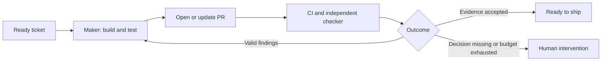

# Build software with AI: from design to a verified release

Blueprint explains a repeatable engineering process for people building software with AI. Use this lifecycle to decide what work needs to happen, who owns it, and what evidence shows that it is complete.

This guide is for developers who know how a repository, a pull request, and automated tests work. By the end, you should be able to turn a request into a ready ticket, supervise a maker and checker, and distinguish a verified change from a shipped product.

## One lifecycle, seven stages

```text
Design → Plan → Build → Test → Review → Ship → Scale
```

These are responsibilities, not seven mandatory agent sessions. Testing happens during building. Review findings send work back to the maker. Production observations can start another design or task. Expand the process when uncertainty or risk requires it; a small, decided change can enter at Build.

| Stage | Question to answer | Output | Ready to move on when |
| --- | --- | --- | --- |
| Design | What should change, why does it matter, and how should it work? | A Markdown specification | Consequential decisions and acceptance criteria are explicit |
| Plan | What deliverable changes will implement the specification? | Ordered tickets, dependencies, and useful milestones | Each ready ticket can be implemented without inventing product decisions |
| Build | How do we implement this ticket within its constraints? | Code, tests, and a pull request | The scoped change exists and the maker has checked it locally |
| Test | Does the behavior work when executed? | Automated results and relevant runtime evidence | Acceptance criteria and affected failure paths have evidence |
| Review | Does the implementation satisfy the contract, and is the proof sufficient? | Independent findings and a verdict | Material findings are addressed or explicitly escalated |
| Ship | Has the accepted change reached its intended users? | A release and verification of its behavior | The release meets its checks and its owner knows how to recover |
| Scale | How do we turn repeatable engineering work into an automated system? | Executable workflows, triggers, workers, and operating evidence | The system preserves quality and authority while reducing repeated supervision |

Continuous integration, or CI, runs automated checks when code changes. Passing CI is one part of verification. It does not establish that the requirements were right or that a release has happened.

## Design combines requirements and technical design

Requirements establish **what and why**: the problem, intended outcome, users, scope, and constraints. Technical design establishes **how**: behavior, interfaces, data, important failure cases, and tradeoffs.

Keep these together in a Markdown specification when that helps someone understand the change. Separate documents are useful only when their ownership or size warrants it. Blueprint's current `/design` output defaults to `docs/<feature-slug>/design.md`; "specification" describes the document's purpose, not a required new filename.

A useful specification contains:

- the problem and intended user outcome;
- the decisions implementation must preserve;
- interfaces, data changes, and failure behavior where relevant;
- acceptance criteria and how they will be verified;
- exclusions and unresolved decisions.

The human owns the product direction and consequential tradeoffs. An agent can research, draft, compare alternatives, and challenge the proposal. It must surface a missing decision when choosing an answer would change the agreed outcome or risk.

Document existing architecture separately from proposed changes. A future design is not evidence of how the current code works.

## Planning makes work delegable

The specification defines a feature or system change. A ticket defines **one deliverable change**. A pull request contains that change and its evidence.

For a small task, the ticket can contain the entire specification. For a larger feature, tickets link to the shared specification and include the requirements specific to their own outcome. Do not duplicate shared decisions across tickets and then let them drift.

A ready ticket identifies:

1. The problem and observable result.
2. Scope, exclusions, and behavior that must remain unchanged.
3. Acceptance criteria and verification methods.
4. Relevant source documents and dependencies.
5. Any authority or operational limits specific to the work.

A new agent should be able to execute the ticket without access to the author's conversation. Ordinary implementation choices remain with the maker. If a shared decision changes during delivery, revise the specification and affected tickets before continuing.

Milestones group useful outcomes, such as a working private preview. Dependencies describe which outcomes must exist first. They are not an excuse to divide every feature into separate database, API, and UI tickets that cannot be evaluated individually.

The handoff boundary is **a ready ticket**, not merely the existence of a ticket in GitHub, Linear, or Jira.

## The maker builds; the checker independently evaluates

The maker reads the ticket and repository context, implements the change, writes relevant tests, and runs local checks. The maker owns repairs to that implementation.

The checker receives the task, relevant specification, current diff, and verification evidence. It independently checks correctness and the adequacy of that evidence. It can run additional tests and inspect the application, but returns findings rather than editing the maker's change.



The maker and checker have separate agent contexts. They can use the same model. Separation reduces dependence on the maker's reasoning, but it does not guarantee correctness. The checker still needs enough context and must support findings with evidence.

Review is part of quality assurance, or QA. QA also includes executing user flows, checking failure behavior, and deciding whether the result is fit for its intended use. Reading a diff is not a substitute for exercising a browser interaction.

A test report says what ran and what passed, failed, or remains unverified. A review says whether the implementation and proof satisfy the task. An agent review is neither a human approval nor a substitute for required GitHub approvals.

## Run the ticket-to-PR loop with an explicit boundary

For one ticket, the repeatable loop is build, test, review, collect CI feedback, repair valid problems, and verify the changed result again. The PR may be opened early to obtain remote checks; its existence is not completion.

Choose the repair budget before running the loop. Three repair passes is a reasonable starting policy for the initial Machinist workflow. It is a limit on autonomous work, not permission to accept a defect after three attempts. Exhaustion returns the evidence and the unresolved problem to a human.

Distinguish code defects from missing requirements, unavailable credentials, infrastructure failures, and optional suggestions. They require different responses. A reviewer comment is evidence to assess, not an instruction that must be obeyed.

Verification belongs to a particular code revision. After a repair, recheck affected behavior and obtain an independent review of the changed result. Retain earlier evidence only where it still applies. Missing checks, stale approvals, and an agent saying "done" cannot establish readiness.

## Ship is a separate decision

The human accepts the change against the intended outcome and authorizes the next consequential action. Merge, deployment, and public release are distinct events. A merged PR may still be behind a feature flag or awaiting deployment.

Before release, name the target environment, smoke checks, responsible person, and recovery route. After release, verify the user behavior and relevant operational signals. Failures and observations become inputs to the next task or design.

The first Machinist delivery workflow stops with a PR ready for human acceptance. Automated merging or deployment requires its own explicit workflow and authority.

## Scale builds systems that build software

Scale means encoding repeatable engineering work into an automated system. It is the move from personally driving each step in a terminal to operating workflows that can take work, execute it, check results, and request help when needed. It does not mean scaling the application's traffic or adding agents without a verification plan.

Start with a workflow you understand and have exercised. Put sequencing, waiting, retry budgets, and recovery in code. Give the maker and checker clear assignments. Add a queue or event trigger only after one task can finish or stop predictably. Keep the human's decisions and permissions explicit.

The automated system must make its work visible: what it is doing, what revision it checked, why it stopped, and what someone needs to decide. Test repeated delivery, interruption, missing credentials, stale feedback, and concurrent attempts at the same ticket before increasing throughput.

Scale is a stage in developing your engineering capability, rather than another step to perform after every small release. The system can automate an earlier loop, such as ticket to reviewed PR, while acceptance and release remain human-controlled. Learn the complete path first, then choose which parts deserve automation.

## Worked example: archive a project

This is a fictional teaching example, not evidence from a shipped Blueprint application.

A user says, "Old projects clutter the workspace. Let me archive them."

**Design.** The human and agent agree that workspace editors may archive a project, archived projects disappear from the default list, direct reads remain available to authorized members, and restoration is outside this change. Cross-workspace access must remain forbidden. The Markdown specification records these decisions and the required checks.

**Plan.** One ticket adds the archive operation and default-list behavior, with authorization and persistence tests. A second dependent ticket adds the archive action to the interface and verifies the browser flow. The first delivers useful API behavior; the second builds on its established contract.

**Build and test.** The maker implements the first ticket. It checks authorized archiving, default-list exclusion, retained direct access, and rejection of a caller from another workspace. Test fixtures use at least two workspaces so the authorization check can fail meaningfully.

**Review.** The checker traces the operation against those criteria. If tests only use an administrator, the checker requests evidence for the actual editor role. If the code lacks the workspace boundary check, the maker fixes it and reruns verification. If the checker asks for restoration, the maker points to the agreed exclusion instead of expanding scope.

**Ship.** After both tickets pass their checks, a human accepts the interface behavior, authorizes release, and verifies archiving in the target environment. A release check failing returns the change to diagnosis; a green PR alone does not settle that failure.

**Scale.** After practicing this delivery loop, the team encodes it in a script. Approved tickets can enter a queue, makers implement them in separate workspaces, and checkers return evidence. A deliberately interrupted run must resume the existing PR before the team increases concurrency. People still decide what to build and what to release.

## How Blueprint and Machinist use this lifecycle

Blueprint provides the mental model, teaching material, and reusable engineering skills. People can use the process directly with a coding agent. Skills support the work without replacing the human's responsibility for decisions and acceptance.

Machinist implements the Scale stage by automating selected parts of the same process through executable workflows. Scripts own ordering, waiting, budgets, and recovery. Agents receive explicit phase assignments. A Machinist workflow does not need a skill to decide what stage runs next.

The shared foundation is the lifecycle and evidence standard. Blueprint and Machinist can implement it differently without requiring a runtime dependency between the projects.

## Practice the handoff and choose what to automate

Take a real request and write its outcome, exclusions, acceptance criteria, and verification approach. Decide whether it needs a separate design or fits in one ticket. Ask a fresh agent to identify consequential decisions it would have to invent before implementation.

You have completed the exercise when another person can explain the intended behavior, a maker can start within the agreed scope, and a checker can tell what evidence would disprove completion. If a question changes the product or its risk, return it to Design. Do not solve it by silently making the ticket longer.

After delivering the task, identify one repeated step you could encode in a script. Name its input, success evidence, retry limit, and human stopping point. Describe how you would prove the script can recover from an interruption without creating a second PR.

## Related material

- [Blueprint workflows](workflows.md) and [skill selection](choosing-a-skill.md).
- [Design](../skills/design/SKILL.md), [planning](../skills/plan/SKILL.md), [testing](../skills/test/SKILL.md), and [review](../skills/review/SKILL.md).
- Addy Osmani's [lifecycle](https://skills.addy.ie/lifecycle/) and [loop engineering](https://skills.addy.ie/loops/) are useful reference material. This guide uses Blueprint's stage names, authority boundaries, and delivery outcomes.
