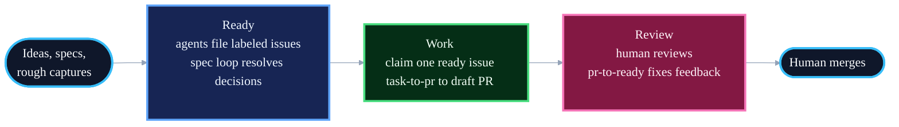

# Running Blueprint as Unattended Loops

Blueprint's skills run attended by default: you invoke them, they pause at human checkpoints. This guide shows how to run them unattended, as scheduled loops over an issue tracker. You write ideas down, agents turn them into specs and draft PRs, and your involvement narrows to two gates: approving specs and reviewing PRs.

The loop layer is deliberately prompts, not skills. Skills encode judgment that must stay consistent everywhere; the loop layer is wiring between skills for one workflow, and it gets pasted into whatever runs it: a GitHub Action, a Claude Code schedule, a Codex automation, or cron. Adjust the prompts to your repo.

## The Three Phases



1. **Ready**: plan, triage, and get work agent-ready. Agents file every issue and judge it at creation: decision-complete work gets `ready-for-agent`, real problems with open decisions get `ready-for-spec`. The spec loop turns the latter into reviewed specs; you flip the label after approving.
2. **Work**: a scheduled agent claims one `ready-for-agent` issue and runs `task-to-pr` to a draft PR, with the ticket as the audit trail.
3. **Review**: you review PRs on your schedule. The review loop runs `pr-to-ready` against your feedback. You merge.

The conventions the loops depend on, the definition of ready and the label state machine, live in [AGENTS.md](../AGENTS.md). The prompts below assume them.

## Phase 1: Ready

### Capture a rough idea

For the thought you have mid-task and don't want to lose. The judgment is the label: the capture agent must not promote a thin idea to `ready-for-agent`.

```text
File this as an issue: <rough idea>.

Shape it to the definition of ready in AGENTS.md: goal stated as an
outcome, context a fresh agent needs, testable acceptance criteria, a
runnable verify step. Label it honestly: ready-for-agent only if it is
decision-complete; otherwise ready-for-spec, with the open decisions
listed in the body. Do not pad a thin idea into fake completeness.
```

### Plan a spec into issues

No prompt needed; this is the `plan` skill with the tracker as destination:

```text
Run plan on docs/<feature-slug>/spec.md. Destination: tracker issues.
```

`plan` files one issue per task, labels ready tasks `ready-for-agent`, and labels dependent tasks `blocked` with a link to the blocker. No plan doc is written; the issues are the plan.

### Spec loop

Turns `ready-for-spec` issues into reviewed specs. Run on a schedule.

```text
One tick of the spec loop.

Pick the oldest unassigned issue labeled ready-for-spec; exit if none.
Assign yourself. Run the spec skill with the issue as the input. Open a
PR adding docs/<slug>/spec.md, link it from the issue, and comment a
summary of the decisions that need review. Leave ready-for-spec in
place: a human flips it to ready-for-agent after reviewing the spec.
```

## Phase 2: Work

The pickup loop. Three details matter more than the schedule:

- **The throttle is review capacity, not frequency.** The loop exits when too many agent PRs await review. Without this it manufactures stale PRs faster than you can read them.
- **Claims are atomic.** Assign and swap the label before any other work, so two ticks can't grab the same issue.
- **Stale claims are released.** A crashed worker must not poison an issue forever.

```text
One tick of the work loop.

1. Throttle. Count open agent-authored draft PRs awaiting human review.
   If there are 3 or more, exit: finishing reviewed work beats starting
   new work.
2. Recover. Release stale claims: any issue labeled agent-in-progress
   with no linked branch or PR activity in 24 hours goes back to
   ready-for-agent. Remove blocked from issues whose blocking issues
   are closed.
3. Claim. Pick the oldest unassigned issue labeled ready-for-agent.
   Assign yourself and swap ready-for-agent to agent-in-progress before
   any other work. If none, exit and say so.
4. Work. Run task-to-pr with the issue.
5. Blocked? Comment what blocked you on the issue, label it needs-human,
   remove agent-in-progress, and exit cleanly. The ticket is the only
   channel.
```

## Phase 3: Review

You review PRs in GitHub whenever suits you. The review loop drives your feedback to merge-ready.

```text
One tick of the review loop.

List open agent-authored PRs with human feedback newer than the last
agent activity. For each, run pr-to-ready. Never merge. If a finding
needs a human decision, say so in a PR comment and move on.
```

## Triggers

The prompts are trigger-agnostic. Each tick is idempotent: safe to run on any schedule, exits cleanly when there is nothing to do.

**Claude Code**: `/schedule` creates a cloud routine from a prompt. Locally, cron works:

```cron
0 8,12,16 * * 1-5  cd /path/to/repo && claude -p "$(cat .loops/work.md)"
```

**GitHub Actions**: run on a schedule or on the `labeled` event so ready issues are picked up immediately:

```yaml
name: work-loop
on:
  schedule:
    - cron: "0 8,12,16 * * 1-5"
  workflow_dispatch:

permissions:
  contents: write
  issues: write
  pull-requests: write

jobs:
  work:
    runs-on: ubuntu-latest
    steps:
      - uses: actions/checkout@v4
      - uses: anthropics/claude-code-action@v1
        with:
          anthropic_api_key: ${{ secrets.ANTHROPIC_API_KEY }}
          prompt: |
            <paste the work loop prompt>
```

**Codex**: paste the prompt into an automation in the Automations tab.

Start with one loop, the work loop, on a slow schedule. Add the spec and review loops once you trust its output.

## What Stays Human

- Flipping `ready-for-spec` to `ready-for-agent` after reviewing a spec.
- Reviewing PRs.
- Merging. No loop, skill, or prompt merges; `pr-to-ready` ends at a readiness verdict.

Everything else is the loops' job. If you find yourself doing it by hand, the fix is a better issue or a better prompt, not more hands.
