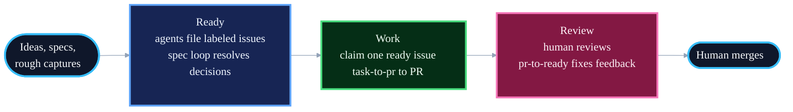

# Running Blueprint as Unattended Loops

Blueprint's skills run attended by default: you invoke them, they pause at human checkpoints. This guide shows how to run them unattended, as scheduled loops over an issue tracker. You write ideas down, agents turn them into specs and PRs ready for review, and your involvement narrows to two gates: approving specs and reviewing PRs.

Use `goal-design` when the `/goal` prompt inside an attended Codex or Claude Code session still needs a finish line, check, proof, or stop rule.
The runtime loop layer is deliberately prompts and external state, not a bespoke runner.
Skills encode judgment that must stay consistent everywhere; the loop layer is wiring between skills for one workflow, and it gets pasted into whatever runs it: a GitHub Action, a Claude Code schedule, a Codex automation, or cron.
Adjust the prompts to your repo.

## The Three Phases



1. **Ready**: plan, triage, and get work agent-ready. Agents file every issue and judge it at creation: decision-complete work gets `agent:ready`, real problems with open decisions get `needs:spec`. The spec loop turns the latter into reviewed specs; you flip the label after approving.
2. **Work**: a scheduled agent claims one `agent:ready` issue and runs `task-to-pr` to a PR ready for review, with the ticket as the work record.
3. **Review**: humans and review systems leave feedback on PRs. The review loop watches for that feedback, runs `pr-to-ready`, and leaves merge decisions to you.

## Labels at a Glance

Labels are the loop's control plane. Namespaces separate dimensions: `agent:*` is the state machine, `needs:*` is what an issue waits on, `risk:*` gates autonomy, `type:*` classifies for reporting. Exactly one loop or human moves an issue out of each state.

| Label | Means | Set by | Moves on when |
|---|---|---|---|
| `needs:spec` | Real problem, open decisions | The agent filing the issue | Spec loop writes a spec; a human reviews it and flips the label to `agent:ready` |
| `agent:ready` | Meets the definition of ready | Filing agent, `plan`, or a human after spec review | Work loop claims it and swaps to `agent:working` |
| `agent:working` | Claimed by a worker | Work loop, atomically at claim time | PR opens and it swaps to `agent:complete`; a blocker routes it to `needs:human`; or the claim goes stale (24h, no branch or PR activity) and releases back to `agent:ready` |
| `agent:complete` | PR open, awaiting feedback or merge | Work loop, when the PR opens | Merge closes the issue; feedback runs through the review loop |
| `blocked` | Waiting on another issue, linked in the body | `plan`, when filing dependent tasks | Work loop removes it once the blocking issue closes |
| `needs:human` | A decision only a human can make, explained in a comment | Any loop, on a blocker | A human answers in the comments and relabels `agent:ready`, or closes the issue |
| `risk:low` / `risk:high` | Blast radius if the work goes wrong | The agent filing the issue | Never moves. Unattended loops claim `risk:low` only; `risk:high` waits for an attended session |
| `type:feature` / `type:bug` / `type:chore` | Classification for reporting | The agent filing the issue | Never moves; not part of the loop |

The definition of ready lives in [AGENTS.md](../AGENTS.md); the full label reference with the state diagram and setup commands lives in [labels.md](labels.md). The prompts below assume both.

## Phase 1: Ready

### Capture a rough idea

For the thought you have mid-task and don't want to lose. The judgment is the label: the capture agent must not promote a thin idea to `agent:ready`.

```text
File this as an issue: <rough idea>.

Shape it to the definition of ready in AGENTS.md: goal stated as an
outcome, context a fresh agent needs, testable acceptance criteria, a
runnable verify step. Label it honestly: agent:ready only if it is
decision-complete; otherwise needs:spec, with the open decisions
listed in the body. Add a risk label for the blast radius if the work
goes wrong (risk:low or risk:high) and a type label (type:feature,
type:bug, type:chore). Do not pad a thin idea into fake completeness.
```

### Plan a spec into issues

No prompt needed; this is the `plan` skill with the tracker as destination:

```text
Run plan on docs/<feature-slug>/spec.md. Destination: tracker issues.
```

`plan` files one issue per task, labels ready tasks `agent:ready` with a risk grade, and labels dependent tasks `blocked` with a link to the blocker. No plan doc is written; the issues are the plan.

### Triage a backlog

When agents file every issue, nothing unjudged enters the tracker and no triage pass is needed. Use this loop when issues arrive unjudged: humans file them, they were imported, or the backlog predates the labels. It is the manager pass: judge what is workable, label it, and sync drift.

```text
One tick of the triage loop.

1. Find open issues with no agent:* or needs:* label. Judge each
   against the definition of ready in AGENTS.md:
   - Decision-complete: label agent:ready, add a risk grade (risk:low
     or risk:high) and a type label.
   - Real problem, open decisions: label needs:spec and comment the
     open decisions.
   - Too thin to act on: comment what is missing and label needs:human.
   The label is the judgment. Do not pad thin issues into fake
   readiness.
2. Sync drift: close issues whose linked PRs merged, release stale
   agent:working claims (24 hours, no branch or PR activity) back to
   agent:ready, and remove blocked where the blocking issue is closed.
3. Report what was labeled, what was released, and what needs a human.
```

A complete GitHub Actions workflow for this loop lives at [examples/workflows/triage.yml](../examples/workflows/triage.yml): copy it to `.github/workflows/` and add an `ANTHROPIC_API_KEY` secret.

### Spec loop

Turns `needs:spec` issues into reviewed specs. Run on a schedule.

```text
One tick of the spec loop.

Pick the oldest unassigned issue labeled needs:spec; exit if none.
Assign yourself. Run the spec skill with the issue as the input. Open a
PR adding docs/<slug>/spec.md, link it from the issue, and comment a
summary of the decisions that need review. Leave needs:spec in
place: a human flips it to agent:ready after reviewing the spec.
```

## Phase 2: Work

The pickup loop. Three details matter more than the schedule:

- **The throttle is review capacity, not frequency.** The loop exits when too many agent PRs await review. Without this it manufactures stale PRs faster than you can read them.
- **Claims are atomic.** Assign and swap the label before any other work, so two ticks can't grab the same issue.
- **Stale claims are released.** A crashed worker must not poison an issue forever.

```text
One tick of the work loop.

1. Throttle. Count issues labeled agent:complete: agent PRs awaiting
   human review. If there are 3 or more, exit: finishing reviewed work
   beats starting new work.
2. Recover. Release stale claims: any issue labeled agent:working with
   no linked branch or PR activity in 24 hours goes back to
   agent:ready. Remove blocked from issues whose blocking issues are
   closed.
3. Claim. Pick the oldest unassigned issue labeled agent:ready and
   risk:low; higher-risk work waits for an attended session. Assign
   yourself and swap agent:ready to agent:working before any other
   work. If none, exit and say so.
4. Work. Run task-to-pr with the issue. When the PR opens, swap
   agent:working to agent:complete.
5. Blocked? Comment what blocked you on the issue, label it needs:human,
   remove agent:working, and exit cleanly. The ticket is the only
   channel.
```

## Phase 3: Review

You review PRs in GitHub whenever suits you.
Review bots and CI can also leave feedback.
The review loop watches the PR, gives review systems a short window to respond after each push, and drives actionable feedback to merge-ready.
It does not merge.

```text
One tick of the review loop.

1. List open agent-authored PRs connected to issues labeled
   agent:complete.
2. Sync closed PRs: if a PR was merged, close or update the linked
   issue using the repo's normal convention. If it was closed without
   merge, comment the state and move the issue to needs:human unless
   the repo has a better documented state.
3. For each open PR, inspect reviews, unresolved threads, top-level
   comments, bot comments, check runs, required statuses, mergeability,
   and the latest head commit.
4. If the latest agent push is less than 10 minutes old and checks or
   review bots are still pending, skip the PR for this tick so feedback
   can arrive.
5. Run pr-to-ready when any human review, bot comment, unresolved
   thread, or failing required check is newer than the last agent
   activity, or when older actionable feedback is still unresolved.
6. After pr-to-ready, comment the readiness verdict with proof when
   it changes the state of play. Leave ready PRs open for human merge.
7. Stop on needs-human findings, repeated identical failures, missing
   permissions, or unclear repo policy. Never merge.
```

## Triggers

The prompts are trigger-agnostic. Each tick is idempotent: safe to run on any schedule, exits cleanly when there is nothing to do.

**Claude Code**: `/schedule` creates a cloud routine from a prompt. Locally, cron works:

```cron
0 8,12,16 * * 1-5  cd /path/to/repo && claude -p "$(cat .loops/work.md)"
```

**GitHub Actions**: run on a schedule or on the `labeled` event so ready issues are picked up immediately:

```yaml
name: work-loop
on:
  schedule:
    - cron: "0 8,12,16 * * 1-5"
  workflow_dispatch:

permissions:
  contents: write
  issues: write
  pull-requests: write

jobs:
  work:
    runs-on: ubuntu-latest
    steps:
      - uses: actions/checkout@v4
      - uses: anthropics/claude-code-action@v1
        with:
          anthropic_api_key: ${{ secrets.ANTHROPIC_API_KEY }}
          prompt: |
            <paste the work loop prompt>
```

**Codex**: paste the prompt into an automation in the Automations tab.
For an attended Codex coordinator that owns a finite issue set and may merge only when explicitly authorized, use [codex-coordinator.md](codex-coordinator.md).

Start with one loop, the work loop, on a slow schedule. Add the spec and review loops once you trust its output.

## What Stays Human

- Flipping `needs:spec` to `agent:ready` after reviewing a spec.
- Reviewing PRs when human judgment is needed.
- Merging. No unattended loop, skill, or prompt merges; `pr-to-ready` ends at a readiness verdict.

Everything else is the loops' job. If you find yourself doing it by hand, the fix is a better issue or a better prompt, not more hands.
